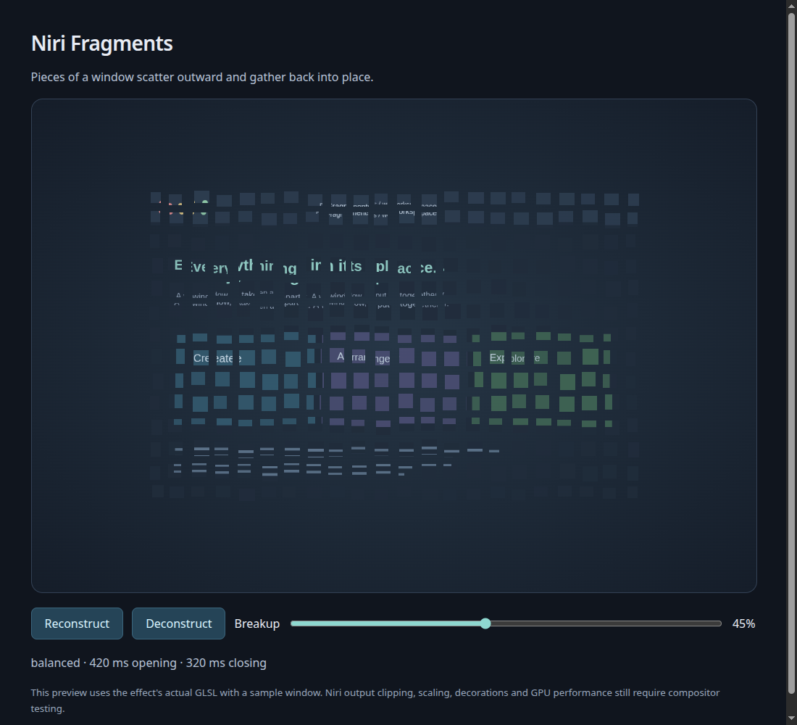

# Niri Fragments

Pixel deconstruction and reconstruction animations for Niri, with configurable
presets and native iNiR/iRiS settings integration.

Closing a window scatters square pieces of its contents; opening gathers them
back into place. The shader runs in Niri. The shell supplies the preset picker.



**Status: initial prototype.** Includes an original GLSL shader, three presets,
a dependency-free Python CLI, a WebGL preview using the actual shader, and
reversible registration in iNiR's user preset registry. Native sliders and a
shader-accurate preview inside iRiS are future work. Real desktop visual and
performance acceptance is still required; this is not a stable release.

## Try the preview

Python 3.10+ is sufficient to run from a checkout:

```sh
python3 -m niri_fragments list
python3 -m niri_fragments preview --output /tmp/niri-fragments-preview.html
xdg-open /tmp/niri-fragments-preview.html
```

Click **Reconstruct** or **Deconstruct**, or scrub the breakup slider. The preview
uses a generated sample window, makes no network requests, and never changes
your desktop. Output creation refuses to overwrite an existing file.

## Use with iNiR / iRiS

Requires an iNiR version with `NiriAnimationPresets` and external user presets.
The adapter reads the installed helper instead of guessing shell settings.

```sh
# Inspect proposed changes without writing anything.
python3 -m niri_fragments register --dry-run

# Register all three presets, preserving other user entries.
python3 -m niri_fragments register
```

Registration does **not** activate an animation or edit Niri's configuration.
In iRiS, open **Settings → Windows → Movement → Style** and select a
**Fragments** preset. Other iNiR families use the same animation preset service.
Niri animations must be enabled for this picker to appear.

By default, registration copies the active recognized iNiR preset and replaces
only its window-open and window-close entries. Workspace, resize, and other
timings retain that preset's values. If your current animations are custom,
registration refuses to approximate them: choose a base explicitly, e.g.
`register --base bouncy`, or use a standalone override instead. Re-register
after changing your desired base preset. Changes made later to other animations
are not dynamically incorporated into already registered presets.

iNiR applies a **whole preset** when a card is selected; registration therefore
captures the base's other settings rather than supplying only two entries.
The shell's existing thumbnail represents timing, not the fragment shader.

Existing user preset files are backed up beside the resolved target before an
atomic update. Malformed JSON, duplicate IDs, and collisions with another
provider's IDs stop the operation. Existing symlinks and unrelated entries are
preserved. The command prints the target and backup paths.

To remove the presets, first select your original style in Settings, then run:

```sh
python3 -m niri_fragments unregister
```

Unregister removes this tool's entries only. It does not change the animation
currently embedded in Niri's configuration. Backups are retained.

For nonstandard installations, use `--inir-root` and `--registry`; defaults
honor XDG paths and iNiR's `illogical-impulse` legacy directory.

## Use with standalone Niri

The output embeds GLSL inline, compatible with Niri 26.04. It does not rely on
the newer `custom-shader path=...` syntax.

```sh
python3 -m niri_fragments render --preset balanced > fragments.kdl
niri validate -c fragments.kdl
```

Move the file to your Niri configuration directory and include it **after**
your base animations. Remove that include to restore the base behavior. Niri
reloads included KDL files automatically. Keep a backup before editing.

Do not combine this override with the iNiR registry approach: a later override
would keep winning after selecting another shell preset.

Tune a standalone effect or preview:

```sh
python3 -m niri_fragments render --tile-size 24 --scatter 70 --open-ms 400 --close-ms 300
```

| Preset | Tile size | Scatter | Open | Close |
| --- | --- | --- | --- | --- |
| Subtle | 24 logical px | 45 logical px | 320 ms | 240 ms |
| Balanced | 28 logical px | 90 logical px | 420 ms | 320 ms |
| Dramatic | 36 logical px | 160 logical px | 550 ms | 420 ms |

Scatter controls radial expansion; randomized jitter adds at most 0.24 tile
per axis. This is a bounded visual effect, not a physics simulation.

## Development

```sh
python3 -m unittest discover -s tests -v
python3 scripts/validate.py --require-glsl --require-niri
```

`glslangValidator` checks GLSL ES 1.00; `niri validate` checks KDL. Neither proves
runtime GPU performance. Check native compositor logs for shader errors, then
test transparent, decorated, small, maximized, and screen-edge windows at the
display scales you use. Opening's drawing area is larger than the window but
has unspecified bounds, so large scatter can be clipped. Client-side shadows
outside window geometry are omitted during breakup. Closing can cover a large
screen area; the shader limits its work to a 3×3 source-cell search.

See [the integration design](docs/integration.md) and
[related projects](docs/related-projects.md), plus the
[initial validation record](docs/validation.md). Optional installation into a
virtual environment: `python3 -m pip install .`.

MIT licensed. Independent project; not affiliated with Niri or iNiR.
