# NiriFX

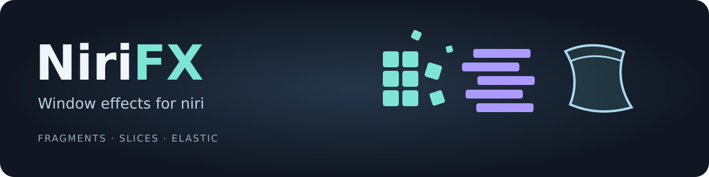

**Explode windows into fragments. Slide them into ribbons. Make them wobble.**

NiriFX brings customizable animations to the **niri Wayland compositor**.
Pick a finished style from **73 presets across nine effect families and seven ready-made open/close pairings**. For further
customization, tune it in Studio, online or on your desktop. Use different effects for opening and closing, from a quiet ripple
to a full window explosion.

Works **standalone** or with **iNiR/iRiS, DankMaterialShell and Noctalia**.
Quickshell is optional. Studio opens as an app-style window or a browser tab.

[Interactive gallery](https://jturbide.github.io/niri-fx/gallery/) ·
[Web Studio](https://jturbide.github.io/niri-fx/studio/) ·
[All presets & comparisons](docs/catalog.md) · [Documentation](docs/README.md) ·
[Roadmap](ROADMAP.md) · [Changelog](CHANGELOG.md)

Opening, closing and optional resize work on **stock Niri**, tested with 26.04.
Resize is **off in every built-in preset**. Native movement, swaps and the
interruption improvements require the [experimental compositor](experimental/README.md).

This README describes `main`, which can include features newer than the latest
release. [Download v0.13.1](https://github.com/jturbide/niri-fx/releases/tag/v0.13.1)
for the versioned package, or read [choosing a version](docs/releases.md).

## Quick start

**Try without installing:** choose from [nine starter looks](https://jturbide.github.io/niri-fx/gallery/?collection=starter), open [Web Studio](https://jturbide.github.io/niri-fx/studio/),
or choose **Try in Studio** from the [gallery](https://jturbide.github.io/niri-fx/gallery/).
Tune an effect, share its settings or download JSON. Previewing does not change your desktop.
[Bring a downloaded style to Niri](docs/web-studio.md).

For a small install without the source gallery, use the [release wheel](docs/releases.md#0131-prerelease).
On Niri with Python 3.10+, you can also start the guided workflow from source:

```sh
git clone --depth 1 https://github.com/jturbide/niri-fx.git
cd niri-fx
python3 -m niri_fx
```

Choose a preset, review its files and type `apply`. Run it again and choose `undo`
to restore the previous settings. With iNiR, it registers the collection for your
existing iRiS picker. No extra UI toolkit is required. [Terminal guide](docs/terminal.md).

For a visual editor, run `python3 -m niri_fx studio --target standalone`.
Previewing changes no active animations. For scriptable setup on plain Niri:

```sh
python3 -m niri_fx setup --target standalone --preset balanced
python3 -m niri_fx setup --target standalone --preset balanced --apply
```

Already using a shell's animation picker? Follow its guide:
[iNiR / iRiS](docs/getting-started.md#inir-and-iris) · [DMS](docs/dms.md) ·
[Noctalia](docs/noctalia.md) · [Standalone / Waybar](docs/standalone.md).
The [scenario guide](docs/scenarios.md) helps choose the right setup and restore path.

## See it in motion

The [interactive gallery](https://jturbide.github.io/niri-fx/gallery/) starts with
nine recommended looks, with Fragments first. Choose **Open/close pairings** for
finished combinations or **All examples** to explore the whole collection. Search,
family/scenario filters and click-to-play previews help narrow it down. It starts paused and loads one
animation at a time. Style cards link to editable settings, JSON downloads and
a local Studio command. Share a filtered view or a customized Studio link.
The [full catalog](docs/catalog.md) includes every preset,
control comparison and downloadable example.

### Fragments first

Fragments preserve pieces of the window's texture and reconstruct them in their
original places. Start with **Balanced**, use **Explosion** for a stronger burst,
or **Implosion** for an inward collapse.

| Balanced | Explosion | Implosion |
| --- | --- | --- |
|  |  |  |
| **Core Detonation** | **Mosaic Burst** | **Orbital Ribbons** |
|  |  |  |

Tune particle density, gravity, spin, release order, waves, size variation and
burst origin. [Compare those controls](docs/catalog.md#one-control-at-a-time).
These clips use Studio's real shaders with synthetic window content.

### More fragment shapes

**Triangle Shatter**, **Circle Burst**, **Rectangle Confetti** and **Hex Swarm**
combine new geometry with the existing gravity and spin controls. Studio also
supports ellipses, diamonds and stars, with adjustable proportions, orientation
and silhouette timing. Available since v0.12.0; resize stays off.

| Triangle Shatter | Circle Burst |
| --- | --- |
| 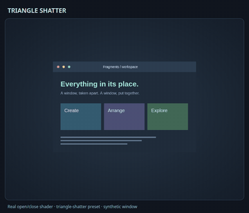 |  |
| **Rectangle Confetti** | **Hex Swarm** |
| 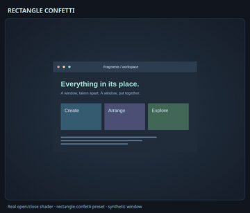 | 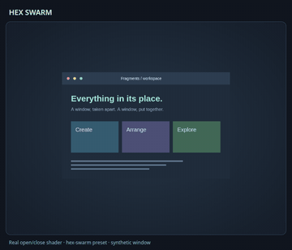 |

[Shape controls and comparisons](docs/fragment-shapes.md) ·
[Try Triangle Shatter](https://jturbide.github.io/niri-fx/gallery/#preset-triangle-shatter)

The [experimental compositor](experimental/README.md) also uses these shapes for
native movement and swaps:

| Triangle swap | Hexagon swap |
| --- | --- |
| 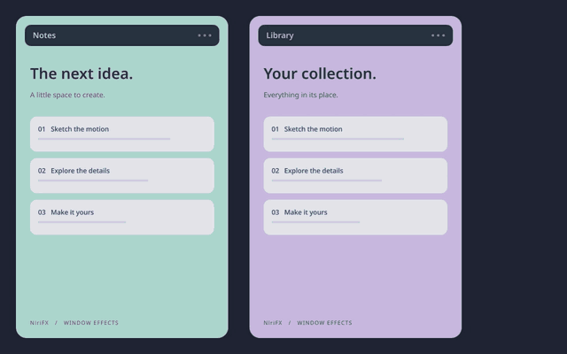 | 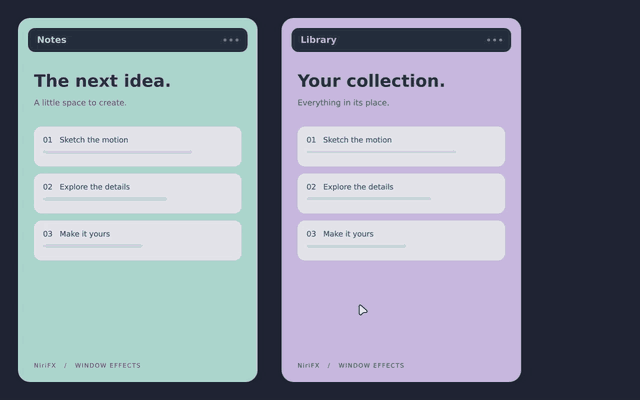 |

### Slices, springs and hexagons

| Alternating Blinds | Spring Wobble | Hexagon Burst |
| --- | --- | --- |
|  |  |  |
| **Ribbon Fold** | **Twist Snap** | **Hive Collapse** |
|  |  |  |

### Pixels, ink and distortion

| Pixel Wipe | Ink Spread | Signal Glitch |
| --- | --- | --- |
|  |  |  |
| **Frost Vanish** | **Ink Bloom** | **Chromatic Glitch** |
|  |  |  |

Also explore [dust, wisps, iris reveals and shockwaves](docs/catalog.md).
Ember Erosion and Signal Glitch start monochrome; their colors are configurable.
Original NiriFX shaders are inspired by the wider [desktop-effects community](docs/related-projects.md).

### Vortex distortion

**Vortex Fold** curls the window into its center; **Soft Swirl** gives it a quicker,
gentler counterclockwise turn. Change twist direction, contraction, falloff and
origin in Studio. Available since v0.11.0.

| Vortex Fold | Soft Swirl |
| --- | --- |
| 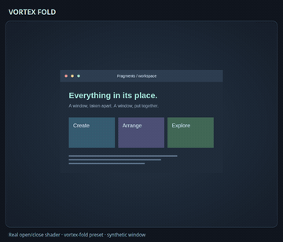 | 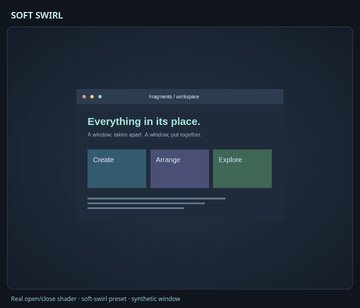 |

[Compare spin directions](docs/gifs/compare-vortex-twist.gif) ·
[Controls and settings](docs/catalog.md#vortex-and-swirl)

## Pick an opening and closing pair

Choose a finished combination with no JSON editing. In the terminal guide, type
`profiles`; in Studio, use **Ready-made open / close pairing**. The desktop pickers
include the same collection. Resize stays off.

| Fragment Flow | Burst and Drift | Frost and Fragments |
| --- | --- | --- |
|  |  |  |
| **Pixel Shuffle** | **Ribbon Exit** | **Spring and Ember** |
| 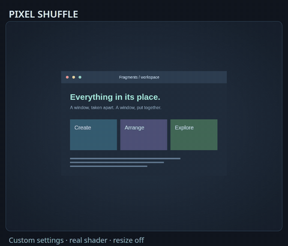 | 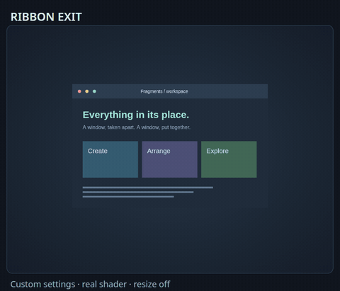 |  |

```sh
python3 -m niri_fx list --profiles --text
python3 -m niri_fx studio --profile fragment-flow
```

[All seven pairings, commands and downloads](docs/profiles.md) ·
[Ghost and Shockwave](docs/gifs/profile-ghost-and-shockwave.gif)

## Resize (opt-in)

Choose fragment breakup, **Elastic Stretch**, **Accordion Resize**, **Ripple
Resize**, **Edge Ripple** or **Torsion Resize**. These work on stock Niri's animated size changes, such as cycling column
widths. They do not add pointer-driven wobble while dragging an edge.


[Resize guide](docs/resize.md) · [Elastic profile](examples/profiles/elastic-resize.json) ·
[Accordion profile](examples/profiles/accordion-resize.json) ·
[Ripple profile](examples/profiles/ripple-resize.json)

**Edge Ripple** and **Torsion Resize** each offer Subtle and Expressive profiles
since v0.11.0. Compare both strengths below, then download a
profile from the [resize guide](docs/resize.md#edge-ripple-and-torsion-resize).

| Edge Ripple | Torsion Resize |
| --- | --- |
|  |  |


## Experimental movement and swaps

These recordings run in a **separate, patched Niri instance** with synthetic app
cards. The standard installation does not replace your compositor.

| Fragment explosion | Slice Exchange |
| --- | --- |
|  |  |
| **Pixel Transfer** | **Soft Phase** |
|  |  |

Repeated swaps preserve the current deformation and seed, with blended direction
changes. Closing during an opening continues its original trajectory while fading
out. Closing during movement retains the movement state instead of creating a new
particle field.

| Redirect a moving window | Close during opening |
| --- | --- |
|  |  |

Eight quick direction changes, carrying the wobble through each retarget:


[Run the nested demo](experimental/README.md) · [Movement behavior and limits](docs/movement.md) ·
[All native swaps and interruption recordings](docs/showcases.md#resize-movement-and-swaps)

The windows still render independently; particles do not share collision physics
or one combined depth order. Studio now previews the actual movement shader on a
synthetic directional path; its older Move/Swap sketches remain labelled concepts.

### Movement beyond horizontal swaps

Fragment Wake, Ribbon Transfer and Momentum Glide provide three movement looks.
The patched compositor also handles vertical reorder and consume/expel animation
paths. Pointer dragging and workspace effects remain on the [roadmap](ROADMAP.md).

| Fragment Wake | Ribbon Transfer | Momentum Glide |
| --- | --- | --- |
| 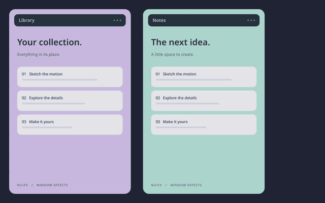 |  | 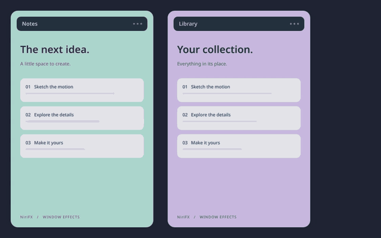 |


[Controls, profile export and isolated demos](docs/movement.md#movement-presets-and-general-rearrangement)

### Shaped resize, explicitly enabled

Triangles, hexagons and other fragment shapes now work during resize. These
separate profiles enable it deliberately; every built-in style still leaves it off.

| Triangle Edge Rebuild | Hexagon Edge Rebuild | Circle Soft Reflow |
| --- | --- | --- |
|  |  |  |

[Importable profiles and resize controls](docs/resize.md#shaped-resize)

## Make it yours

Studio offers a **Basic / Advanced** control view, search and favorites, independent
action profiles, Undo/Redo and pinned A/B comparisons. Pause or scrub any preview;
Reduced Motion shows endpoints without playback and respects the system preference.
Preview preferences do not change exported effects.

Import one of the [JSON examples](examples/README.md), edit it and export a preset
or Niri config. [Studio guide](docs/usage.md) · [Profiles](docs/profiles.md) ·
[Control reference](docs/effect-controls.md).

## Desktop pickers

Prefer your terminal? `niri-fx` provides preset search, reviewed Apply and Undo
without a graphical toolkit. [Guided workflow](docs/terminal.md):

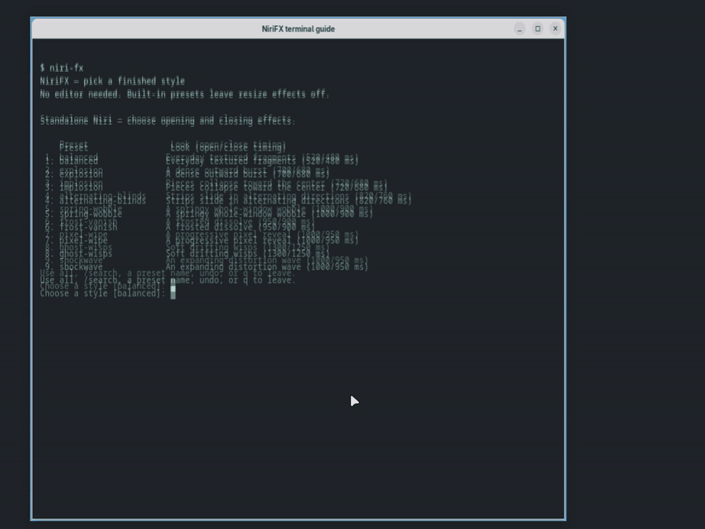

Run `python3 -m niri_fx picker` from the checkout to browse styles and load JSON
profiles. Review the affected files before Apply; Undo restores the previous
settings. Custom resize effects require explicit consent. Choose a toolkit:

| Toolkit | Command from a checkout | Integration guide |
| --- | --- | --- |
| Quickshell | `python3 -m niri_fx picker` | [Reusable QML picker](docs/quickshell.md) |
| GTK 4 / GJS | `python3 -m niri_fx picker --toolkit gtk` | [Standalone GTK and AGS 3 example](docs/gtk.md) |

Both provide reusable components for custom settings pages.

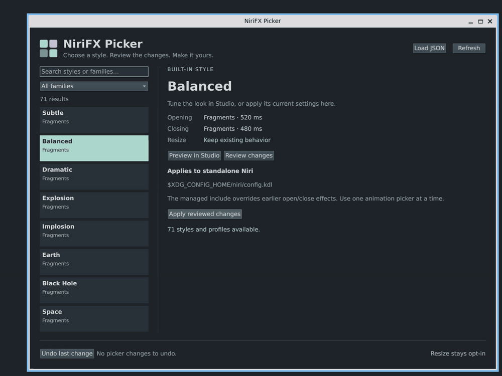

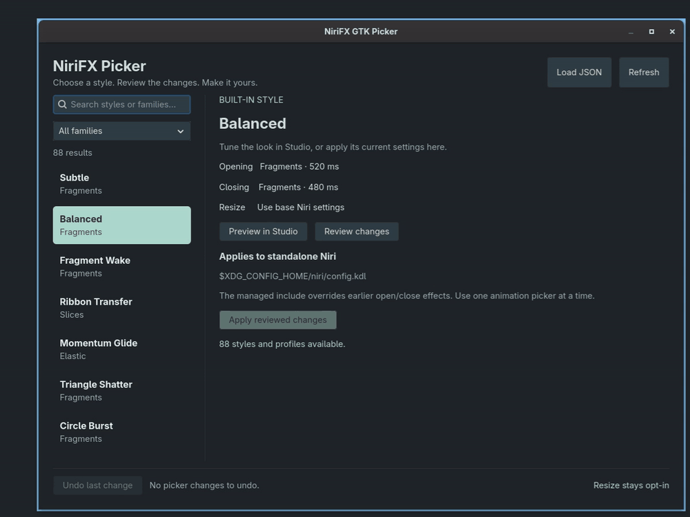

Only the chosen UI's toolkit is needed; the GTK picker also works without AGS.
Studio and standalone setup remain independent of both toolkits.
Available since v0.9.0; built-in open/close pairings require v0.10.0.

## Performance and compatibility

Effect cost depends on the renderer, window size and settings. The
[performance guide](docs/performance.md) includes reproducible shader benchmarks;
the [validation record](docs/validation.md) describes native tests and remaining
hardware limits. Particle count is a visual control, not a universal quality setting.
The [fragment optimization results](docs/performance.md#varied-fragment-flight-bounds)
compare shader costs while keeping the same particles and motion.

| Feature | Requirement |
| --- | --- |
| Open/close, nine families | Stock Niri with animations enabled |
| Resize, four families | Stock Niri; explicit checkbox, profile slot or `--resize` |
| Native movement and interruption continuity | Pinned experimental Niri build |
| iNiR/iRiS, DMS, Noctalia pickers | Optional [shell integrations](docs/compatibility.md) |
| Waybar or another bar on Niri | Standalone path; no effects plugin needed |

## Built with and connected to

Built for [niri](https://github.com/niri-wm/niri) with Python, GLSL and WebGL.
Shell adapters share the same effect catalog and CLI. Explore the
[related projects](docs/related-projects.md), [integration roadmap](docs/roadmap.md)
and [brand assets](docs/branding.md).

## Help and contributing

[Open an issue](https://github.com/jturbide/niri-fx/issues) with your Niri version,
effect settings and steps to reproduce a problem. Remove personal information
from logs and recordings. See [security reporting](SECURITY.md) for vulnerabilities.

Contributions are welcome: presets, documentation, hardware results and code.
[Contributing](CONTRIBUTING.md) explains the checks and review process;
[ROADMAP.md](ROADMAP.md) describes the next priorities.

## License

Original code, shaders and sample artwork are [MIT licensed](LICENSE).
The optional Niri patch is **GPL-3.0-or-later**, with [its license](experimental/COPYING-NIRI).
See [third-party notices](THIRD_PARTY.md). NiriFX is independent and is not affiliated
with Niri, iNiR, DMS or Noctalia.
