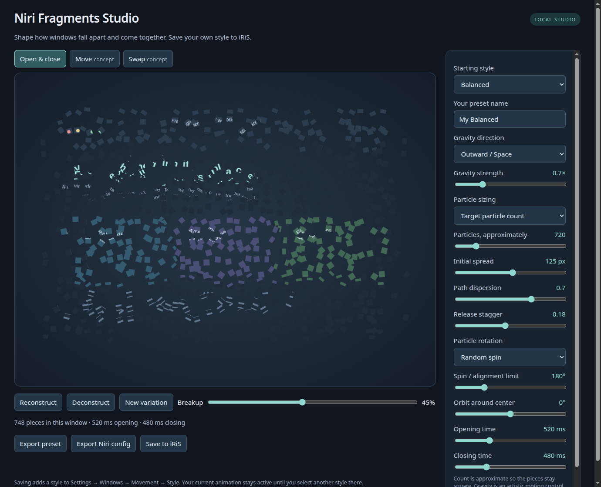

# Niri Fragments

Pixel deconstruction and reconstruction animations for Niri, with configurable
presets and native iNiR/iRiS settings integration.

Closing a window scatters pieces of its contents; opening reconstructs it.
Choose falling, drifting, spinning, or inward-spiraling fragments. Niri renders
the effect; iNiR/iRiS provides the native preset picker.



**Version 0.3 prototype.** Denser bursts, staggered release, varied flight speeds,
later dissolution, and softer edges replace the earlier preset tuning. Balanced
now targets 720 pieces; Explosion uses 1,200 and Implosion 1,000.
Studio opens as an app-style window and includes move/swap design previews.
Desktop appearance and GPU performance still need acceptance on each setup. [Validation details](docs/validation.md).

## Select a style in iRiS

Run from the checkout with Python 3.10+ (no Python runtime dependencies):

```sh
python3 -m niri_fragments register --dry-run
python3 -m niri_fragments register
```

Open **iRiS Settings → Windows → Movement → Style** and choose a Fragments
preset. Niri animations must be enabled for the picker to appear.

| Preset | Motion |
| --- | --- |
| Subtle / Balanced / Dramatic | Increasingly dense bursts: 360 / 720 / 1,100 pieces |
| Explosion | A strong outward burst of 1,200 tumbling pieces; opening implodes them back into place |
| Implosion | Pulls 1,000 pieces into the center on close; opening reverses the collapse |
| Earth | Falls down with acceleration and randomized spin |
| Black Hole | Draws pieces inward, turning them toward the center |
| Space | Drifts outward in every direction with free spin |
| Vortex | Spirals inward while fragments turn along their travel |
| Confetti | Hundreds of small tumbling pieces with downward gravity |
| Updraft | Rises with a slight orbit and direction-following rotation |

Registration adds or updates the built-in pack without activating anything.
Other user presets, including custom Fragments styles, are preserved.

## Tune and save your own style

```sh
python3 -m niri_fragments studio
```

This opens a dedicated Chromium app window, with no tabs or address bar and a
separate profile. The existing application launcher opens the same window.
The renderer is still web technology, not a native QML page. If Chromium is
unavailable, it falls back to your browser; `studio --browser` explicitly opens
a browser tab. Live controls include:

- **Gravity direction:** none, down, up, left, right, center, or outward.
- **Gravity strength:** 0–3×. Downward gravity accelerates; outward space motion
  drifts at a constant radial rate. Strength is artistic, not an SI unit.
- **Particles:** a target of 16–4096 pieces, or a fixed square size of 8–128
  logical pixels. Target counts are approximate so fragments remain square;
  very small windows also have a four-pixel minimum tile size.
- **Rotation:** none, random spin, or orientation toward the travel direction.
- **Spin:** 0–720 degrees; the random spin range or the alignment limit.
- **Orbit:** −360 to +360 degrees around the window center.
- **Spread:** 0–240 logical pixels of initial radial scatter.
- **Path dispersion:** 0–1; separates fragment speeds and curves their paths.
- **Release stagger:** 0–0.4; varies when fragments separate and dissolve.
- **Timing:** independent opening and closing durations, 100–1500 ms.

The editor uses the same shader templates as the CLI. Click **Reconstruct** or
**Deconstruct**, or scrub the timeline. Set a name and choose **Save to iRiS**;
then select that named style in iRiS's existing picker. Saving does not activate
it. Saving the same name updates that custom preset, with a backup.

The **Move** and **Swap** tabs are visual concepts: textured particles cross
between columns and reconstruct at their destinations. They are not installed
movement effects. Saving/exporting still changes only open/close behavior.
See [the compositor extension design](docs/movement.md) for the implementation path.

The controls live in Fragments Studio. iRiS's native page lists the resulting
presets; its stock thumbnail still shows generic timing rather than this shader.

The editor binds only to loopback and uses a per-session save token and origin
checks. It reads the installed iNiR helper and writes only the preset registry.
The editor page makes no external network requests. It exits within 15 minutes of the app window or tab
closing (or immediately with Ctrl+C when launched from a terminal).

For an app-launcher entry tied to this checkout:

```sh
python3 scripts/install-desktop.py
```

Search for **Niri Fragments Studio** in your application launcher. This is
on-demand; nothing is added to session startup. Keep the checkout at its current
path, or recreate the launcher after moving it.

An offline editor is also available:

```sh
python3 -m niri_fragments preview --preset earth --output /tmp/fragments.html
xdg-open /tmp/fragments.html
```

Offline mode can export a preset JSON file or standalone KDL. Import JSON with:

```sh
python3 -m niri_fragments register --custom ~/Downloads/niri-fragments-preset.json
```

## Command-line options

```sh
# Save a custom option alongside the built-in pack.
python3 -m niri_fragments register --name "Heavy Meteor" --preset earth \
  --gravity-strength 1.8 --particles 400 --rotation random --spin 360

# Render a standalone override; includes no shell integration or activation.
python3 -m niri_fragments render --preset black-hole --gravity-strength 0.8 \
  --swirl 120 --rotation gravity --particles 300 > fragments.kdl
niri validate -c fragments.kdl
```

`--tile-size` switches off target-count mode. `--particles 0` also selects fixed
sizing. `list` prints the built-in parameters as JSON. `--preset` chooses the
starting values for `render`, `preview`, `studio`, or a named `register`.

## Integration and rollback

Requires an iNiR version with `NiriAnimationPresets` and external user presets.
Registration reads the active recognized preset and copies all its non-open/close
animation settings. If active animations are custom and unrecognized, choose an
explicit `--base`, for example `--base bouncy`; the tool refuses to approximate
unknown timings. iNiR applies a whole preset when selected, so each saved style
captures its base settings at creation time. Later base edits are not inherited
automatically; re-register or save again to capture them.

Existing registries are backed up beside their resolved target and updated
atomically. Bad JSON, duplicate IDs, and foreign ID collisions are rejected.
Custom presets survive built-in pack updates. Existing symlinks are preserved.
The command prints the target and backup paths. `--inir-root` and `--registry`
support nonstandard installations; defaults follow XDG and iNiR's legacy path.

To remove all Fragments entries, select your original style in iRiS, then run:

```sh
python3 -m niri_fragments unregister
```

Unregister leaves the animation currently embedded in Niri's configuration and
retains backups. To remove the optional launcher, delete
`~/.local/share/applications/niri-fragments-studio.desktop` (or its XDG equivalent).

For standalone Niri, include generated KDL after your base animations. Remove
that include to revert. Niri live-reloads included KDL. **Use either a standalone
late override or the iNiR registry approach:** a later override otherwise keeps
winning over choices made in Settings. Inline GLSL works with Niri 26.04.

## Development and limits

```sh
python3 -m unittest discover -s tests -v
python3 scripts/validate.py --require-glsl --require-niri
python3 -m build
```

The tests include a temporary loopback server, so they need local socket access.
A dependency-free Node 22+/Chromium browser check can render all styles, compare
shader exports, check exact endpoints and gravity motion, and capture previews:

```sh
node scripts/browser-smoke.mjs file:///absolute/path/to/fragments.html
```

Use `--save-test` only with a Studio process pointed at a temporary `--registry`.
The browser check uses an isolated Chromium profile and software WebGL; it is
not a desktop GPU benchmark.

The shader uses three interleaved velocity fields, each with a bounded 3×3 source
search: at most 27 candidate cells per pixel, independent of particle count.
This costs more shader work than the earlier single-field effect.
Attraction also shrinks fragments to prevent unbounded overlap at the center;
there are no particle collisions or physical simulation. Opening reverses the
closing trajectory, with its own duration. Niri's unspecified opening draw bounds
can clip large excursions. Client-side shadows outside the window geometry are
omitted during breakup. Check real applications, transparency, fractional scale,
screen edges, and frame time before choosing an everyday style.

See [integration details](docs/integration.md) and [related work](docs/related-projects.md).
Optional installation in a virtual environment: `python3 -m pip install .`.
MIT licensed. Independent project; not affiliated with Niri or iNiR.
