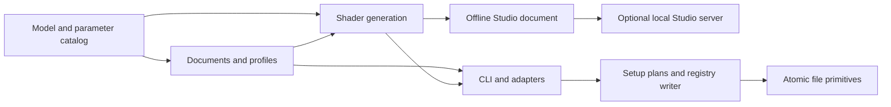

# Architecture and maintenance contracts

NiriFX generates compositor configuration from validated parameter data. It does
not run a particle daemon, replace Niri, or render a shell's UI surfaces. Studio
previews the same GLSL source using a synthetic window texture.

## Dependencies flow toward the effect model

Arrows mean “supplies data to,” not an execution order. The model, documents and
shader generation import no shell adapter, HTTP server or setup writer. A small
import-boundary test enforces that separation.

| Module | Responsibility and boundary |
| --- | --- |
| [parameters.py](../niri_fx/parameters.py), [model.py](../niri_fx/model.py) | Parameter types, limits, labels, family applicability, GLSL tokens and capability flags. No I/O. |
| [capabilities.py](../niri_fx/capabilities.py) | Separate movement/pointer parser probes, IPC executable identity and running renderer contracts. Read-only checks; never activates effects or substitutes a version string for a contract. |
| [presets.py](../niri_fx/presets.py) | Named built-in values. All built-ins leave resize off. |
| [catalog.py](../niri_fx/catalog.py) | Curated opening/closing recipes reference existing presets. Shared normalized documents and family labels feed every picker. No I/O. |
| [profiles.py](../niri_fx/profiles.py), [pointer.py](../niri_fx/pointer.py), [motion.py](../niri_fx/motion.py) | Immutable action choices, optional pointer settings and desktop springs. Null optional choices inherit; pointer strength zero explicitly disables deformation. No I/O. |
| [documents.py](../niri_fx/documents.py) | Named JSON validation, bounded reads and serialization. Independent of a shell registry. |
| [agent.py](../niri_fx/agent.py), [agent_data/nirifx/SKILL.md](../niri_fx/agent_data/nirifx/SKILL.md) | Offline operation map, canonical parameter metadata and packaged instructions for CLI consumers. No new transport or writer. |
| [effects.py](../niri_fx/effects.py), [shaders/](../niri_fx/shaders/) | GLSL assembly and KDL exports. Movement and pointer emission require separate explicit flags; combined native settings share one animation block. |
| [preview.py](../niri_fx/preview.py) | Catalog and self-contained HTML assembly from packaged assets. No network or state writes. |
| [effect-core.js](../niri_fx/effect-core.js) | Browser document validation, number formatting, shader expansion and KDL generation. No DOM, storage or WebGL. |
| [library.js](../niri_fx/library.js) | Ready-made selection, combo editing and saved-profile navigation using the Studio document and history. |
| [library.py](../niri_fx/library.py) | Document storage and reviewed activation adapters. Launch arguments fix all paths; Apply and Restore use existing transactions scoped to the same config and adapter. |
| [studio.js](../niri_fx/studio.js) | UI state, history, action editing, synthetic WebGL preview and user-triggered save/download. |
| [motion-preview.js](../niri_fx/motion-preview.js) | Labelled Canvas move/swap concepts. Not a compositor renderer. |
| [studio.py](../niri_fx/studio.py) | On-demand app launch and authenticated loopback HTTP transport. Delegates validation and writes. |
| [integration.py](../niri_fx/integration.py) | iNiR base inheritance, ownership-aware registration and backups. Never selects a style. |
| [picker.py](../niri_fx/picker.py), [qml/](../niri_fx/qml/), [gtk/](../niri_fx/gtk/) | Optional desktop launchers and reusable pickers. Toolkit views call the CLI through argument arrays; no shader renderer or configuration writer is duplicated in the UI. |
| [setup.py](../niri_fx/setup.py), [pack.py](../niri_fx/pack.py) | Inspectable plans, apply/restore snapshots, standalone includes and picker folders. |
| [storage.py](../niri_fx/storage.py) | Staged, flushed file writes and atomic replacement. Callers decide ownership, locking and symlink policy. |
| [scripts/lib/browser.mjs](../scripts/lib/browser.mjs) | Isolated Chromium lifecycle and bounded CDP requests for tests, recording and measurement. Not a runtime dependency. |

## One catalog, two execution environments

Python and browser JavaScript intentionally both validate and expand shaders:
offline HTML must work without a Python process. Avoid separately maintained
parameter lists. `preview_catalog()` serializes the Python metadata, defaults,
capabilities and templates; the browser consumes that contract.

`integer` means a user value must be whole. `glsl_type` describes emitted GLSL
syntax: slice-loop bounds need integers, while whole particle counts participate
in float arithmetic. Number formatting uses six decimals with the same tie and
negative-zero behavior in both languages. Unknown shader tokens fail explicitly. `basic` controls initial editor visibility; it never removes values from saved documents. Family-specific resize templates share the two-texture sampling contract. The varied fragment search radius is derived from wave strength in both generators, with its coverage proof beside the shader loop.

Node checks compare every preset's opening, closing and supported resize source
against Python. Browser checks then exercise actual compiled pixels and the real
HTTP save path. Shared [document cases](../tests/fixtures/documents.json) cover
accepted and rejected input on both sides. Changing a schema requires updating
both validators and those cases together.

### Portable pointer settings

A schema 1 profile keeps four shader actions: open, close, resize and movement.
Optional `motion` and `pointer` objects live beside `actions`. The pointer object
requires strength, damping and frequency. Omission or null canonicalizes to no
override; strength zero remains an explicit disabled override. The Python document
parser normalizes whole JSON numbers such as `65.0` to integers for damping and
frequency, matching JavaScript's numeric model. The native `PointerWobble` value
still requires integer controls. Shared fixtures cover both acceptance and rejection.

`animation_types(..., pointer=True)` and `render_kdl(..., pointer=True)` require
an explicit profile choice. Stock calls omit the node even for strength zero.
The browser uses equivalent options. Pointer and timed movement are composed into
one `window-movement` block; desktop springs retain their existing separate blocks.
No fifth shader action or browser pointer simulation is introduced. The built-in
pointer renderer belongs to the optional compositor extension.

The three pointer presets and bounds are canonical in `pointer.py`.
`scripts/lib/pointer_wobble.py` re-exports them for source-checkout harnesses;
recording helpers do not maintain their own copies.

## Agent consumers

`agent-info` exposes a versioned operation map and command argument arrays;
`agent-info --parameters` derives public bounds and supported families from the
same models used by validation. `agent-info --skill` reads the packaged skill
resource. The [agent guide](agents.md) explains the workflow, while repository
[AGENTS.md](../AGENTS.md) covers contributions. These interfaces are Unreleased
source-checkout additions; the package version remains 0.17.0 until a release.

Agent adapters call the existing catalog, profile, inspection, preview and setup
commands. They do not get a separate config writer. Review fingerprints, authorized
scope, transaction history and conflict-aware Restore apply equally to agents,
Studio and the terminal. Imported preset descriptions and documents remain data;
they cannot authorize commands or expand the user's requested work.

## Desktop picker state and lifetime

The line-oriented [terminal guide](../niri_fx/terminal.py) calls the same setup
and restore functions directly. It fixes the backend before review, rebuilds
the plan before confirmed Apply and pins the reviewed transaction for Undo.
Recommended choices reference the existing preset registry; they introduce no
new parameter defaults. The CLI preserves JSON output for integrations.

The QML picker and GTK/GJS picker consume `list --documents`: each catalog entry is
a complete, normalized style or profile document. `list` retains the single-effect
parameter map; `list --profiles` returns only pairings. A profile belongs to both
of its action families for filtering. Adapters dispatch `--profile` for a built-in
pairing and `--preset` for a single effect; both resolve through the same catalog.
GTK separates a toolkit-independent controller, Gio subprocess transport and ordinary
widgets. Controller tests run under Node; local runtime tests exercise the same
state transitions through GJS and the real Python CLI. AGS imports the packaged
GTK view, retaining its resource paths and avoiding a second implementation.

Selection invalidates a review and resets resize consent. Review compares the
normalized settings with what the UI displays; Apply passes the plan fingerprint
back to the CLI, which revalidates the files. A single busy operation prevents
overlapping actions. Undo names its reviewed transaction and uses a dedicated
history directory. Neither controller writes config files itself.

Standalone windows wait for in-flight operations when closed. Embedding shells
must retain the controller and application until it is idle, then disconnect and
dispose the view. Do not add cancellation timers that can terminate a writer
halfway through a multi-file transaction. Tests cover the GTK close-during-Apply
case; forced process termination remains outside that guarantee.

## Shader contract

- Vortex distortion combines uniform contraction with radius-dependent rotation
  in logical pixels. Its inverse first divides by the positive scale, then uses
  that source radius to undo rotation. Rotation preserves radius, so no iterative
  lookup is needed. The validated contraction bound keeps scale at least 0.05;
  one premultiplied texture sample supplies the result. Resize retains its separate
  ripple renderer.
- `coords_geo` is window-relative geometry; `size_geo` provides logical-pixel size.
  Convert before measuring angles, distances or circular masks on wide windows.
- Use the supplied geometry-to-texture matrices for sampling. Return transparent
  outside the supported source bounds; clamping an out-of-range sample can smear
  the last texel across the drawing surface.
- Niri texture colors are premultiplied by alpha. Fade RGB and alpha together;
  multiply generated highlight colors by sampled alpha before compositing.
- Closing generally maps progress zero to intact and one to transparent. Opening
  reverses the same path. Explicit endpoint branches avoid residual pixels and
  rounding gaps. Resize and movement have different endpoint requirements.
- Seeded functions must be deterministic during one animation. These effects are
  inverse lookups, not frame-by-frame simulations with persistent particle state.
- Bound loops independently of window area. When changing a motion field, prove
  that the candidate neighborhood still covers every contributor. Document the
  bound beside the loop; fewer particles alone need not reduce shader cost.
  The varied fragment renderer also bounds each complete velocity group before
  searching it. Its envelope includes jittered centers, wave amplitude, field
  rotation/scale, wandering and the maximum rotated piece radius. Early rejection
  must preserve iteration/compositing order for every surviving fragment.
- Preserve the distinction between stock open/close, opt-in resize,
  Canvas concepts, timed native movement and the additional pointer renderer.

The renderer-specific comments explain the applicable coordinate frames, search
bounds and scale floors. The shader bodies are deliberately kept readable as
GLSL files rather than generated strings of math inside Python or JavaScript.

### Shaped fragment geometry

`shaped.glsl` is the bounded layout renderer for explicit shapes and rotated
partitions. `fragment-shapes.glsl` owns geometry: rectangular cells, two triangular
pieces per cell, and a hexagonal axial lattice with deterministic edge ownership.
Window pixels stay attached to their source piece. Circle, ellipse, diamond and
star masks emerge inside the source region; exact endpoints restore the texture.

The source partition is oriented independently of flight spin. Size variation
shrinks pieces during flight, preserving the initial joined layout. The inverse
search accounts for the largest stretched, rotated piece, wandering, wave slope
and each lattice's centroid offset. `shape_search_radius` documents the bound;
Python and JavaScript exports must agree. Forward-transformed vertex tests and
translucent WebGL coverage checks exercise the geometry independently.

The seeded hash uses integer-valued highp arithmetic below 2^24 and power-of-two
reduction to keep particle identities stable across loop specialization. Shader
code remains stateless between frames. Existing square styles keep their three
original optimized paths; resize continues to use its separate renderer.

## File ownership and recovery

A setup plan captures logical paths, resolved targets and before/after bytes.
Apply checks that both the symlink target and current contents still match.
Restore verifies stored hashes and current contents before undoing an applied
snapshot. Failure rollback touches only bytes that still match NiriFX's writes.
Never reinterpret a conflict as permission to overwrite later user edits.

`staged_write()` writes and fsyncs a sibling temporary file; `atomic_write()`
renames it into place. The registry uses the same staging primitive but performs
its conflict check and backup before rename. An absent file is `None`; an empty
file is `b""`. Restore must preserve that distinction.

Locks coordinate cooperating NiriFX writers using the same state/registry path.
They do not lock out external editors. Atomic file replacement is not a
crash-atomic multi-file transaction. Keep snapshots and conflict checks even
when an individual rename is atomic.

## Studio trust and lifetime

Only loopback is bound. Writes require matching Host and Origin plus a per-session
token, and accept at most the shared 16 KiB document limit. Preview/catalog assets
are local; token-bearing request URLs are not logged. Documents contain named
parameters, never arbitrary shader source, paths or commands from the browser.

Saving to iNiR registers without activation. Standalone/Noctalia save targets
download stock KDL. Library's separate Review/Apply flow delegates to the selected
adapter and shared transaction backend. Standalone includes take effect when Niri
loads that configuration. Favorites have their own validated persistence path.
The server exits after its idle period; there is no session-startup service.

Experimental activation requires an explicit standalone target and per-feature
consent. The selected trusted executable validates the generated configuration;
its identity must match the IPC peer and its renderer contract must verify.
Pointer controls, enable flags and the validation executable participate in the
review fingerprint. Apply checks runtime support again before any write, even
for a plan with no file changes. Unsupported shells may preserve pointer JSON,
but their stock exports and registrations omit the native node.

`test-pointer-integration.py` exercises the real CLI and authenticated HTTP flow
against an owned nested compositor. It checks readiness before configuration,
capability loss between review and Apply, pointer-only and combined exports,
explicit disable, reload and exact Restore. Browser tests separately cover UI
choices, consent reset and stock-safe exports.

## Comments and scope

Explain invariants, units, ordering, ownership, bounds and tradeoffs. Do not narrate
assignments or add commented-out experiments. Put user instructions in scenario
guides, mathematical rationale next to the shader, and upcoming work in the
[phase plan](next-phases.md). Keep pure domain modules free of adapter shortcuts.

## Compositor portability

Niri is the supported compositor. Keep the effect model, preset descriptions,
geometry/math and Studio independent of shell-specific persistence. The current
GLSL entry points, texture uniforms, matrices and KDL export are a Niri rendering
contract, not a Wayland-wide shader interface.

A future backend would adapt textures, coordinate spaces, progress, stable seeds,
premultiplied alpha, output scale and clipping. It would also own animation
retargeting, damage/occlusion, capture restrictions and configuration. Reusing a
shader's math does not supply those lifecycle guarantees.

Hyprland's [plugin interface](https://wiki.hypr.land/Plugins/Development/Getting-Started/)
could host an experiment, but it introduces C++ integration and compositor-version
maintenance. Start with one opening/closing effect if that work is prioritized.
Keep Niri implementation direct until a second working backend demonstrates which
abstractions are useful. The [roadmap](../ROADMAP.md) tracks this deferred research.
