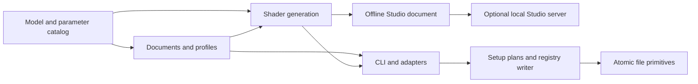

# Architecture and maintenance contracts

NiriFX generates compositor configuration from validated parameter data. It does
not run a particle daemon, replace Niri, or render a shell's UI surfaces. Studio
previews the same GLSL source using a synthetic window texture.

## Dependencies flow toward the effect model

Arrows mean “supplies data to,” not an execution order. The model, documents and
shader generation import no shell adapter, HTTP server or setup writer. A small
import-boundary test enforces that separation.

| Module | Responsibility and boundary |
| --- | --- |
| [parameters.py](../niri_fx/parameters.py), [model.py](../niri_fx/model.py) | Parameter types, limits, labels, family applicability, GLSL tokens and capability flags. No I/O. |
| [presets.py](../niri_fx/presets.py) | Named built-in values. All built-ins leave resize off. |
| [profiles.py](../niri_fx/profiles.py) | Immutable choices for separate actions. A null resize/movement slot means inherit existing behavior. |
| [documents.py](../niri_fx/documents.py) | Named JSON validation, bounded reads and serialization. Independent of a shell registry. |
| [effects.py](../niri_fx/effects.py), [shaders/](../niri_fx/shaders/) | GLSL assembly and stock KDL exports. Movement generation is a separate explicit API. |
| [preview.py](../niri_fx/preview.py) | Catalog and self-contained HTML assembly from packaged assets. No network or state writes. |
| [effect-core.js](../niri_fx/effect-core.js) | Browser document validation, number formatting, shader expansion and KDL generation. No DOM, storage or WebGL. |
| [studio.js](../niri_fx/studio.js) | UI state, history, action editing, synthetic WebGL preview and user-triggered save/download. |
| [motion-preview.js](../niri_fx/motion-preview.js) | Labelled Canvas move/swap concepts. Not a compositor renderer. |
| [studio.py](../niri_fx/studio.py) | On-demand app launch and authenticated loopback HTTP transport. Delegates validation and writes. |
| [integration.py](../niri_fx/integration.py) | iNiR base inheritance, ownership-aware registration and backups. Never selects a style. |
| [picker.py](../niri_fx/picker.py), [qml/](../niri_fx/qml/), [gtk/](../niri_fx/gtk/) | Optional desktop launchers and reusable pickers. Toolkit views call the CLI through argument arrays; no shader renderer or configuration writer is duplicated in the UI. |
| [setup.py](../niri_fx/setup.py), [pack.py](../niri_fx/pack.py) | Inspectable plans, apply/restore snapshots, standalone includes and picker folders. |
| [storage.py](../niri_fx/storage.py) | Staged, flushed file writes and atomic replacement. Callers decide ownership, locking and symlink policy. |
| [scripts/lib/browser.mjs](../scripts/lib/browser.mjs) | Isolated Chromium lifecycle and bounded CDP requests for tests, recording and measurement. Not a runtime dependency. |

## One catalog, two execution environments

Python and browser JavaScript intentionally both validate and expand shaders:
offline HTML must work without a Python process. Avoid separately maintained
parameter lists. `preview_catalog()` serializes the Python metadata, defaults,
capabilities and templates; the browser consumes that contract.

`integer` means a user value must be whole. `glsl_type` describes emitted GLSL
syntax: slice-loop bounds need integers, while whole particle counts participate
in float arithmetic. Number formatting uses six decimals with the same tie and
negative-zero behavior in both languages. Unknown shader tokens fail explicitly. `basic` controls initial editor visibility; it never removes values from saved documents. Family-specific resize templates share the two-texture sampling contract. The varied fragment search radius is derived from wave strength in both generators, with its coverage proof beside the shader loop.

Node checks compare every preset's opening, closing and supported resize source
against Python. Browser checks then exercise actual compiled pixels and the real
HTTP save path. Shared [document cases](../tests/fixtures/documents.json) cover
accepted and rejected input on both sides. Changing a schema requires updating
both validators and those cases together.

## Desktop picker state and lifetime

The line-oriented [terminal guide](../niri_fx/terminal.py) calls the same setup
and restore functions directly. It fixes the backend before review, rebuilds
the plan before confirmed Apply and pins the reviewed transaction for Undo.
Recommended choices reference the existing preset registry; they introduce no
new parameter defaults. The CLI preserves JSON output for integrations.

The QML picker and GTK/GJS picker consume the CLI's catalog and normalized documents.
GTK separates a toolkit-independent controller, Gio subprocess transport and ordinary
widgets. Controller tests run under Node; local runtime tests exercise the same
state transitions through GJS and the real Python CLI. AGS imports the packaged
GTK view, retaining its resource paths and avoiding a second implementation.

Selection invalidates a review and resets resize consent. Review compares the
normalized settings with what the UI displays; Apply passes the plan fingerprint
back to the CLI, which revalidates the files. A single busy operation prevents
overlapping actions. Undo names its reviewed transaction and uses a dedicated
history directory. Neither controller writes config files itself.

Standalone windows wait for in-flight operations when closed. Embedding shells
must retain the controller and application until it is idle, then disconnect and
dispose the view. Do not add cancellation timers that can terminate a writer
halfway through a multi-file transaction. Tests cover the GTK close-during-Apply
case; forced process termination remains outside that guarantee.

## Shader contract

- `coords_geo` is window-relative geometry; `size_geo` provides logical-pixel size.
  Convert before measuring angles, distances or circular masks on wide windows.
- Use the supplied geometry-to-texture matrices for sampling. Return transparent
  outside the supported source bounds; clamping an out-of-range sample can smear
  the last texel across the drawing surface.
- Niri texture colors are premultiplied by alpha. Fade RGB and alpha together;
  multiply generated highlight colors by sampled alpha before compositing.
- Closing generally maps progress zero to intact and one to transparent. Opening
  reverses the same path. Explicit endpoint branches avoid residual pixels and
  rounding gaps. Resize and movement have different endpoint requirements.
- Seeded functions must be deterministic during one animation. These effects are
  inverse lookups, not frame-by-frame simulations with persistent particle state.
- Bound loops independently of window area. When changing a motion field, prove
  that the candidate neighborhood still covers every contributor. Document the
  bound beside the loop; fewer particles alone need not reduce shader cost.
- Preserve the distinction between stock open/close, opt-in resize,
  Canvas concepts and the separately patched native movement interface.

The renderer-specific comments explain the applicable coordinate frames, search
bounds and scale floors. The shader bodies are deliberately kept readable as
GLSL files rather than generated strings of math inside Python or JavaScript.

## File ownership and recovery

A setup plan captures logical paths, resolved targets and before/after bytes.
Apply checks that both the symlink target and current contents still match.
Restore verifies stored hashes and current contents before undoing an applied
snapshot. Failure rollback touches only bytes that still match NiriFX's writes.
Never reinterpret a conflict as permission to overwrite later user edits.

`staged_write()` writes and fsyncs a sibling temporary file; `atomic_write()`
renames it into place. The registry uses the same staging primitive but performs
its conflict check and backup before rename. An absent file is `None`; an empty
file is `b""`. Restore must preserve that distinction.

Locks coordinate cooperating NiriFX writers using the same state/registry path.
They do not lock out external editors. Atomic file replacement is not a
crash-atomic multi-file transaction. Keep snapshots and conflict checks even
when an individual rename is atomic.

## Studio trust and lifetime

Only loopback is bound. Writes require matching Host and Origin plus a per-session
token, and accept at most the shared 16 KiB document limit. Preview/catalog assets
are local; token-bearing request URLs are not logged. Documents contain named
parameters, never arbitrary shader source, paths or commands from the browser.

Saving to iNiR registers without activation. Standalone/Noctalia save targets
download KDL. Explicit standalone `setup --apply` activates an include. Favorites
have their own validated persistence path. The server exits after its idle period;
there is no session-startup service.

## Comments and scope

Explain invariants, units, ordering, ownership, bounds and tradeoffs. Do not narrate
assignments or add commented-out experiments. Put user instructions in scenario
guides, mathematical rationale next to the shader, and upcoming work in the
[phase plan](next-phases.md). Keep pure domain modules free of adapter shortcuts.
