# Full effect catalog

Prefer a lighter page? Use the [searchable, click-to-play gallery](https://jturbide.github.io/niri-fx/gallery/).
This reference keeps every preset and control comparison together.

## See it in motion

[Fragments](#twenty-three-fragment-styles) · [Slices](#twelve-slice-styles) · [Wobble](#seven-elastic-styles) · [Reveals](#dissolve-and-iris-reveals) · [Pixels](#pixel-wipes-and-dust) · [Wisps](#wisps-and-currents) · [Distortions](#shockwaves-and-distortions) · [Profiles](#combine-different-actions) · [Compare the controls](#one-control-at-a-time) ·
[Custom examples](#three-custom-examples) · [Resize](#resize--opt-in) ·
[Movement](#experimental-movement-and-swaps) · [Real workflows](#real-desktop-workflows) · [Install](../README.md#quick-start)

All **64 presets** have a recording. The [visual scenario index](showcases.md)
also helps you compare controls and choose a combination for everyday use,
strong explosions, drifting dust, subtle distortion or different open/close actions.

Opening and closing use the **Explosion** preset. Fragments keep pieces of the
window's actual texture, then reconstruct those pieces in their original places.
These clips use Studio's real shader renderer with synthetic content at 20 fps.

| Open · reconstruct | Close · explode |
| --- | --- |
| 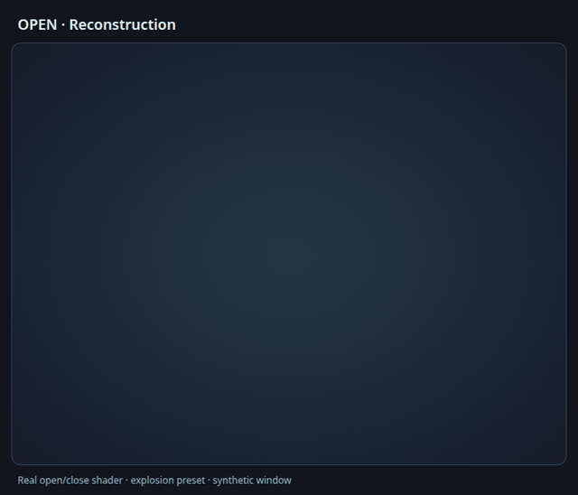 | 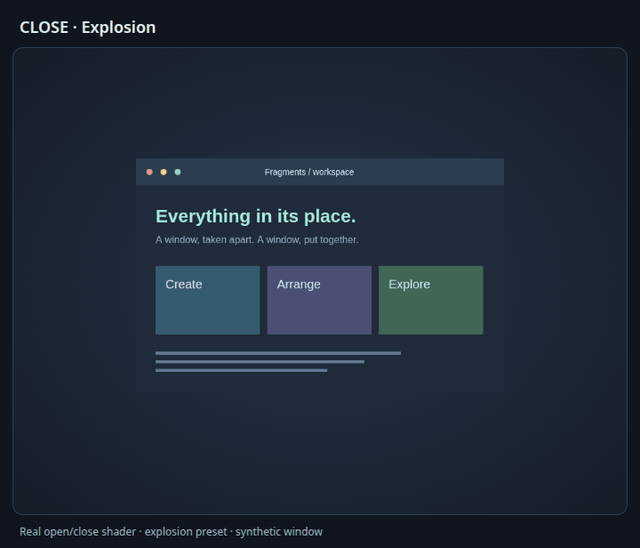 |

### Twenty-three fragment styles

Every loop closes and opens at that preset's configured timing. Start with
**Balanced** for an everyday burst, **Explosion** for a stronger outward blast,
or **Implosion** for an inward collapse.

| Subtle | Balanced | Dramatic |
| --- | --- | --- |
| 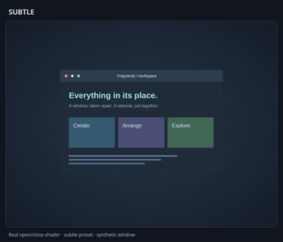 |  |  |
| Compact · 360 pieces | Everyday · 720 pieces | Wide burst · 1,100 pieces |
| **Explosion** | **Implosion** | **Earth** |
| 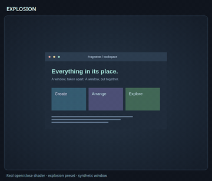 |  |  |
| Outward blast · 1,200 pieces | Inward collapse · 1,000 pieces | Downward gravity · 600 pieces |
| **Black Hole** | **Space** | **Vortex** |
|  | 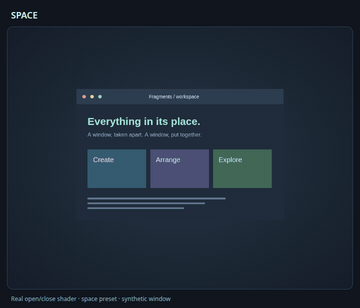 |  |
| Center pull + turning | Outward drift + free spin | Center pull + orbit |
| **Confetti** | **Updraft** | |
|  |  | |
| Tumbling shower · 1,600 pieces | Upward pull + gentle orbit | |

Counts are targets, not exact totals; square tiles adapt to each window's shape.

**Release pieces in waves, move the burst origin, or spiral into a central collapse.**

| Directional Wave | Corner Burst | Orbital Collapse |
| --- | --- | --- |
| 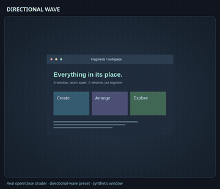 | 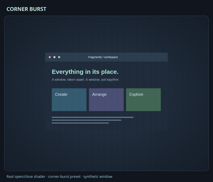 |  |
| 900 pieces · staged release | 1,200 pieces · lower-left origin | 1,400 pieces · 300° orbit |
| [Settings JSON](../examples/directional-wave.json) | [Settings JSON](../examples/corner-burst.json) | [Settings JSON](../examples/orbital-collapse.json) |

### Waves and varied fragments

Unequal pieces, travelling waves and seeded direction variation add more organic
motion. These controls also feed the separate native movement experiment.

| Tidal Fragments | Mosaic Burst | Chaotic Confetti |
| --- | --- | --- |
|  |  | 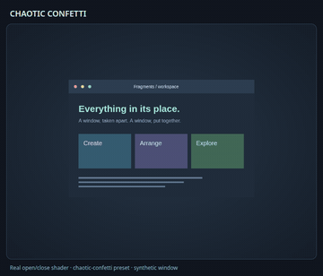 |
| [Settings JSON](../examples/tidal-fragments.json) | [Settings JSON](../examples/mosaic-burst.json) | [Settings JSON](../examples/chaotic-confetti.json) |
| **Crosswind** | **Orbital Ribbons** | |
|  |  | |
| [Settings JSON](../examples/crosswind.json) | [Settings JSON](../examples/orbital-ribbons.json) | |

**Uniform / unequal cells / travelling wave.** Same starting preset and timing;
size variation and wave motion are shown separately.

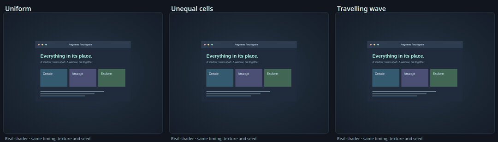

### Piece shapes and spatial releases

**Pixel Dust** shrinks into fine debris; **Bubble Burst** rounds the textured
pieces. **Core Detonation** spreads outward from the burst origin, while
**Checker Scatter** releases alternating spatial groups. Each rebuilds an intact window.

| Pixel Dust | Bubble Burst |
| --- | --- |
|  |  |
| [Settings JSON](../examples/pixel-dust.json) | [Settings JSON](../examples/bubble-burst.json) |
| **Core Detonation** | **Checker Scatter** |
| 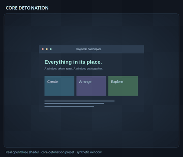 |  |
| [Settings JSON](../examples/core-detonation.json) | [Settings JSON](../examples/checker-scatter.json) |

**Square / rounded / extra shrink.** Same timing, density, seed and trajectory;
only the named shape control changes.


**Core / outer regions / diagonal.** Compare three spatial release sequences.
The Checker Scatter preset above releases alternating groups of pieces.

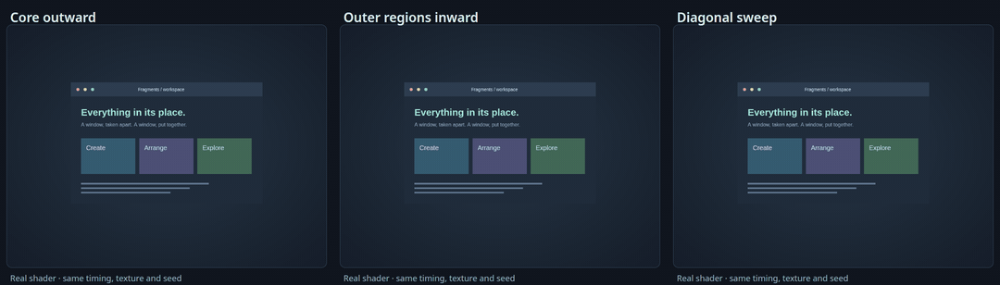

### One control at a time

These synchronized comparisons use the **same texture, seed, timing and other
settings within each row**. Each closes, pauses and reconstructs; only the named
control changes. They are examples of settings, not additional built-in presets.

**Particle count — 180 / 720 / 2,400.** Fewer pieces give a chunky breakup;
more pieces produce a finer cloud. This is a visual comparison, not a benchmark.

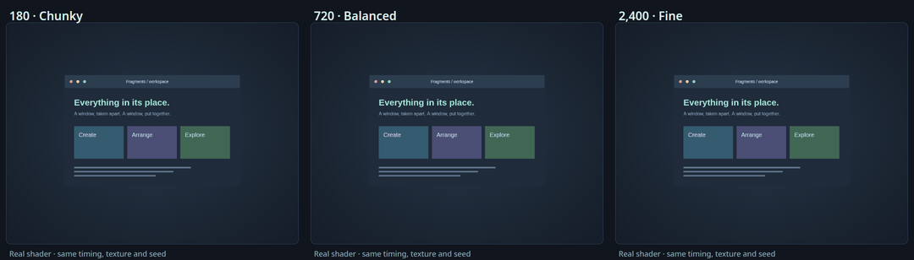

**Gravity direction — down / center / outward.** Fall like debris, collapse
into a central point, or spread in every direction.

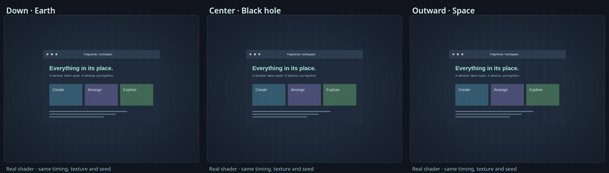

**Gravity strength — 0.3× / 1× / 2×.** The same downward direction ranges from
a gentle fall to a stronger pull. Strength is an artistic multiplier.

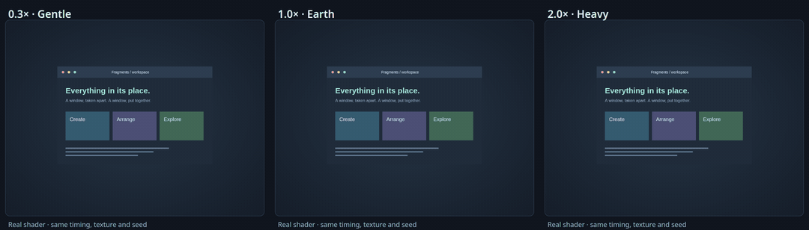

**Rotation — none / random / follow travel.** Larger pieces make the change in
orientation easier to see; all three use the same 180-particle target.

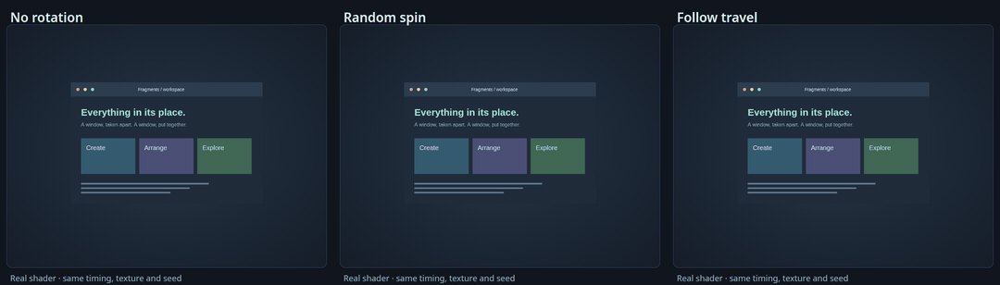

**Burst origin — center / upper left / lower right.** Move the point from which
pieces scatter and around which they orbit; everything else is held constant.

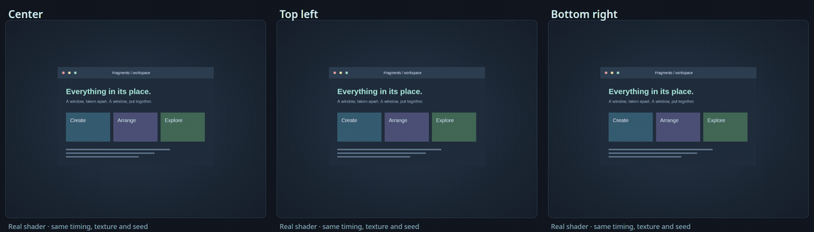

### Three custom examples

Combine the controls to create your own style. These downloadable examples use
the Fragments family; they are separate from the built-in presets. **Resize is off
in all three.** The JSON files contain the exact parameters used for the GIFs.

| Meteor Shower | Orbit Burst | Reverse Gravity |
| --- | --- | --- |
| 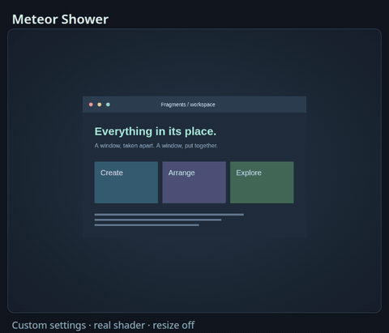 |  | 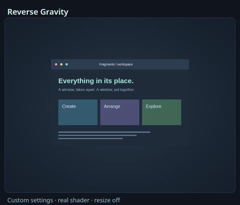 |
| 1,800 pieces · 1.7× down · 540° spin | 1,500 pieces · outward drift · 180° orbit | 1,000 pieces · 1.55× up · −70° orbit |
| [Settings JSON](../examples/meteor-shower.json) | [Settings JSON](../examples/orbit-burst.json) | [Settings JSON](../examples/reverse-gravity.json) |

From the checkout, add an example to iRiS and then select it in Settings:

```sh
python3 -m niri_fx register --custom examples/meteor-shower.json
```

Use the other JSON filenames to add those styles too. Registration does not
activate an effect. [Preview commands and standalone export instructions](../examples/README.md)
let you try the same examples without iNiR or any desktop configuration changes.

### Hexagonal breakup

Hexagon Burst separates the window into spinning hexagonal tiles. Hive Collapse
pulls the same lattice inward. Radius, spread, rotation and stagger are adjustable.

| Hexagon Burst | Hive Collapse |
| --- | --- |
|  |  |
| [Settings](../examples/hexagon-burst.json) | [Settings](../examples/hive-collapse.json) |

### Twelve slice styles

Whole strips slide, rotate and reassemble. **Slide Apart alternates adjacent
horizontal strips**; **Split Curtain** separates the window into outward-moving halves.
Choose random directions, release order, unequal widths and travelling waves.
Slices supports stock Niri open/close and optional Accordion Resize. Native movement uses the experimental build.

| Slide Apart | Alternating Blinds | Diagonal Shear |
| --- | --- | --- |
|  | 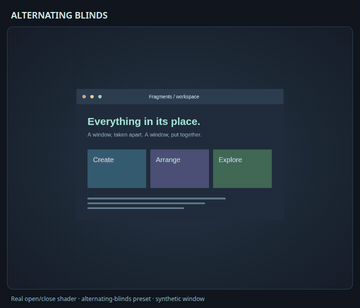 | 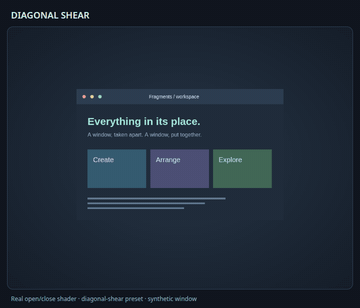 |
| [Settings JSON](../examples/slide-apart.json) | [Settings JSON](../examples/alternating-blinds.json) | [Settings JSON](../examples/diagonal-shear.json) |
| **Split Curtain** | **Ribbon Wave** | **Shuffled Slats** |
| 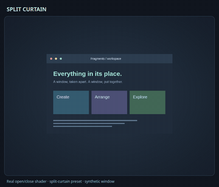 |  | 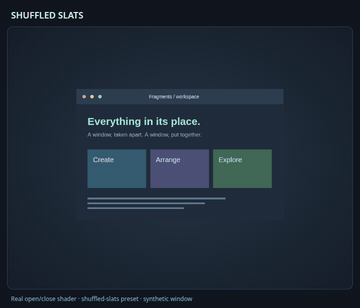 |
| [Settings JSON](../examples/split-curtain.json) | [Settings JSON](../examples/ribbon-wave.json) | [Settings JSON](../examples/shuffled-slats.json) |
| **Venetian Sweep** | | |
| 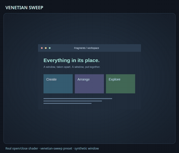 | | |
| [Settings JSON](../examples/venetian-sweep.json) | | |

**Hinges and shutters.** Rotate around either end, compress strip width, or
combine both with travelling waves and staggered release. These are 2D strip
transforms, not a 3D page-turn simulation.

| Hinged Fan | Venetian Shutter |
| --- | --- |
|  |  |
| [Settings JSON](../examples/hinged-fan.json) | [Settings JSON](../examples/venetian-shutter.json) |
| **Ribbon Fold** | **Zipper** |
|  | 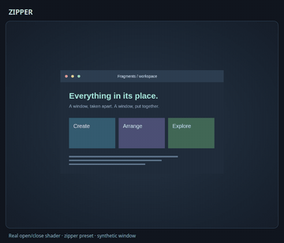 |
| [Settings JSON](../examples/ribbon-fold.json) | [Settings JSON](../examples/zipper.json) |

**Hinge position — first end / center / other end.** Same strip rotation and travel.

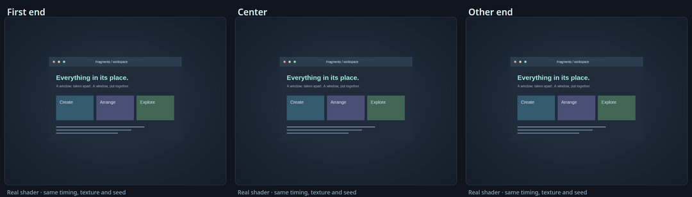

**Width collapse — none / half / full.** Watch shutter strips become progressively thinner.

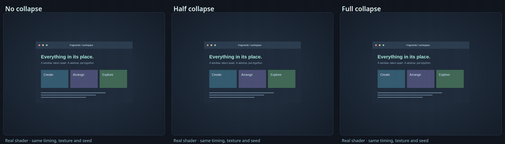

**Direction — split halves / alternate / random.** Each random strip chooses its
own direction; there is no forced 50/50 distribution.

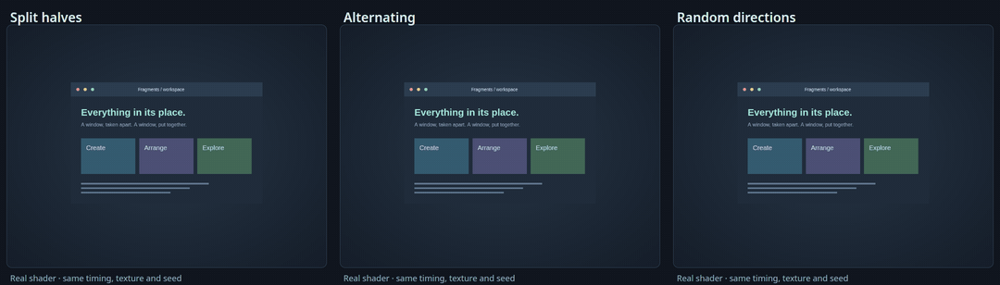

**Release order — forward / center / random.** Control where separation begins.

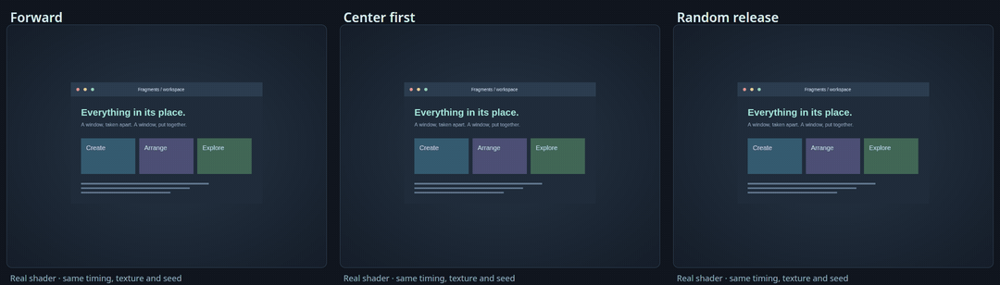

**Slice count — 4 / 12 / 32.** Same timing, texture and alternating motion.

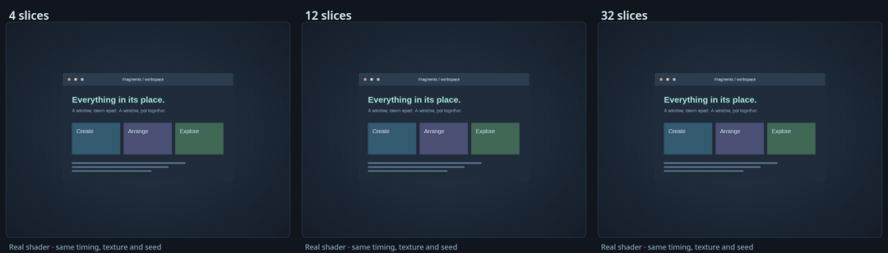

### Seven elastic styles

A Compiz-inspired spring feel: bend the whole window, let it oscillate, then
settle. Tune strength, frequency, damping and axis. These are timed open/close
shaders; native swaps use the experimental compositor. Interactive drag physics
is not implemented. Animated size changes support opt-in Elastic Stretch.

| Spring Wobble | Rubber Band | Jelly |
| --- | --- | --- |
| 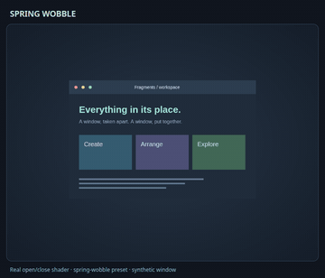 |  | 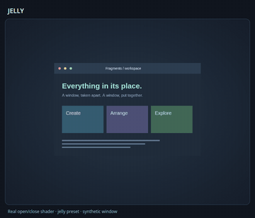 |
| [Settings JSON](../examples/spring-wobble.json) | [Settings JSON](../examples/rubber-band.json) | [Settings JSON](../examples/jelly.json) |

Twist around the center or a corner, add spatial ripples, and exaggerate spring
stretching. **Transform origin** controls rotation, stretching and collapse;
it does not pin an edge to the pointer or simulate cloth.

| Twist Snap | Flag Wave |
| --- | --- |
|  |  |
| [Settings JSON](../examples/twist-snap.json) | [Settings JSON](../examples/flag-wave.json) |
| **Corner Spring** | **Accordion** |
|  |  |
| [Settings JSON](../examples/corner-spring.json) | [Settings JSON](../examples/accordion.json) |

**Simple bend / twist / ripple.** Matched timing and spring settings, with one
added control in each comparison panel.

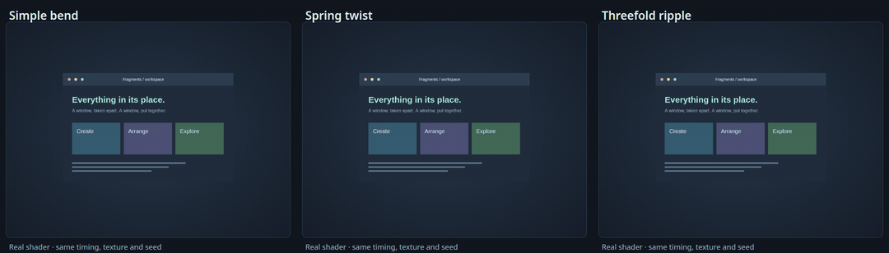

**Same duration, different springs:** compare all three at matched timing.

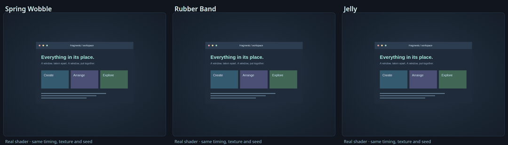

[Controls and CLI examples](effect-controls.md) explain how to tune these
styles. Resize remains off in all built-ins.

### Dissolve and iris reveals

Erode the window through seeded noise, or reveal it with an aspect-correct mask.
These are stock Niri open/close shaders. Resize stays off.

| Noise Dissolve | Ember Erosion | Frost Vanish |
| --- | --- | --- |
|  | 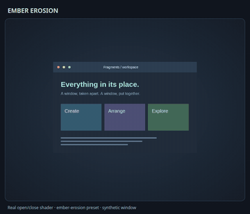 | 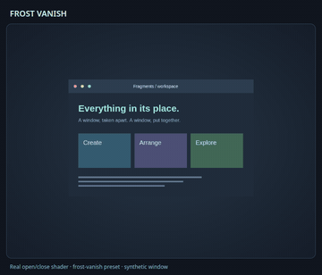 |
| [Settings](../examples/noise-dissolve.json) | [Settings](../examples/ember-erosion.json) | [Settings](../examples/frost-vanish.json) |
| **Iris Bloom** | **Diamond Turn** | **Portal Out** |
|  | 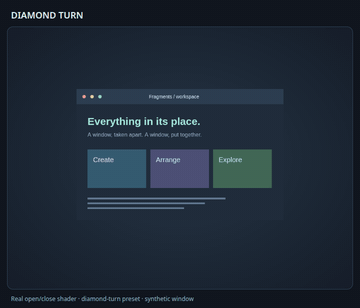 |  |
| [Settings](../examples/iris-bloom.json) | [Settings](../examples/diamond-turn.json) | [Settings](../examples/portal-out.json) |

**Noise size — 12 / 32 / 90 logical pixels.** Direction, color and timing stay fixed.

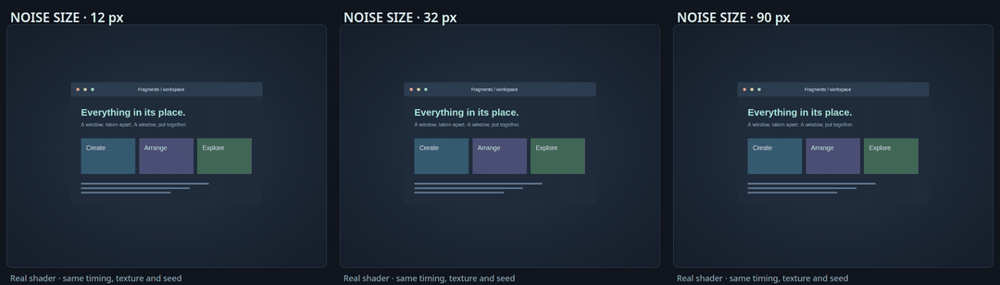

**Reveal shape — circle / diamond / square.** Same origin, softness and timing.

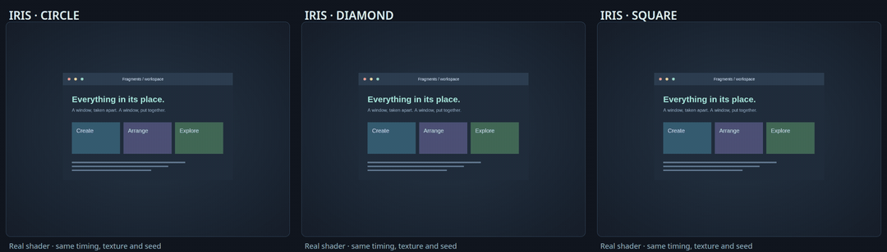

**Ember defaults to charcoal and white.** Adjust hue, saturation and brightness
for a white, black or warm edge. Layered noise and flowing detail shape the erosion.
Frost keeps its cool, fine-grained look.

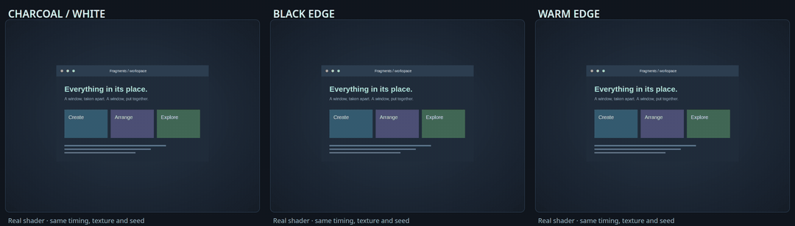

<details>
<summary>Compare erosion flow: still field, gentle flow and stronger flow</summary>

Only flow changes: **0 / 0.7 / 1.4**, with the same monochrome edge and timing.
Zero stops the noise field's travel; the window still erodes and reconstructs.

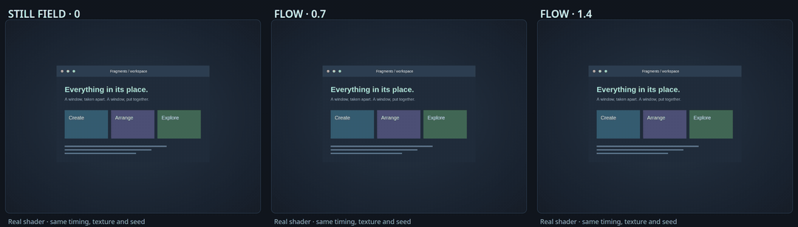

</details>

### Pixel wipes and dust

A radial grid wipe, progressive pixelation, or fine grains drifting on the wind.
Choose the starting point, wipe direction, grain size, randomness and dust travel.
The origin is a configured point in the window, not the live mouse pointer.

| Pixel Wipe | Pixelate | Dust Drift |
| --- | --- | --- |
| 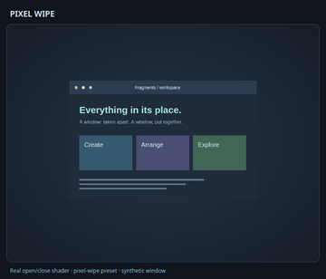 | 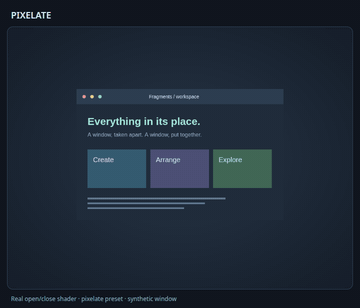 | 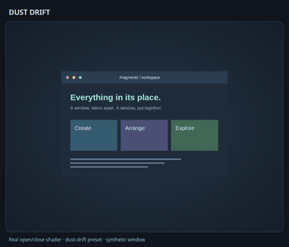 |
| [Settings](../examples/pixel-wipe.json) | [Settings](../examples/pixelate.json) | [Settings](../examples/dust-drift.json) |

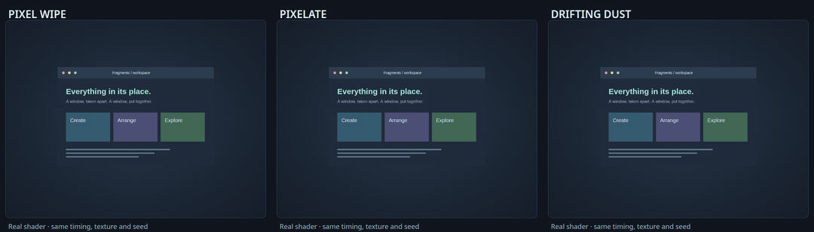

<details>
<summary>Compare wipe direction, dust size and wind</summary>

**Wipe direction — center out / edges in / left to right.** This controls the
release front, independently of dust travel.

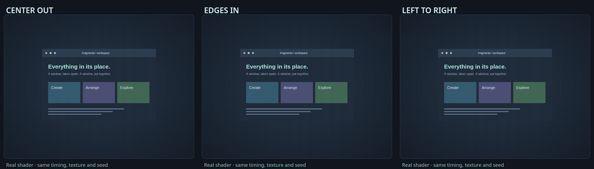

**Dust size — 4 / 8 / 16 logical pixels.** Travel stays at eight cells, so larger
grains also travel farther in pixels. Timing and wind stay fixed.

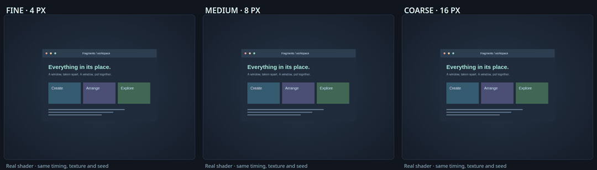

**Wind — up / right / down.** All three keep the same left-to-right release front.

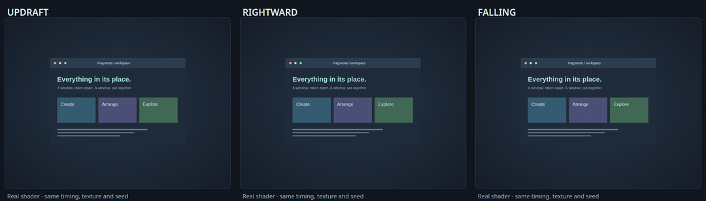

</details>

### Wisps and currents

Threaded erosion and flowing texture distortion produce wisps. Adjust curl,
drift, thread density, direction and highlight color; the original texture alpha
is preserved. These are shader flows, not a fluid simulation.

| Ghost Wisps | Ink Current |
| --- | --- |
| 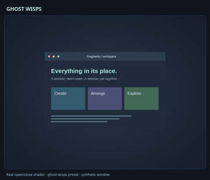 |  |
| [Settings](../examples/ghost-wisps.json) | [Settings](../examples/ink-current.json) |

<details>
<summary>Compare wisp curl and white, ink or teal threads</summary>

**Curl — 0 / 0.8 / 1.6.** Direction, thread density and color stay fixed.

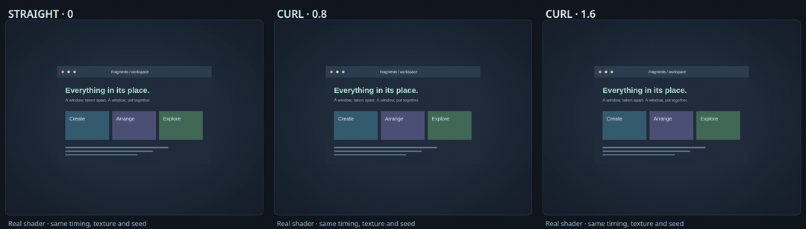

**Palette — white / ink / teal.** Hue, saturation and brightness define the
highlight palette; the source window texture is the same in every panel.

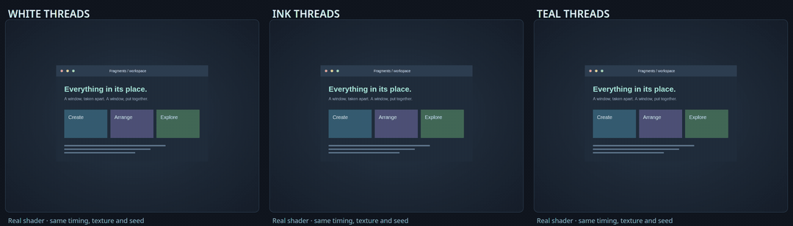

</details>

### Shockwaves and distortions

Bend the actual window texture with an expanding shock front, concentric ripples
or travelling planar waves. Control displacement, wavelength, falloff and origin.
Distortion uses stock Niri open/close, optional Ripple Resize and experimental native movement.

| Shockwave | Ripple Collapse | Wave Fold |
| --- | --- | --- |
| 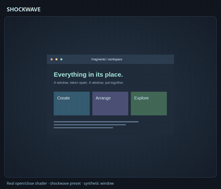 |  | 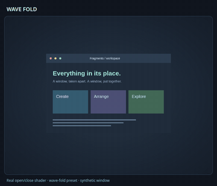 |
| [Settings](../examples/shockwave.json) | [Settings](../examples/ripple-collapse.json) | [Settings](../examples/wave-fold.json) |

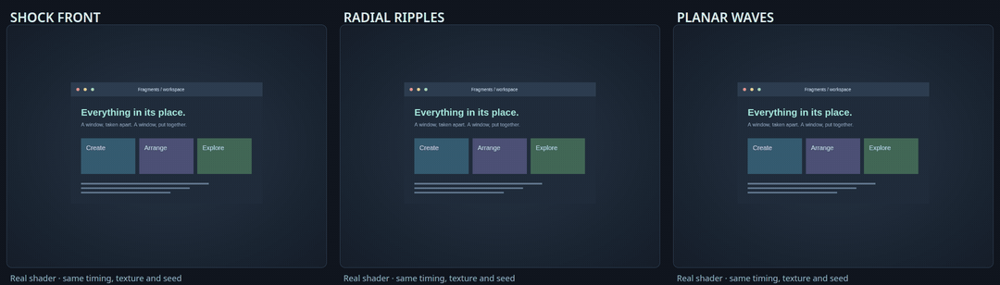

<details>
<summary>Compare distortion strength and shockwave origins</summary>

**Ripple displacement — 0 / 28 / 56 logical pixels.** At zero, the fade remains
without texture warping. Wavelength, falloff and timing stay fixed.

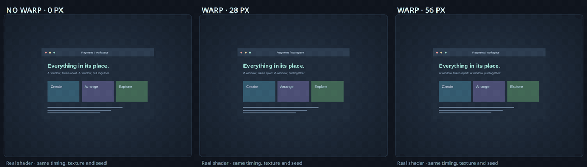

**Shockwave origin — center / near the left edge / lower corner.** The origin is
a configured window-relative point; it does not follow the pointer.

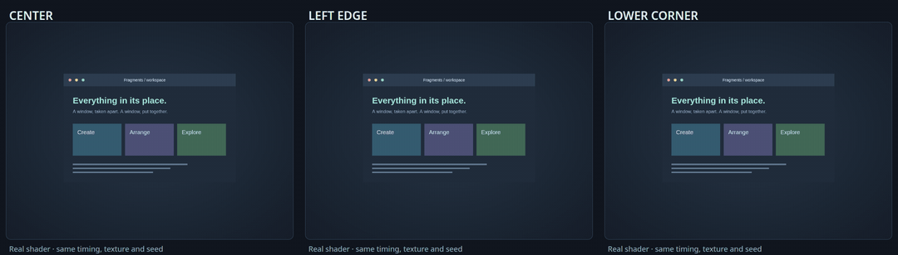

</details>

[Burn My Windows](https://github.com/Schneegans/Burn-My-Windows) supplied the visual
references for pixel wipes, disintegration and wisps. These NiriFX shaders are
original implementations; no upstream shaders or preview assets are bundled.
[Controls and limits](effect-controls.md).

### Combine different actions

Open with Spring Wobble and close with Ember Erosion in the same profile.
Studio includes independent action editing, undo/redo, parameter reset,
search, favorites and a pinned A/B comparison. [Profile guide](profiles.md).

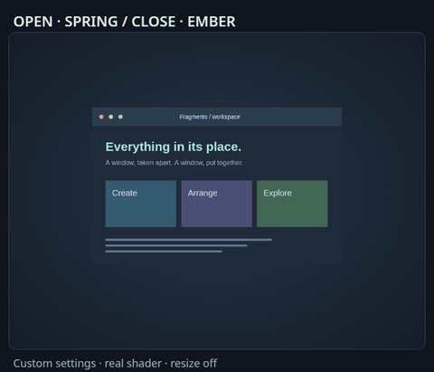

Three more combinations are ready to import into Studio. These loops close,
then open, using each action's own timing. **Resize remains off in all four profiles.**

| Burst and Drift | Frost and Fragments | Ghost and Shockwave |
| --- | --- | --- |
| 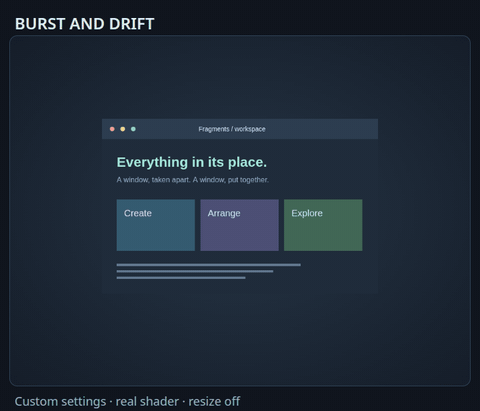 | 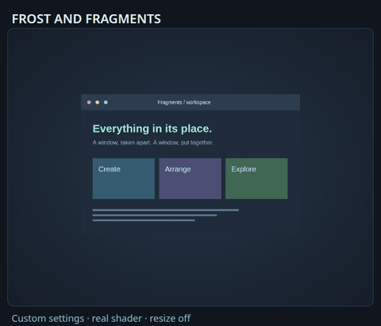 | 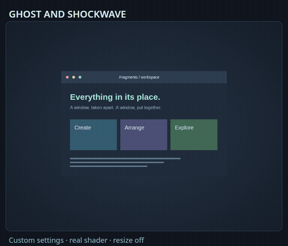 |
| Open: Explosion · Close: Dust Drift | Open: Frost Vanish · Close: Pixel Dust | Open: Ghost Wisps · Close: Shockwave |
| [Import JSON](../examples/profiles/burst-and-drift.json) | [Import JSON](../examples/profiles/frost-and-fragments.json) | [Import JSON](../examples/profiles/ghost-and-shockwave.json) |

[Preview or export these profiles](../examples/profiles/README.md).

### Resize — opt-in

**Disabled by default.** When explicitly enabled, the actual resize shader breaks
up the old window texture and rebuilds the contents at the new size.

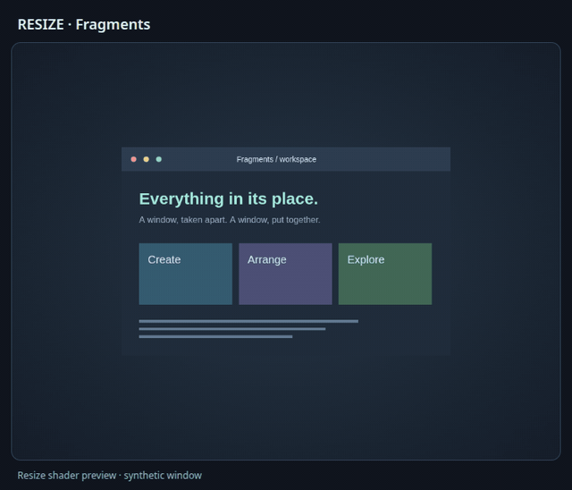

Enable **Resize effect** in Studio or pass `--resize` when
saving/rendering a style. Ordinary resizing stays in place unless you opt in.

Three styles let you choose how much of the window breaks apart. **The example
JSON below explicitly enables resize**; importing it loads that choice into the
editor, and applying the resulting preset enables it on the desktop.

| Full Breakup | Edge Rebuild | Soft Reflow |
| --- | --- | --- |
| 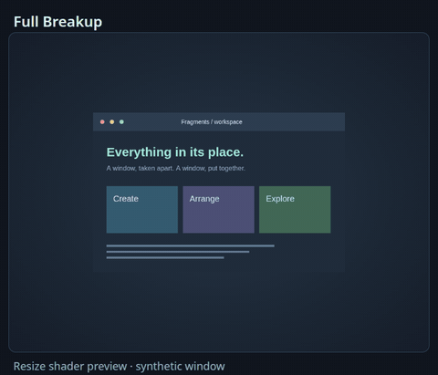 |  | 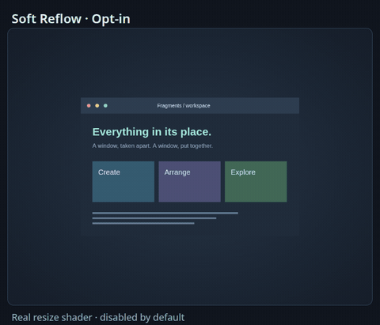 |
| Whole-window effect | Preserves the center | Gentler blend |
| [Opt-in JSON](../examples/resize-full.json) | [Opt-in JSON](../examples/resize-edge.json) | [Opt-in JSON](../examples/resize-soft.json) |

### Experimental movement and swaps

**Native column swap — requires the patched Niri build.** Two real synthetic
demo clients deconstruct, exchange columns and reconstruct inside a nested
compositor. Both streams overlap during the swap; particles are still rendered
per window, with no shared collision simulation or particle-level interleaving.

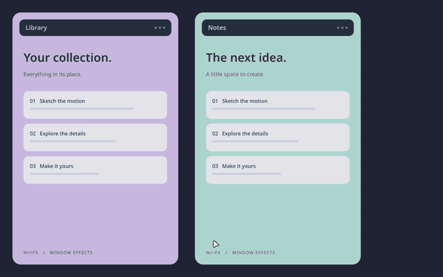

**Wave and spring styles**, recorded with the experimental Niri build:

| Crosswind | Orbital Ribbons | Spring Wobble |
| --- | --- | --- |
| 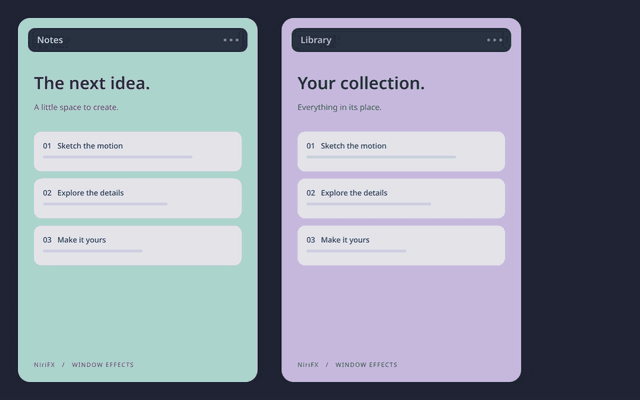 |  |  |
| Sideways fragment wave | Curved fragment streams | Continuous elastic windows |

**Rounded fragments, staged bursts and twisting windows:**

| Bubble Burst | Core Detonation | Twist Snap |
| --- | --- | --- |
| 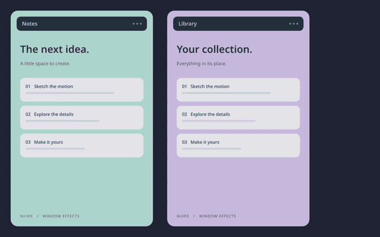 |  | 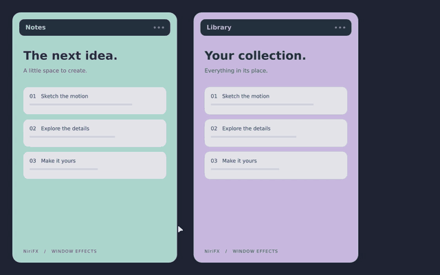 |
| Rounded texture pieces | Staged breakup | Opaque spring rotation |

**Studio concept comparison — Crosswind / Orbital Ribbons / Tidal Fragments.**
This is the Canvas choreography preview, separate from the native recordings.

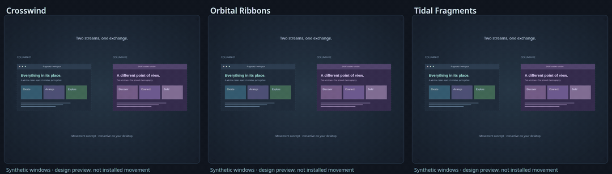

**Studio design concepts:** the two clips below show the intended move/swap
choreography. They are Canvas previews, with different trajectories and particle
ordering from the native patch. Saving them does not install movement effects.

| Move concept | Swap concept |
| --- | --- |
| 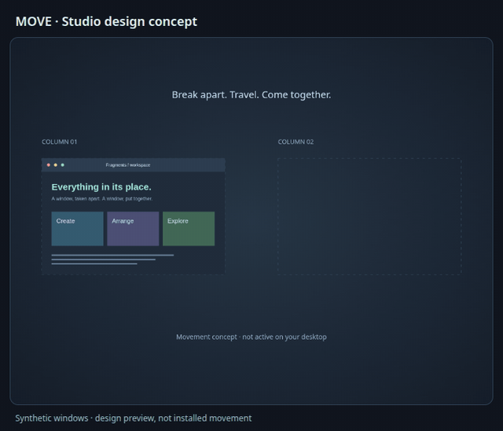 | 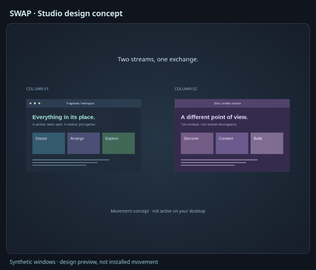 |

See [the experimental build and limitations](../experimental/README.md) before
trying native movement. Direct dragging and seamless interrupted swaps remain
future work. The standard installation uses stock Niri.

All clips use synthetic content; GIF scaling and palette reduction affect fine
edges. [Recording details and reproduction commands](gifs/README.md).

### Real desktop workflows

**Studio: import → tune one action → compare A/B → Undo/Redo → export.**
This recording uses the actual controls and download buttons with the
[Burst and Drift profile](../examples/profiles/burst-and-drift.json).

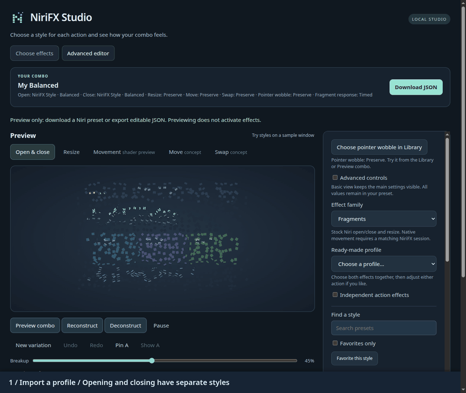

**Choose a style from your shell.** Select mixed-action profiles in iRiS, search
presets and Undo changes in DMS, or use Noctalia's Niri Animations picker.
The iRiS and DMS clips use the shells' real UI components in isolated demo windows;
the Noctalia clip uses its running shell. The iRiS cards show timing previews.
[Setup guides](scenarios.md) · [Tested versions and details](validation.md#workflow-and-compositor-scenarios)

| iRiS · mixed profiles and return to Snappy | DMS · search, apply, Undo and Studio |
| --- | --- |
| 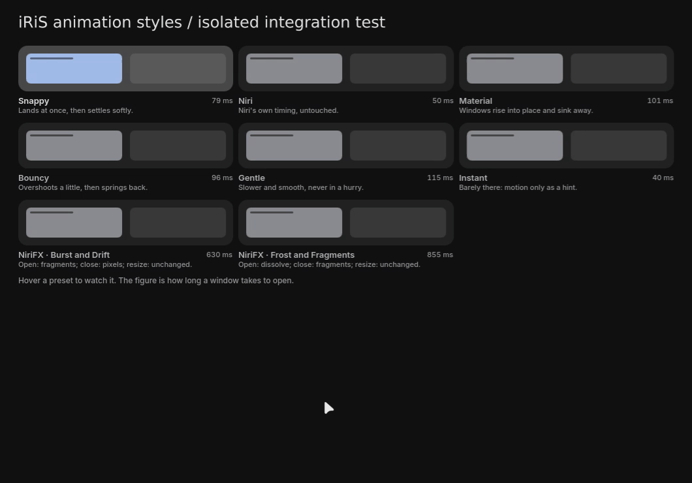 |  |

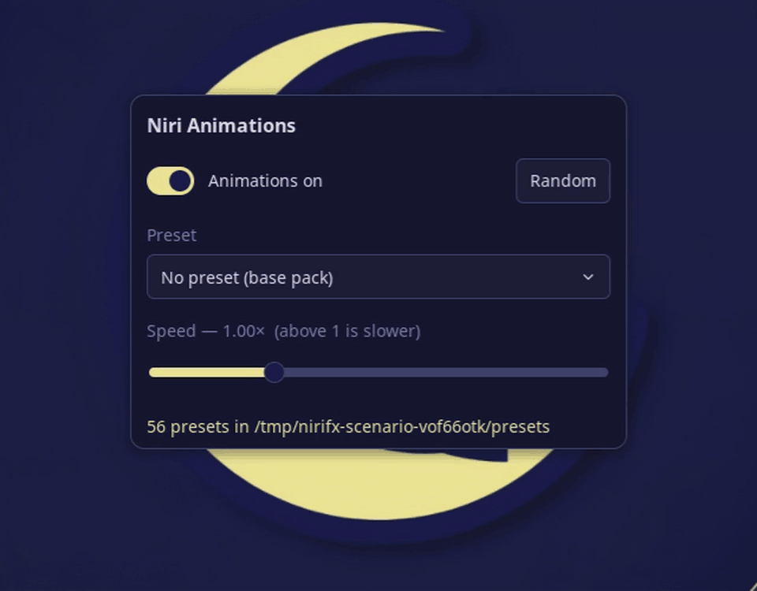

**See how transparent windows break apart.** These stock Niri recordings show
fragments and wisps around transparent margins and a gap between two shapes.
Resize is off in both examples.

| Fragment explosion | Ghost Wisps |
| --- | --- |
|  |  |

More cases: [wide Shockwave](gifs/stock-wide-shockwave.gif),
[tall Pixel Wipe](gifs/stock-tall-pixels.gif), and
[Frost at 1.5× scale](gifs/stock-fractional-frost.gif).
The Frost example uses a single scaled output; mixed-monitor testing is still planned.

**Change direction or close a moving window.** These experimental Niri recordings
show windows reconstructing after repeated moves and after one window closes.
Interrupted effects retain their phase and seed; direction impulses blend on retarget.
The experimental compositor also preserves sampled tile/column position velocity
through interrupted moves. Acceleration, camera motion and direct dragging remain
separate work; see [movement behavior](movement.md).

| Reverse direction during movement | Close during movement |
| --- | --- |
|  |  |

The [scenario index](showcases.md) maps the **134-GIF gallery** to practical
choices. See the [roadmap](../ROADMAP.md) for planned improvements.

## New ways to resize and swap

Resize remains **off in every built-in preset**. These separate profiles opt into
Elastic Stretch, Accordion Resize or Ripple Resize on stock Niri's animated size
changes. They do not add pointer-driven wobble while dragging an edge.

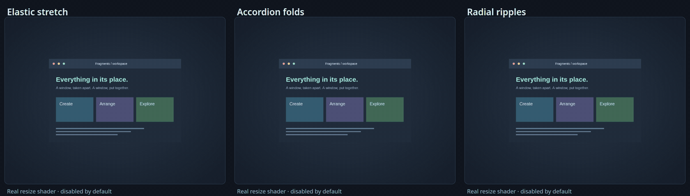

[Elastic profile](../examples/profiles/elastic-resize.json) ·
[Accordion profile](../examples/profiles/accordion-resize.json) ·
[Ripple profile](../examples/profiles/ripple-resize.json) · [Resize guide](resize.md)

The experimental movement build adds three distinct swap styles:

| Slice Exchange | Pixel Transfer | Soft Phase |
| --- | --- | --- |
|  | 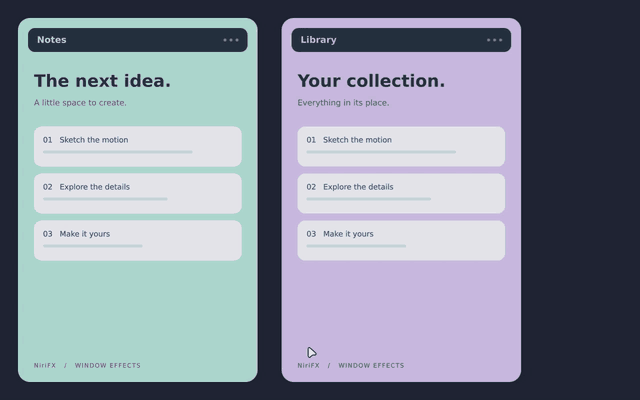 | 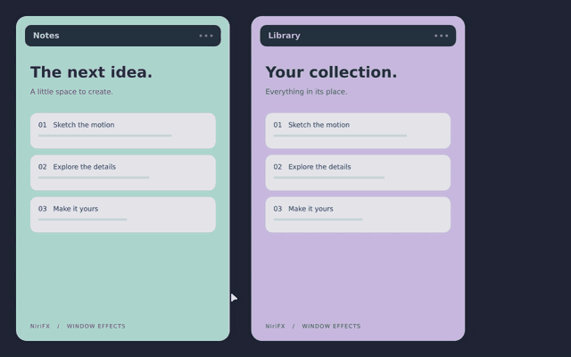 |

Interrupted swaps retain their deformation and seed. Closing during an opening
continues the original trajectory while fading out, instead of starting a new
breakup. These continuity changes require the experimental compositor.


The same presets also support stock opening and closing:

| Slice Exchange | Pixel Transfer | Soft Phase |
| --- | --- | --- |
|  |  |  |
| [Settings](../examples/slice-exchange.json) | [Settings](../examples/pixel-transfer.json) | [Settings](../examples/soft-phase.json) |

### Ink and signal distortion

Ink Spread and Ink Bloom create a turbulent spreading edge. Signal Glitch is
monochrome by default; Chromatic Glitch adds adjustable color separation.

| Ink Spread | Ink Bloom |
| --- | --- |
|  | 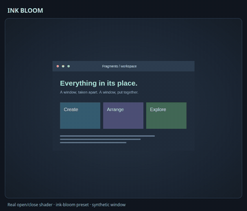 |
| **Signal Glitch** | **Chromatic Glitch** |
|  |  |
