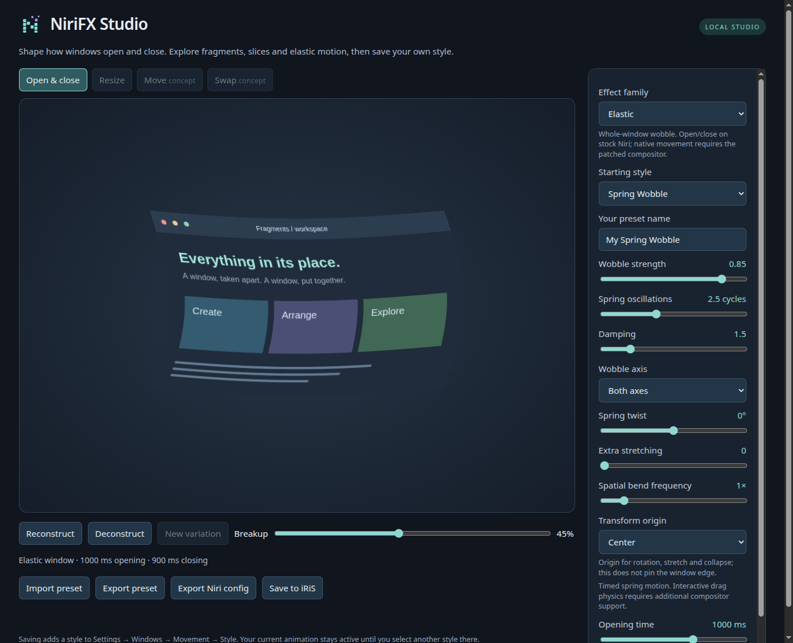

# Effect controls

This guide follows **main**. For a tagged release, use the guide shipped with that
version and consult the [changelog](../CHANGELOG.md). All built-ins leave resize disabled.

## Fragments

The **Piece shape** selector offers square, rectangle, triangle, circle, ellipse,
hexagon, diamond and star. The [shape guide](fragment-shapes.md) explains proportions,
orientation, emergence timing and how pieces reconstruct without gaps.

Existing square styles use a compact renderer, or a wider lookup when size
variation, direction variation or a travelling wave is nonzero. Other shapes and
rotated layouts use a bounded geometry renderer; larger aspect ratios and waves
can increase its cost.

| Control / CLI flag | Meaning |
| --- | --- |
| Extra piece shrink / `--fragment-shrink` | 0–1. Adds up to 85% scale reduction during flight on top of the ordinary dissolution. |
| Rounded corners / `--fragment-roundness` | 0–1. Corners round after release; 1 turns square pieces into discs. Unequal cells become rounded rectangles. Endpoints remain intact. |
| Spatial release / `--release` | Adds `center`, `edges`, `diagonal` and `checkerboard` to the directional sequences. Center/edges use the configured burst origin; checkerboard alternates two groups in a 6×6 spatial partition. `--wave-span` controls their separation. |
| Unequal piece sizes / `--size-variation` | 0–1. Jitters shared grid boundaries, creating rectangular pieces without missing texture between cells. Zero retains square tiles. |
| Direction variation / `--direction-variation` | 0–1. Rotates each of three seeded motion bands by up to ±180°. Existing dispersion adds independent per-piece path variation. |
| Wave strength / `--wave-strength` | 0–1. Bends the field of rigid pieces along a sinusoidal path. |
| Wave frequency / `--wave-frequency` | 0.25–4 spatial cycles. Lower values produce broader waves. |
| Wave speed / `--wave-speed` | 0–4 temporal cycles over the animation. Zero freezes phase while the wave's amplitude still grows and fades. |

Shared boundaries move at most 20% of a cell, so individual widths/heights range
from 60% to 140% of the nominal size. Particle count remains a target. Randomness
is fixed within an animation; **New variation** changes the seed in Studio.
Niri supplies a fresh seed for each animation.

**Tidal Fragments** makes a broad wave; **Mosaic Burst** emphasizes unequal pieces;
**Chaotic Confetti** mixes tumbling fragments and varied paths; **Crosswind** sweeps
sideways; **Orbital Ribbons** combines waves with an inward orbit.

```sh
python3 -m niri_fx preview --preset crosswind --output /tmp/crosswind.html
python3 -m niri_fx render --preset balanced --size-variation 0.8 \
  --wave-strength 0.7 --wave-frequency 0.5 --wave-speed 1.5 > /tmp/waves.kdl
```

Rounding and shrink stay inside each piece's source region. Their controls do not increase the candidate search radius. Try **Pixel Dust**, **Bubble Burst**, **Core Detonation**
and **Checker Scatter**. The Canvas move/swap concepts approximate these controls;
only the native experiment uses the actual movement shader.

A travelling wave changes pieces' paths. The existing **release direction / wave
span** controls instead delay three sections' departure. They can be combined.
These controls affect opening, closing and the separate movement experiment;
**they do not change the resize shader**.

## Slices

**Slide Apart alternates adjacent horizontal strips left and right.**
**Split Curtain** retains the former outward split. Choose the direction explicitly when tuning a custom style.

| Control / CLI flag | Meaning |
| --- | --- |
| Hinge position / `--slice-pivot` | −1–1 along the strip's tangent: first end, center, other end. Requires nonzero rotation to make the hinge visible. Diagonal strips use the window's projected extent. |
| Width collapse / `--slice-collapse` | 0–1. Compresses the strip perpendicular to its length during flight. A positive scale floor keeps the inverse transform finite. |
| Direction / `--slice-direction` | `outward`, `alternate`, `positive`, `negative`, or `random`. Random chooses each strip independently, so neither half nor the total is forced to split evenly. |
| Release order / `--slice-order` | `forward`, `reverse`, `center`, `edges`, `random`, or `together`. Together ignores stagger. |
| Unequal sizes / `--size-variation` | Jitters shared strip boundaries by up to 45% of a strip, preserving a complete texture partition. |
| Direction variation / `--direction-variation` | Adds a seeded angular offset per strip to its selected heading. |
| Travel variation / `--slice-travel-variation` | 0–1. Independent variation of distance; 0.1 preserves the old distance jitter. |
| Rotation variation / `--slice-rotation-variation` | 0–1. Varies the configured strip rotation, including its sign. Has no effect when strip rotation is zero. |
| Wave strength / frequency / speed | Same units as Fragments; moves strips transversely to their travel. |

**Ribbon Wave** uses alternating strips along a broad wave; **Shuffled Slats**
combines random direction/order, unequal sizes and spin; **Venetian Sweep** sends
vertical strips away from a center-first release. Count, angle, distance and
rotation remain independently adjustable. Slices supports stock open/close only.

```sh
python3 -m niri_fx preview --preset ribbon-wave --output /tmp/ribbons.html
python3 -m niri_fx render --preset slide-apart --slice-direction random \
  --slice-order edges --size-variation 0.8 --wave-strength 0.6 > /tmp/slats.kdl
```

**Hinged Fan**, **Venetian Shutter**, **Ribbon Fold** and **Zipper** combine
hinges, width collapse and release order. These are 2D affine strip transforms,
not perspective or 3D folding.

## Elastic: a Compiz-inspired wobble



**Spring Wobble**, **Rubber Band** and **Jelly** bend the whole window texture,
with spring oscillation and settling. They use stock Niri open/close shaders;
movement and column swaps require the [patched compositor](../experimental/README.md).
Native movement keeps the window opaque while it bends and returns intact.

| Control / CLI flag | Range |
| --- | --- |
| Strength / `--elastic-strength` | 0–1 deformation |
| Frequency / `--elastic-frequency` | 1–5 oscillation cycles |
| Damping / `--elastic-damping` | 0–8; higher values settle earlier |
| Axis / `--elastic-axis` | `both`, `horizontal`, `vertical`; applies to the shear bend |
| Spring twist / `--elastic-twist` | −90–90° signed rotation amplitude; rotates in logical pixels to respect aspect ratio |
| Extra stretching / `--elastic-stretch` | 0–1 additional stretch/compression; strength also scales stretching |
| Spatial bend frequency / `--elastic-ripple` | 0.5–4× the basic bend's spatial frequency; separate from temporal spring oscillations |
| Transform origin / `--elastic-anchor` | `center`, four edges, or `top-left`, `top-right`, `bottom-left`, `bottom-right`; affects rotation, stretch and collapse, not a pinned edge |

```sh
python3 -m niri_fx preview --preset spring-wobble --output /tmp/wobble.html
python3 scripts/nested-demo.py --preset spring-wobble --duration-ms 1200
```

Try **Twist Snap**, **Flag Wave**, **Corner Spring** and **Accordion**. The new
controls also drive actual native movement. Two sequential shear inverses and
positive scales keep the warp invertible, including maximum ripple/strength;
the effect is not a cloth simulation.

The second command requires the experimental build. This is a timed shader
animation, **not Compiz's interactive spring mesh attached to the pointer**.
Direct dragging and resize wobble are not implemented. Studio disables the
unsupported Resize/Move/Swap concept tabs for this family; the native swap GIF is
an actual nested compositor recording. Elastic does not use a random seed.

## Saved presets and rendering cost

All families use **schema 3**. Older formats and command aliases have been removed.
Omitted parameters use current defaults, and resize stays off unless explicitly
requested. See the [update policy](upgrading.md).

The varied fragment renderer checks up to **147 candidate cells per output pixel**,
or **441** with staged release. The compact renderer uses 27/81. These are
bounded lookup counts, not benchmark results. Slices checks up to its configured
2–48 strips; Elastic uses a whole-window warp without particle searches. Window
area and expanded drawing bounds matter, and fewer particles alone do not
necessarily make a shader faster. See [validation limits](validation.md).

## Dissolve

Noise Dissolve erodes the texture with layered noise. Ember Erosion defaults
to a **white rim and charcoal band**; Frost Vanish retains its cool blue edge.
The window contents keep their original colors. These are procedural masks,
not simulated flames or ice. Highlights preserve the source texture's alpha.

| CLI flag | Range / meaning |
| --- | --- |
| `--dissolve-scale` | 4–160 logical pixels; noise cell size |
| `--dissolve-softness` | 0.005–0.25; feathering around the erosion boundary |
| `--dissolve-direction` | none, left, right, up, down, center; starting region |
| `--dissolve-bias` | 0–1; blend from noise order toward directional order |
| `--dissolve-detail` | 0–1; finer noise layered over the main cells |
| `--dissolve-flow` | 0–2; noise-field motion during the animation |
| `--edge-width` | 0–0.3; boundary band width; zero disables it |
| `--edge-hue` | 0–360 degrees around the hue wheel |
| `--edge-saturation` | 0–1; zero gives grayscale edges and makes hue irrelevant |
| `--edge-brightness` | 0–1; zero gives black highlights, one gives full brightness |
| `--edge-char` | 0–1; darkens the wider band behind the narrow highlight |

Color is configurable in Studio with **Edge color hue**, **Edge saturation**
and **Edge brightness**. For a warm Ember:

```sh
python3 -m niri_fx preview --preset ember-erosion --edge-hue 25 \
  --edge-saturation 0.9 --edge-brightness 1 --output /tmp/warm-ember.html
```

Use saturation `0` and brightness `0` for a black edge, or saturation `0` and
brightness `1` for white. A nonzero edge width makes the palette visible.

## Iris

Iris Bloom closes inward. Portal Out expands a hole instead. Diamond Turn rotates
the reveal mask; the window texture itself remains stationary. Distances use
logical pixels to preserve shape proportions on wide or tall windows.

| CLI flag | Range / meaning |
| --- | --- |
| `--iris-shape` | circle, diamond, square |
| `--iris-direction` | inward or outward during closing; opening reverses it |
| `--iris-softness` | 0.005–0.3; feathered mask edge |
| `--iris-twist` | −180–180 degrees of mask rotation; visible on non-circular shapes |
| `--iris-x`, `--iris-y` | 0–1; reveal origin within the window |

## Pixels

**Pixel Wipe** removes cells in a configurable sequence. **Pixelate** coarsens
the sampled texture while blocks disappear. **Dust Drift** erodes a front into
small pieces of the original texture that drift, shrink and fade. Closing
disintegrates; opening reverses the path. The origin is configured, not read
from the live pointer.

| CLI flag | Range / meaning |
| --- | --- |
| `--pixel-mode` | `wipe`, `pixelate`, `dust` |
| `--pixel-size` | 4–64 logical pixels per cell; smaller cells give finer grains |
| `--pixel-direction` | center, edges, left, right, up, down; release sequence for wipe/dust |
| `--pixel-randomness` | 0–1; mixes spatial release with stable per-cell randomness |
| `--pixel-softness` | 0.01–0.4; release feathering |
| `--pixel-travel` | 0–8 **cells**, dust only; physical distance also scales with cell size |
| `--pixel-wind` | right, left, up, down; dust travel direction, independent of release order |
| `--pixel-x`, `--pixel-y` | 0–1; origin for radial release |

Dust searches 33 candidate cells per output pixel. It is a bounded texture
animation, without persistent particles or collisions. Wipe/pixelate have no
candidate search. Studio disables mode-specific controls when they do not apply.

## Wisps

**Ghost Wisps** creates pale curling threads; **Ink Current** creates a dark,
diagonal flow. Both combine texture warping with a directional noise mask.
They are threaded shader flows, not a fluid or emitted-particle simulation.

| CLI flag | Range / meaning |
| --- | --- |
| `--wisp-scale` | 12–128 logical pixels; noise-field size |
| `--wisp-strands` | 1–10; elongation of the noise field into threads |
| `--wisp-curl` | 0–2; flow curvature |
| `--wisp-drift` | 0–240 logical pixels of travel |
| `--wisp-angle` | −180–180°; flow direction |
| `--wisp-speed` | 0–4; field evolution during the animation |
| `--wisp-glow` | 0–1; boundary highlight strength |
| `--wisp-softness` | 0.01–0.3; mask feathering |

Hue, saturation and brightness use the same edge-color controls as Dissolve.
The highlight respects source alpha and cannot turn transparent input opaque.

## Distortion

**Shockwave** sends a radial front through the texture and clears behind it.
**Ripple Collapse** combines concentric ripples with fading. **Wave Fold** uses
a travelling planar warp. Opening reverses the configured path. They distort
the window image; they do not move the actual window or affect neighboring apps.

| CLI flag | Range / meaning |
| --- | --- |
| `--distortion-mode` | shockwave, ripple, wave, glitch, vortex |
| `--distortion-strength` | 0–80 logical pixels of displacement; inactive for vortex |
| `--distortion-twist` | −720–720° at the vortex center; positive turns clockwise, negative counterclockwise |
| `--distortion-contract` | 0–0.95; fraction of scale removed by the end of the vortex path |
| `--distortion-wavelength` | 12–240 logical pixels between waves |
| `--distortion-width` | 10–240 logical pixels; shockwave front width |
| `--distortion-cycles` | 0.25–4; temporal wave cycles |
| `--distortion-falloff` | 0–4; radial attenuation; vortex uses it to concentrate twist toward the origin |
| `--distortion-angle` | −180–180°; planar wave direction only |
| `--distortion-fade` | 0.15–0.85; fade timing except shockwave |
| `--distortion-x`, `--distortion-y` | 0–1; distortion origin |

**Vortex Fold** contracts strongly with a clockwise spiral; **Soft Swirl** uses
a shorter, gentler counterclockwise turn. Zero twist leaves contraction and fade;
zero contraction leaves rotation and fade. Falloff zero rotates the window rigidly,
while higher values curl the center more than the outer texture. Wave displacement,
wavelength and cycles do not affect vortex. These additions require NiriFX 0.11 or newer.

```sh
python3 -m niri_fx studio --preset vortex-fold
python3 -m niri_fx render --preset vortex-fold --distortion-twist -360 \
  --distortion-contract 0.7 --distortion-x 0.3 > /tmp/vortex.kdl
```

All modes return the exact intact texture and transparent image at the endpoints.
Only Glitch uses a random seed. Vortex preserves source alpha and uses one texture
sample with no particle search; see [measured costs](performance.md#vortex-distortion).

Distortion also supports experimental movement and separate opt-in Ripple, Edge
Ripple and Torsion Resize modes. Vortex twist and contraction do not alter resize;
Torsion has its own `--resize-twist` control. See the [resize guide](resize.md). Studio disables controls that
do not affect the selected action. Use an independent [profile](profiles.md) to
combine families. [GPU benchmark scope](performance.md).

## Hexagons

Hexagon Burst and Hive Collapse use a hexagonal texture lattice. `--hex-size`
sets the circumradius in logical pixels (6–80); `--hex-spread` controls flight
(0–2), `--hex-direction` selects outward or inward, `--hex-spin` controls seeded
rotation (0–360°), and `--hex-stagger` delays individual cells (0–0.7).
These styles support stock opening and closing.

## Ink and signal glitch

Dissolve's `--dissolve-mode ink` spreads a turbulent edge from
`--dissolve-x` / `--dissolve-y`. `--dissolve-turbulence` is 0–1; noise size,
detail, flow and the existing edge palette remain adjustable. Ink Spread uses a
dark edge, while Ink Bloom starts pale.

Distortion's `--distortion-mode glitch` produces seeded horizontal signal bands.
`--glitch-bands` accepts 4–96 and `--glitch-chroma` controls color separation
from 0 (monochrome) to 1. Displacement and travel cycles adjust shift distance
and signal changes. Its stepped cadence is intentional; the seed remains fixed
within an animation. Resize uses the independently selected `--distortion-resize-mode`.

## Native movement and resize

`--movement-strength` (0–1) controls the experimental movement deformation.
Pass it to `scripts/nested-demo.py` to try an override in the isolated compositor.
Studio also stores this value in exported JSON; its Canvas concept does not
preview this native control.
The standard export never emits a movement hook. Slice Exchange, Pixel Transfer
and Soft Phase supply three new starting points for the patched compositor.

Resize time and strength are shared by all four supported resize families.
See [Resize effects](resize.md) for the parameters used by each renderer.
