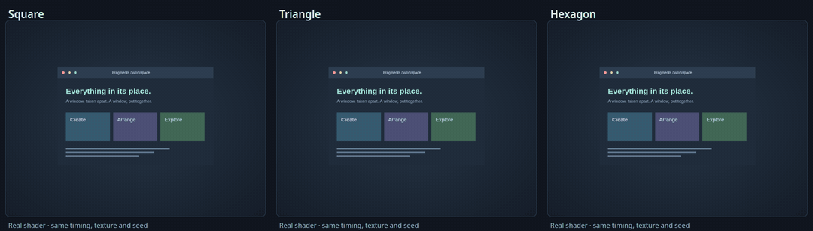
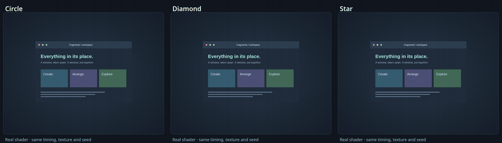
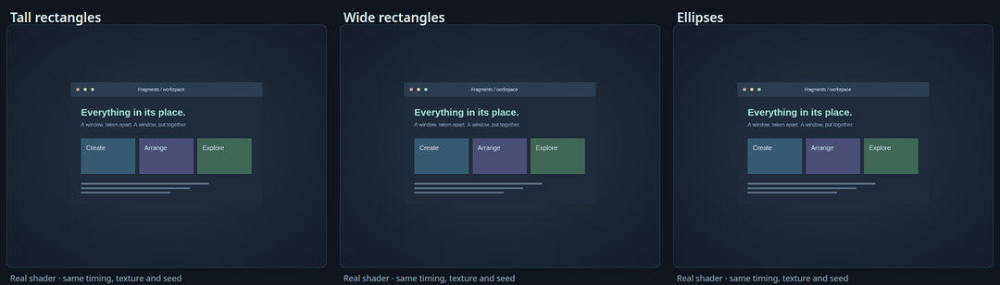
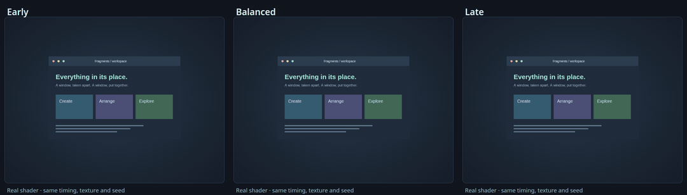

# Fragment shapes

Turn window contents into triangles, circles, rectangles, hexagons, diamonds or
stars while keeping the Fragments gravity, spin, waves and release controls.
These controls require **NiriFX 0.12 or newer**. Update before importing their
settings; older releases do not include them.

In Studio, choose **Fragments**, then **Piece shape**. Open Advanced controls for
proportions, orientation and emergence timing. For a finished look, choose one of
the four presets below. Every preset leaves resize off.

| Triangle Shatter | Circle Burst |
| --- | --- |
|  |  |
| [Settings](../examples/triangle-shatter.json) | [Settings](../examples/circle-burst.json) |
| **Rectangle Confetti** | **Hex Swarm** |
|  |  |
| [Settings](../examples/rectangle-confetti.json) | [Settings](../examples/hex-swarm.json) |

## Choose a shape

| Shape | How it breaks apart |
| --- | --- |
| Square | Square cells; existing presets retain their original renderer and appearance. |
| Rectangle | Joined rectangular cells with adjustable proportions. |
| Triangle | Each rectangular cell splits into two independently moving triangles. |
| Circle / ellipse | Joined cells gradually become circular or elliptical silhouettes. |
| Hexagon | A joined honeycomb layout; proportions can stretch the hexagons. |
| Diamond / star | Joined cells gradually become diamond or five-point star silhouettes. |

Shapes keep the original window pixels inside each piece. They are not solid
colored particles. Opening reverses the breakup and restores the complete window.
Circles, ellipses, diamonds and stars emerge during flight so they do not punch
holes into the intact window. Their silhouettes reverse smoothly on reconstruction.





## Controls

| CLI flag | Meaning |
| --- | --- |
| `--fragment-shape` | `square`, `rectangle`, `triangle`, `circle`, `ellipse`, `hexagon`, `diamond` or `star`. |
| `--fragment-aspect` | Width / height from 0.25 to 4; 1 gives equal proportions. Square and circle ignore this stored value. |
| `--fragment-orientation` | Starting lattice angle from -180 to 180 degrees. This changes the cuts; rotation/spin controls their subsequent flight. |
| `--fragment-transition` | Fraction of a piece's local breakup time used to reveal its silhouette or rounding, from 0.05 to 0.6. Lower values reveal it sooner. |
| `--fragment-roundness` | Softens polygon corners toward a contained circle during flight. Circle, ellipse and star ignore it. Existing square presets retain their original rounded-corner behavior. |
| `--size-variation` | For shaped or rotated layouts, varies shrink during flight while keeping the starting partition joined. Existing unrotated square effects retain their unequal grid boundaries. |

Orientation turns the layout about the window center. Particle count is a target;
clipped border cells and the minimum piece size affect the actual total. Aspect
preserves nominal cell area, and triangles account for two pieces per grid cell.
In fixed-size mode, size describes the square root of nominal piece area.





```sh
python3 -m niri_fx preview --preset triangle-shatter --output /tmp/triangles.html
python3 -m niri_fx preview --preset circle-burst --fragment-shape star --output /tmp/stars.html
python3 -m niri_fx render --preset rectangle-confetti --fragment-aspect 3 > /tmp/confetti.kdl
```

These commands preview or export only. Use the [setup workflow](setup.md) to review
and apply the selected style, or select it in an existing shell picker after
re-registering or exporting the updated collection.

## Supported actions and cost

Opening and closing work on stock Niri. Native movement and swaps use the same
shape renderer through the [experimental compositor](../experimental/README.md).
Studio's older Canvas movement sketches support unrotated square fragments; use
the native recordings to judge shaped swaps.

| Triangle swap | Hexagon swap |
| --- | --- |
|  |  |

NiriFX 0.13 adds shaped resize: the same joined geometry supports Full, Edge
Rebuild and Soft Reflow. Resize uses bounded interior motion and a stable border;
open/close scatter and waves do not apply. Choosing a shape never enables resize.
See the [explicit resize profiles](resize.md#shaped-resize).

Triangles draw two pieces per cell. Wide or tall pieces, travelling waves and
multiple release groups increase the bounded search work. A lower particle count
alone does not guarantee a cheaper shader. See [measurements](performance.md#fragment-shapes)
for tested GPU costs and their limits.

Custom SVG paths and mixed-shape particles are future work. No SVG import is
available in this version; see the [roadmap](../ROADMAP.md).
