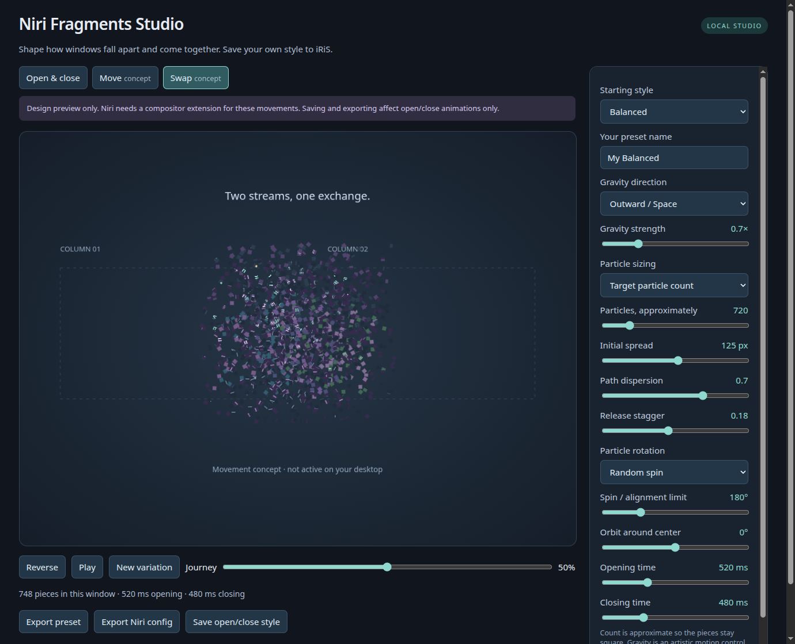

# Native movement and interruption behavior

## What works today

Niri 26.04 (`8ed0da4`) supports custom open, close, and resize shaders.
`window-movement` accepts animation timing, not a shader. A temporary config
with `custom-shader` inside that block fails `niri validate` with
`unexpected node custom-shader`. No live config was used for that probe.

This agrees with the [official animation documentation](https://niri-wm.github.io/niri/Configuration:-Animations.html#window-movement)
and the installed revision's [animation configuration](https://github.com/niri-wm/niri/blob/8ed0da4/niri-config/src/lib.rs).
Changing iRiS settings alone cannot add a compositor rendering hook.

Studio's Move and Swap tabs are a Canvas design prototype. Each fragment keeps
its own source image coordinates. The two color streams overlap in the middle,
then reconstruct their original contents in opposite columns. No window contents
are captured: both images are synthetic. Saving a style exports supported open/close and enabled resize shaders.
The [isolated native prototype](../experimental/README.md) demonstrates
fragment, elastic, slice, pixel and distortion column swaps in a separate compositor.

## Continuous interruptions

The experimental build preserves the current deformation and seed when another
move retargets the same window. Deformation phase and direction impulses retain
their sampled speed through cubic transitions, instead of restarting their easing
curve. A repeated reversal carries the direction's current speed as well as its value.
Late phase handoffs shorten their remaining duration when necessary to avoid
overshooting or reversing reconstruction.

Closing during opening continues the original opening shader and clock while
fading out. Closing during movement retains its current phase, seed, orientation
and remaining displacement while fading. This avoids re-fragmenting a snapshot
with a newly seeded close effect. It intentionally takes precedence over the
usual close style during those interruptions.

The shader phase and impulse transitions match their incoming first derivative;
close movement also starts with the sampled translation speed. This does not
change Niri's layout easing during a swap, preserve acceleration, or create
shared particle physics. The windows still render as separate elements. The pinned patch is required; a stock Niri install or a
shell event listener cannot provide the same state handoff.

## Prototype and longer-term compositor design

The appropriate implementation belongs in Niri, developed separately from the
installed compositor. At the inspected revision,
[`Tile::animate_move_x_from_with_config` and its Y counterpart](https://github.com/niri-wm/niri/blob/8ed0da4/src/layout/tile.rs#L575)
track an offset and timing. `Tile::render_inner` already has an offscreen texture
path for resize, which is a useful implementation reference, not a drop-in fix.
Column movement and camera scrolling also need tracing: a tile-only hook would
not cover every kind of horizontal movement.

1. Add an optional movement effect configuration with the normal movement
   animation as its fallback. Expose start/end rectangles, progress, stable seed,
   logical output coordinates, and the window texture. Configuration decoding,
   renderer compilation and hot reload all need support.
2. At a layout transaction, record the affected windows' start/end geometry and
   give them one timeline. For a swap, both streams must advance together. Keep
   camera scrolling separate so ordinary panning does not explode every window.
3. Use instanced textured quads for a real particle renderer. Forward-rendered
   fragments can have independent velocity, acceleration, rotation and curved
   paths without a costly full-screen inverse lookup over every particle.
   Keep source UVs and window identity fixed. Streams can visually interleave;
   a combined render pass is needed for particle-level ordering across windows.
4. Damage the union of start/end bounds and particle excursions, including each
   previous frame's occupied region. Respect workspace/output clipping,
   fractional scale, opacity, capture block-out rules, popup/focus-ring handling,
   and occlusion. A normal opaque window rectangle must not hide the stream.
5. Preserve interactive semantics: retarget/reverse from the current visual
   state on repeated movement; handle close/resize/fullscreen during transit;
   disable or simplify during dragging, gestures, and reduced-motion mode.
6. Validate in a separate nested Niri session first. The packaged compositor and
   normal login session remain the return path until visual, input, capture and
   frame-time checks pass.

Only after that capability exists should iRiS expose movement-specific controls.
The first shell integration can offer a capability-gated enable switch, duration,
and style, with Studio for detailed tuning. Opening a Studio app is a small
upstream shell change; embedding its renderer directly in QML is a separate
integration and dependency decision.

The project now includes the first movement rendering hook, config decoder,
shader compilation/hot reload, expanded offscreen drawing, and a nested demo.
The full transaction and particle renderer above remains future work.
A screenshot overlay or keybinding wrapper cannot faithfully replace layout rendering: it misses other
movement triggers and leaves input, z-order and cancellation out of sync.
