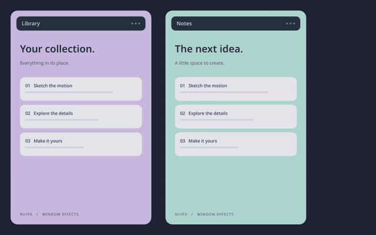

# Native movement and interruption behavior

## What works today

Stock Niri 26.04 (`8ed0da4`) supports custom open, close, and resize shaders.
`window-movement` accepts animation timing, not a shader. A temporary config
with `custom-shader` inside that block fails `niri validate` with
`unexpected node custom-shader`. No live config was used for that probe.

This agrees with the [official animation documentation](https://niri-wm.github.io/niri/Configuration:-Animations.html#window-movement)
and the installed revision's [animation configuration](https://github.com/niri-wm/niri/blob/8ed0da4/niri-config/src/lib.rs).
Changing iRiS settings alone cannot add a compositor rendering hook.

The [NiriFX session](native-session.md) includes movement and swap effects,
pointer wobble, continuous fragments and interruption improvements in one build.
After preparing a session, open `niri-fx studio --target native`, choose a combo
and set **Move** and **Swap** independently to **Preserve**, **NiriFX Style** or
**Off**. Move covers dragging and ordinary tile/column rearrangement. Swap
overrides explicit `swap-window-left` / `swap-window-right` commands; when no
separate swap setting exists, it follows Move. Older NiriFX builds need updating
before a separate Swap choice can be applied.

Review **Apply to desktop** to see the exact action changes. A verified running
NiriFX session can load them immediately; otherwise Studio saves the selection
for the next login and reports that outcome. Applying does not edit a shell
checkout. The managed tools are included in NiriFX 0.20; the full compositor
builds from its matching source. Shared configurations instead update watched
includes through [Apply shared settings](shared-settings.md), reporting file
updates separately from confirmed live activation. Distribution packages and
broader physical-session acceptance remain pending.

Studio's **Movement (shader preview)** tab renders the same GLSL used by the
pinned compositor, with a synthetic texture and a simple directional path. Niri
owns actual window positions, timing handoffs and interruptions. Choosing **Swap**
in Library previews its timed shader on two synthetic windows exchanging places.
Each window has its own texture and deformation; this is not a shared particle
simulation or a native desktop recording. The older
**Move concept** and **Swap concept** tabs remain Canvas design prototypes. Each fragment keeps
its own source image coordinates. The two color streams overlap in the middle,
then reconstruct their original contents in opposite columns. No window contents
are captured: both images are synthetic. Portable profile JSON retains separate
movement, swap and pointer choices. **Export stock Niri config** omits those nodes;
**Export NiriFX session config** includes them for a matching NiriFX build.
The [isolated native demos](../experimental/README.md) demonstrate
fragment, elastic, slice, pixel and distortion column swaps in a separate compositor.


## Continuous interruptions

The NiriFX build preserves the current deformation and seed when another
move retargets the same window. Deformation phase and direction impulses retain
their sampled speed through cubic transitions, instead of restarting their easing
curve. A repeated reversal carries the direction's current speed as well as its value.
Late phase handoffs shorten their remaining duration when necessary to avoid
overshooting or reversing reconstruction.

Closing during opening continues the original opening shader and clock while
fading out. Closing during movement retains its current phase, seed, orientation
and remaining displacement while fading. This avoids re-fragmenting a snapshot
with a newly seeded close effect. It intentionally takes precedence over the
usual close style during those interruptions.

With a movement shader configured, interrupted tile and column positions also
retain their sampled velocity. A cubic path starts at the current offset and speed,
then reaches the new destination at rest. Direction reversals can briefly keep
moving the original way before turning. Initial moves keep Niri's configured
easing or spring; closing follows the actual remaining position path independently
of shader phase.

These timed-shader handoffs preserve first derivatives, not acceleration. Camera
scrolling and shared particle physics remain separate work. Direct dragging can
use [pointer wobble](pointer-wobble.md) or [continuous fragments](fragment-drag.md),
both included in the NiriFX session. Continuous fragments have their own retained
motion state and closing limitations; the handoffs above describe timed shaders.
Windows still render as separate elements. The NiriFX build is required; a stock
Niri install or a shell event listener cannot provide the same state handoff.

## Prototype and longer-term compositor design

The rendering work belongs in the compositor. The NiriFX session already includes
the first movement hook, configuration decoding, shader compilation and hot
reload, expanded offscreen drawing and isolated demos. The design below explains
those foundations and the remaining work on shared transactions and particles.
At the inspected upstream revision,
[`Tile::animate_move_x_from_with_config` and its Y counterpart](https://github.com/niri-wm/niri/blob/8ed0da4/src/layout/tile.rs#L575)
track an offset and timing. `Tile::render_inner` already has an offscreen texture
path for resize, which is a useful implementation reference, not a drop-in fix.
Column movement and camera scrolling also need tracing: a tile-only hook would
not cover every kind of horizontal movement.

1. Add an optional movement effect configuration with the normal movement
   animation as its fallback. Expose start/end rectangles, progress, stable seed,
   logical output coordinates, and the window texture. Configuration decoding,
   renderer compilation and hot reload all need support.
2. At a layout transaction, record the affected windows' start/end geometry and
   give them one timeline. For a swap, both streams must advance together. Keep
   camera scrolling separate so ordinary panning does not explode every window.
3. Use instanced textured quads for a real particle renderer. Forward-rendered
   fragments can have independent velocity, acceleration, rotation and curved
   paths without a costly full-screen inverse lookup over every particle.
   Keep source UVs and window identity fixed. Streams can visually interleave;
   a combined render pass is needed for particle-level ordering across windows.
4. Damage the union of start/end bounds and particle excursions, including each
   previous frame's occupied region. Respect workspace/output clipping,
   fractional scale, opacity, capture block-out rules, popup/focus-ring handling,
   and occlusion. A normal opaque window rectangle must not hide the stream.
5. Preserve interactive semantics: retarget/reverse from the current visual
   state on repeated movement; handle close/resize/fullscreen during transit;
   disable or simplify during dragging, gestures, and reduced-motion mode.
6. Validate in a separate nested Niri session first. The stock compositor and
   stock login session remain the return path until visual, input, capture and
   frame-time checks pass.

Use Studio for preset selection and detailed tuning regardless of the shell.
Opening it through a launcher does not require modifying shell source. Embedding
its renderer directly in QML would be a separate integration and dependency
decision. Shared swap transactions and particle-level ordering between windows
remain future work; continuous fragments currently retain state per window.
A screenshot overlay or keybinding wrapper cannot faithfully replace layout rendering: it misses other
movement triggers and leaves input, z-order and cancellation out of sync.

## Shaped fragments

Triangle Shatter, Circle Burst, Rectangle Confetti and Hex Swarm use the shared
fragment movement hook since 0.12.0. The same geometry and seeded identity
are used for opening, closing and native movement; no new compositor patch is
required. See the [shape guide and native recordings](fragment-shapes.md).

```sh
python3 scripts/nested-demo.py --preset triangle-shatter
python3 scripts/nested-demo.py --preset hex-swarm
```

These commands open isolated demos. They do not replace the login compositor.

## Movement presets and general rearrangement

The **Movement and swaps** collection groups styles tuned for rearranging
windows. They also work as stock opening and closing styles; native movement
requires the NiriFX session.

| Fragment Wake | Ribbon Transfer | Momentum Glide |
| --- | --- | --- |
|  |  |  |
| 850 ms, trailing triangle breakup | 900 ms, alternating ribbons | 750 ms, gentle elastic deformation |

Five more choices keep rearrangement within 620–720 ms. Pick ribbons or pixels
for breakup, Spring Rebound for whole-window motion, or a distortion that keeps
the window visible throughout the transition.

| Style | Movement | Shader preview | Native swap |
| --- | --- | --- | --- |
| Ribbon Cascade | 680 ms, alternating vertical strips detach in stages | [Preview](gifs/movement-ribbon-cascade.gif) | [Recording](gifs/native-swap-ribbon-cascade.gif) |
| Spring Rebound | 640 ms, elastic stretch with a small twist | [Preview](gifs/movement-spring-rebound.gif) | [Recording](gifs/native-swap-spring-rebound.gif) |
| Pixel Relay | 620 ms, coarse pixels break up along the trailing edge | [Preview](gifs/movement-pixel-relay.gif) | [Recording](gifs/native-swap-pixel-relay.gif) |
| Ripple Transit | 680 ms, radial ripples deform the window texture | [Preview](gifs/movement-ripple-transit.gif) | [Recording](gifs/native-swap-ripple-transit.gif) |
| Vortex Transit | 720 ms, a partial spiral with gentle contraction | [Preview](gifs/movement-vortex-transit.gif) | [Recording](gifs/native-swap-vortex-transit.gif) |

Shader previews use synthetic directional paths. Native swaps record actual
column rearrangement in an owned nested compositor, using the shared Move
renderer. Independent **Swap** selections apply to explicit
`swap-window-left` / `swap-window-right` commands; dragging and column reordering
still use **Move**. These presets use timed deformation; they do not add
continuous pointer materials for their families.
For continuous dragging, see [fragments](fragment-drag.md) and
[pointer wobble](pointer-wobble.md).

In Studio, choose the movement action and filter the Library to **Movement and
swaps**, then select a style to preview it. The same catalog is available from
the CLI:

```sh
niri-fx list --collection movement
niri-fx studio --preset spring-rebound
```

`movement_strength` controls deformation, `movement_ms` sets the demo/preview
clock, and `movement_focus` emphasizes the trailing edge for Fragments, Slices,
Pixels and Distortion. Trailing emphasis blends intact content with the effect
according to the compositor's direction impulse. It is a screen-space mask,
not a particle emitter or cross-window simulation. Elastic uses its impulse
and spring controls instead.

```sh
python3 scripts/nested-demo.py --preset fragment-wake
python3 scripts/nested-demo.py --preset ribbon-transfer
python3 scripts/nested-demo.py --preset momentum-glide
python3 scripts/nested-demo.py --custom examples/profiles/fragment-wake-motion.json
python3 scripts/test-movement.py --preset fragment-wake
```


The movement hook covers tile and column animation paths, including vertical
reordering and consuming/expelling windows. The harness checks final layout,
client identity, resize during movement, insertion/removal, repeated reversals
and complete close cleanup. These checks establish coverage and endpoints; they
do not prove continuous velocity for every overlap. The same session includes
[pointer wobble](pointer-wobble.md) and [continuous fragments](fragment-drag.md);
workspace transitions and camera scrolling remain distinct roadmap epics.

## Additional overlap coverage



The overlap fixture now checks floating/tiled changes and closing a newly opened
client while an explicit resize is active. [Portable fixture settings](../examples/profiles/movement-overlaps.json)
include open, close, resize and movement actions. These are deliberately enabled
for testing; ordinary presets preserve existing resize and movement settings.

Rapid swaps and the existing close continuations retain their established state
handoffs. New endpoint tests verify client identity, final layout and cleanup;
they do not establish resize velocity continuity or shared particle state between
windows. No new discontinuity was demonstrated by this matrix. Physical output
changes and broader pointer-drag acceptance remain on the [roadmap](../ROADMAP.md).

For coordinated stock workspace, camera and overview motion, use the
[desktop motion packs](desktop-motion.md). These change spring timing and do not
apply fragment shaders to workspaces. To change effects in an already running
NiriFX session, use the
[verified live setup workflow](setup.md#activate-movement-in-a-running-session).
Studio also reviews and applies selections directly. Its result reports whether
the running managed session loaded them or they were saved for the next login.
