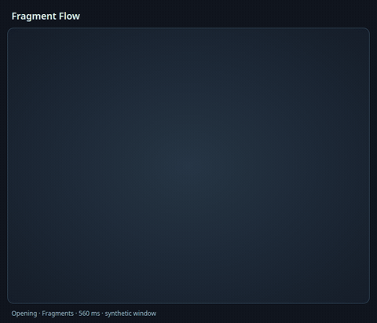
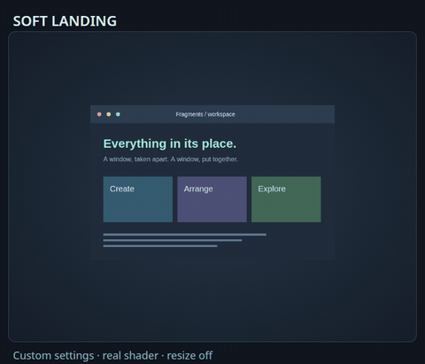
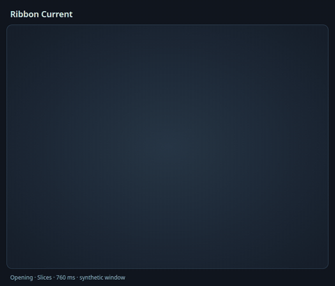
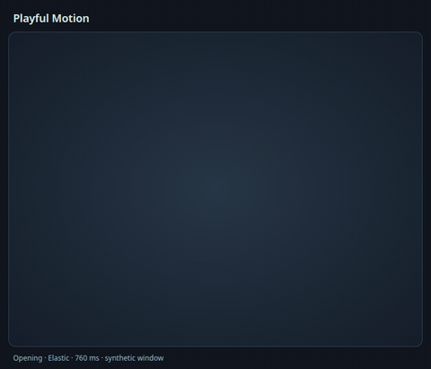
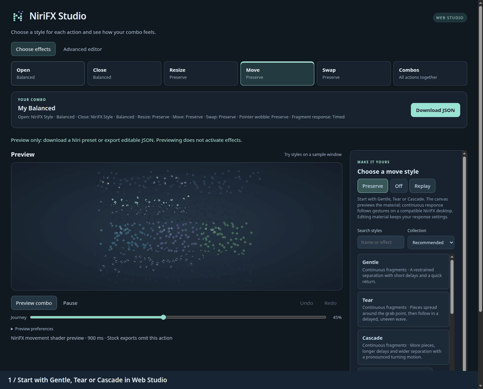
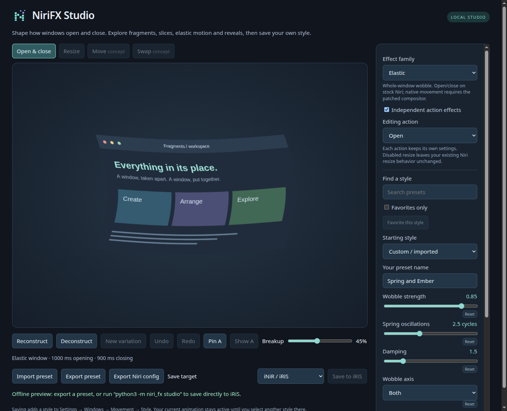

# Independent action profiles

A style describes one effect. A profile assigns separate styles to opening,
closing and optionally resizing, moving or swapping. Desktop springs and pointer drag can
be stored separately from these shader actions. For example: open with Balanced
fragments, close with Implosion, and leave your existing resize behavior unchanged.



## Choose which actions to customize

Each action has the same three choices:

| Choice | Result |
| --- | --- |
| **Preserve** | Keep the configuration underneath NiriFX, including shell customizations. This is not a reset to Niri defaults. |
| **NiriFX Style** | Apply the selected effect or pointer preset. |
| **Off** | Disable that action's animation. |

Choose independently for Open, Close, Resize, Move, Swap and Pointer wobble.
Updated NiriFX builds support an independent Swap override for explicit left/right
window swaps. Ordinary moves, pointer drags and column reordering use Move. Shared styles change only actions
already set to **NiriFX Style**; Preserve and Off remain unchanged. If a shared
style does not support an action, its existing selection stays in place.

When replacing a previously applied NiriFX profile, Preserve removes that
profile's override for the action and reveals the underlying configuration.
It does not keep the previous NiriFX effect. Restore returns the exact saved
configuration from before Apply.

In a managed [NiriFX session](native-session.md#choose-effects-in-studio), Preserve
inherits the saved baseline captured for that session. Reopening a customized
bundle keeps its original baseline; it does not follow later shell edits.
**Select for next login** and reviewed rollback affect the next session, without
reloading the current desktop.

Studio can preview a selected NiriFX style or an instant Off transition. It
cannot know how an inherited desktop animation will look offline; Preserve is
labelled in the preview instead of simulating an assumed Niri default.

Movement and pointer choices require the [NiriFX session](native-session.md),
which includes both in one build. Stock exports keep their choices in JSON but
omit them from KDL, including Off. Native contract 2 keeps movement and pointer
wobble overrides independent even though they share one Niri configuration block.
Applying Off for movement does not turn off pointer wobble, and vice versa.
[Continuous fragments](fragment-drag.md) follow the movement choice, including
Off; Pointer wobble controls the separate whole-window wobble. Global Niri
animations Off still wins.

## Separate Move and Swap styles

```sh
niri-fx profile --name "Fragments and Pixels" \
  --open explosion --close frost-vanish \
  --movement fragment-wake --swap pixel-relay > my-combo.json
niri-fx studio --custom my-combo.json
```

Move controls normal movement and dragging. Swap targets Niri's explicit
`swap-window-left` and `swap-window-right` commands. Column reordering and pointer
drops remain Move, even when neighboring windows exchange places. The same
movement-capable families can be selected for either slot. Swap uses the preset's
movement duration and a timed shader; continuous fragment response remains with
Move. Choose Preserve for Swap to return to the underlying configuration, or Off
to disable explicit swap animation independently.

A separate Swap choice requires an updated NiriFX compositor. Older retained
builds can preview and save it in Studio but refuse Apply with update guidance.
Stock configuration downloads omit both native movement and swap settings;
portable JSON keeps them.

## Compose a partial profile

For a frosted closing effect with unchanged opening and no resize animation:

```sh
niri-fx profile --name 'Quiet Exit' --open preserve --close frost-vanish \
  --resize off > quiet-exit.json
niri-fx studio --custom quiet-exit.json
```

For stock opening, closing and resizing all disabled:

```sh
niri-fx profile --name 'Still Windows' --open off --close off --resize off \
  > still-windows.json
```

Use `--movement preserve|off|PRESET` and `--pointer preserve|off|PRESET` for the
native choices. The older `--open-preset`, `--close-preset`, `--resize-preset` and
`--movement-preset` names remain aliases. Previewing or creating JSON changes no
active settings. Review the selection in Library when ready: **Apply** updates
a connected stock configuration, while **Select for next login** prepares a
managed NiriFX session.

## Choose a finished pairing

Start with **Recommended** in Library for five complete combos: Fragment Flow,
Soft Landing, Ribbon Current, Playful Motion and Geometric Flow. Their opening
and closing effects have coordinated timing and modest refinements to travel,
rotation or spring settling. The individual source presets keep their settings.

Choose any built-in pairing by name. Select **profiles** in the
terminal guide, use **Ready-made profile** in the detailed Studio controls, or search a name
in the Quickshell, GTK, DMS or iRiS picker. No JSON file is needed. Existing iNiR
registrations and Noctalia preset packs need a reviewed update to add the new names.

| Profile | Opens with | Closes with | Look |
| --- | --- | --- | --- |
| `fragment-flow` | Balanced | Implosion | Everyday textured assembly and a compact inward collapse |
| `soft-landing` | Momentum Glide | Frost Vanish | A gentle arrival and a quiet frosted exit |
| `ribbon-current` | Ribbon Wave | Ribbon Transfer | Flowing waves and an exit with matching alternating strips |
| `playful-motion` | Spring Wobble | Bubble Burst | A damped spring, light bubbles and bouncing desktop springs |
| `geometric-flow` | Triangle Shatter | Hex Swarm | Triangles assemble and hexagons drift away at matching density |
| `burst-and-drift` | Explosion | Dust Drift | A strong arrival followed by drifting dust |
| `frost-and-fragments` | Frost Vanish | Pixel Dust | A frosted reveal that breaks into pixels |
| `spring-and-ember` | Spring Wobble | Ember Erosion | A playful spring with a monochrome fade |
| `ghost-and-shockwave` | Ghost Wisps | Shockwave | Soft wisps followed by a ripple |
| `pixel-shuffle` | Pixel Wipe | Pixelate | A pixel reveal and a chunky exit |
| `ribbon-exit` | Alternating Blinds | Ribbon Fold | Alternating strips that fold away |
| `gentle-motion` | Momentum Glide | Frost Vanish | Gentle desktop springs |
| `balanced-motion` | Balanced | Implosion | Restrained desktop springs |
| `fragments-motion` | Mixed Confetti | Orbiting Shapes | Mixed geometry with Balanced desktop timing |
| `ribbons-motion` | Ribbon Wave | Zipper | Flowing strips with Gentle desktop timing |
| `elastic-motion` | Spring Wobble | Rubber Band | Springy sheets with Playful desktop timing |

| Fragment Flow | Soft Landing | Ribbon Current |
| --- | --- | --- |
|  |  |  |

| Playful Motion | Geometric Flow |
| --- | --- |
|  |  |

Browse by look in the [preset collections](collections.md). Pairings build on
the named source presets; the five recommended combos refine their action settings
as described above. Their JSON files contain the exact resolved parameters.
The [motion packs](desktop-motion.md) and [coordinated action sets](action-sets.md)
additionally coordinate stock desktop springs. Action sets suggest resize and
movement companions in Studio or through `profile --action-set`. The built-in
profiles leave resize, movement and pointer drag at Preserve. Their shader cost
is the cost of the chosen action; profiles do not add a second rendering pass.
See [performance measurements](performance.md).

```sh
python3 -m niri_fx list --profiles --text
python3 -m niri_fx studio --profile burst-and-drift
# Review standalone activation, then append --apply to write that selection:
python3 -m niri_fx setup --target standalone --profile burst-and-drift --no-launcher
# Register just this pairing for selection in iRiS:
python3 -m niri_fx register --profile burst-and-drift
# Export editable JSON or stock Niri KDL:
python3 -m niri_fx inspect --profile burst-and-drift > /tmp/burst-and-drift.json
python3 -m niri_fx render --profile burst-and-drift > /tmp/burst-and-drift.kdl
```

`--profile` chooses both actions; `--preset` chooses one style for both. They cannot
be combined. Effect override flags are deliberately rejected with `--profile`,
so a change cannot silently target the wrong action. Open it in Studio to customize.
[All JSON files and preview commands](../examples/profiles/README.md) and
[gallery loops](showcases.md#different-effects-for-each-action) remain available.

## Preview a complete combo

Choose a card in Library, then press **Preview combo**. The sequence plays the
opening effect, holds the intact window and plays the closing effect using each
action's own style and duration. Selected resize and movement effects are included
when those profile slots are enabled; leaving them at shell defaults skips them.
Previewing never enables an optional action or applies desktop settings. In
version 0.18 and newer, an explicit pointer choice with strength above
zero adds a scripted drag and release before closing. Unset and disabled pointer
choices add no animation. **Reduced motion** skips this pointer phase.

Use **Try pointer drag** in Library for interactive dragging, or **Play drag demo**
for a repeatable comparison. **Reset position** recenters the sample; **Return to
effects** or Escape restores the editor view. With **Reduced motion**, interactive
dragging moves the sample without bending or settling. These browser previews
use native spring and shader math with synthetic window content; native input,
layout, capture behavior and display latency require compositor checks. See
[pointer-driven wobble](pointer-wobble.md).

Resize requires an explicit choice. **Movement (shader preview)** shows the shader
on a synthetic path; actual move/swap effects require the NiriFX session.
It does not simulate the continuous fragment renderer. See
[movement support](movement.md). Playful Motion also includes stock
desktop spring settings, whose workspace, camera and overview behavior is shown
in the [native desktop recordings](desktop-motion.md), separately from the
window shader preview.

## Create your own combination

In Studio, enable **Independent action effects**, choose **Editing action**, and
choose **Preserve**, **NiriFX Style** or **Off**, then tune a selected style.
Reconstruct previews opening; Deconstruct previews closing. Viewing Resize leaves
its choice unchanged. Fragments, Slices, Elastic and Distortion support resize.
Turning independent effects off creates a single-style document; Undo recovers
the profile.

Create the same profile from the CLI:

```sh
python3 -m niri_fx profile --name 'Spring and Ember' \
  --open-preset spring-wobble --close-preset ember-erosion > /tmp/my-profile.json
python3 -m niri_fx preview --custom /tmp/my-profile.json --output /tmp/my-profile.html
python3 -m niri_fx render --custom /tmp/my-profile.json > /tmp/my-profile.kdl
niri validate -c /tmp/my-profile.kdl
```

Add `--resize-preset balanced` when creating a profile to include resize. To register it
without activation, use `register --custom /tmp/my-profile.json`; standalone
`setup --custom /tmp/my-profile.json --target standalone` first prints a plan.
`--apply` activates the backed-up standalone include. See [setup](setup.md).

Profiles use **kind `profile`** with `name` and `actions`. Schema 2 has open, close,
resize and movement choices. **Schema 3** adds `swap`, using the same effect
parameters and `movement_ms` timing as Move.
Each of `open`, `close`, `resize` and `movement` contains an effect object for
NiriFX Style, `null` for Preserve or the string `"off"` for Off. Schema 1 profiles
remain readable and normalize to schema 2 without changing their behavior.
Without a saved fragment response, documents with a Swap style or Off serialize
as schema 3; removing that override returns to schema 2. Current source builds
use schema 4 when a complete `fragment_motion` response is saved, retaining all
five action keys, including `swap: null` when Swap is preserved.
Each nested effect keeps `resize: false`: the separate resize slot selects that action.
Single-style documents continue to use effect schema 3; these are different
document types, not compatibility aliases. [Complete example](../examples/profiles/spring-and-ember.json).

The `movement` slot is validated and preserved on JSON import/export.
Studio can edit it and preview the actual shader in **Movement (shader preview)**.
Choose **NiriFX Style** or **Off** for Move or Swap to store an override;
viewing an action alone does not select it. Stock KDL and iNiR/iRiS registrations
omit movement nodes. The NiriFX session target includes the selected movement in
its next-login configuration. To apply it in an already running session, use
[verified live Apply and Restore](setup.md#activate-movement-in-a-running-session).
Profiles do not add application-specific rules. Pointer wobble is an independent
control in the same NiriFX build, described below.

## Portable fragment response

**Unreleased, available from current source:** continuous-fragment recipes now
travel with the profile. In Library's Move view, choose **Gentle**, **Tear** or
**Cascade**, or use **Fragment response** under **Customize your combo**. The
prefab sets its square movement material and response together. Other actions
keep their choices. **Customize fragment response** exposes delays, batches,
catch-up times, spread, rotation, tilt and release timing. Edited values show
**Custom response**.

These controls work in local, hosted and offline Studio. **Save to My profiles**,
**Download JSON**, **Share settings**, import and Undo/Redo retain all response
values. The document stores values rather than a preset ID, so changing a
prefab's defaults cannot change an existing recipe. The browser previews the
movement material; it does not simulate the compositor's continuous gesture.



Move **Off**, **Preserve**, or a material that cannot use the square mesh leaves
the saved response dormant. It remains editable and returns when a compatible
Move style is selected. Choose **Timed movement** to remove the continuous
response from the recipe explicitly. Pointer wobble remains independent.

Create a portable recipe without opening Studio:

```sh
python3 -m niri_fx profile --name 'My Tear Combo' \
  --open balanced --close implosion --fragment-preset tear > /tmp/tear-combo.json
python3 -m niri_fx inspect --custom /tmp/tear-combo.json
python3 -m niri_fx studio --custom /tmp/tear-combo.json
```

`--fragment-preset` resolves the matching Move material and all 18 response
controls. It does not activate them. Resize and Swap stay at Preserve unless
selected separately. Start with the importable
[Gentle](../examples/profiles/continuous-gentle.json),
[Tear](../examples/profiles/continuous-tear.json),
[Cascade](../examples/profiles/continuous-cascade.json) or
[custom Long Trail](../examples/profiles/continuous-long-trail.json) examples.

Schema 4 requires a complete top-level `fragment_motion` object using snake_case
control names and all five `actions` keys. Unknown or missing controls fail
validation. Delays and response times require near ≤ far; native integer
controls accept whole JSON numbers. Profile schemas 1, 2 and 3 remain supported
and do not acquire response settings automatically. NiriFX 0.20 cannot import
schema 4; keep an older recipe when sharing with older tools.

Stock config exports omit Move, Swap and the native response. JSON preserves
them for a compatible NiriFX session. Native config export includes the response
only for an eligible Move material; applying it still requires verified native
support. See [continuous fragment controls](fragment-drag.md) and
[retained-recipe export](upgrading.md#portable-fragment-recipes-unreleased).

## Pointer drag

Pointer settings in profiles, Studio and reviewed activation are available in
**0.18 and newer**. Pointer deformation is included in the
[NiriFX session](native-session.md); see [pointer-driven wobble](pointer-wobble.md)
for its behavior and validation limits.

In Library, **Pointer wobble** uses Preserve / NiriFX Style / Off. NiriFX Style
offers **Gentle**, **Rubber Sheet** and **Release Settle**. **Customize pointer wobble** exposes
strength, damping and frequency. These choices are independent of the opening,
closing, resize and timed movement styles. Switching to one shared window style
preserves the pointer choice; Undo/Redo, JSON import/export and share links preserve it too.

```sh
python3 -m niri_fx profile --name 'Gentle Fragments' \
  --open-preset subtle --close-preset subtle --pointer gentle > /tmp/gentle-fragments.json
python3 -m niri_fx inspect --custom /tmp/gentle-fragments.json
python3 scripts/nested-demo.py --custom /tmp/gentle-fragments.json
```

Build the [NiriFX compositor](native-session.md#prepare-a-version) before running
that demo. The profile can contain pointer settings with no timed `movement`
action. The nested window uses its own compositor and configuration.

A profile's optional top-level `pointer` object contains all three controls:
`{"strength": 0.4, "damping": 85, "frequency": 10}`. Strength is a finite number
from 0 to 2, damping is a whole percentage from 10 to 100, and frequency is a whole
number from 2 to 16 Hz. Omitting `pointer` or setting it to `null` inherits existing
behavior. Strength zero is an explicit disabled override; use `profile --pointer off`
to generate one. Pointer settings do not add a shader action; profiles have four
`actions` keys in schema 2, or five in schema 3 and schema 4.
Existing schema 1 profiles remain valid.

Saving a pointer choice does not activate it. Stock KDL, iNiR registrations and
Noctalia preset downloads omit pointer nodes, including a disabled override.
Portable JSON retains the settings. Studio's **Export NiriFX session config** includes
pointer settings and any selected timed movement in one `window-movement` block;
that file requires the matching NiriFX build.

Live activation is available through the standalone adapter after verifying the
running pointer contract. **Apply pointer wobble** is a separate
choice from **Apply movement**. Changing the pointer settings clears
its activation choice and invalidates the review. A disabled override also requires
explicit activation. See [reviewed pointer Apply and Restore](setup.md#activate-pointer-drag-in-a-running-session).
In the managed session target, review **Select for next login** instead; all
selected actions are prepared together without changing the running compositor.



## Studio workflow

- Search filters the current family's presets; favorites can narrow the list.
  Local Studio stores favorites in `$XDG_STATE_HOME/niri-fx/studio-preferences.json`
  (or `--state`). Offline previews use browser-local storage when available.
- Undo/Redo keeps the last 100 editing states, including profile actions and imports.
  Reset returns an individual parameter to its catalog default.
- **Pin A** remembers the current effect and random seed. Edit B, then **Show A/B**
  compares them at the same timeline position. Saving always exports B. Comparison
  is available for open/close effects; it does not alter either action.
- **Save target** selects iNiR registration or a named KDL download for Noctalia
  or standalone Niri. Downloads do not activate effects. For Noctalia, put the file
  in the picker's configured preset folder; see [Noctalia setup](noctalia.md).
- Detailed wave controls are collapsible. Each family shows applicable controls
  using the same parameter definitions as the CLI and Python validation.

Launch with `python3 -m niri_fx studio --target standalone` to start with file
downloads, or choose `--target inir` / `--target noctalia`. The default `auto`
selects iNiR when its helper is installed, otherwise standalone. Offline previews
also default to standalone. The target changes the save UI, not your active effect.

For a prepared NiriFX session, use `niri-fx studio --target native`. Choose a
ready-made combo, set each action and review **Select for next login**. Continuous
fragments add **Gentle**, **Tear** and **Cascade** choices with their matching
movement materials. Current source builds save those response values in the
[portable profile](#portable-fragment-response); 0.20 keeps them only in the
retained session recipe. See
[choosing session effects](native-session.md#choose-effects-in-studio).

Test an exported movement profile without replacing the login compositor:

```sh
python3 scripts/nested-demo.py --custom examples/profiles/fragment-wake-motion.json
```

The demo uses the movement action's duration and strength. `--duration-ms` and
`--movement-strength` are explicit demo overrides. A profile with pointer settings
and an unset movement slot demonstrates pointer drag without adding a timed shader.
A profile with neither choice is rejected. `--pointer-wobble gentle` can override
its pointer settings for the demo without changing the JSON. See
[native movement](movement.md) and [pointer drag](pointer-wobble.md).
