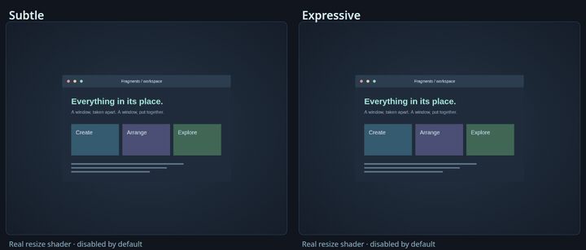
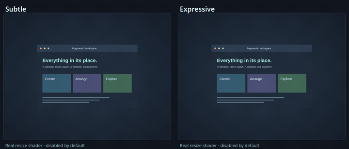
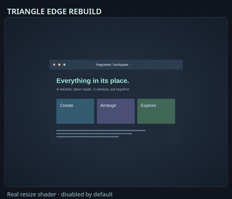
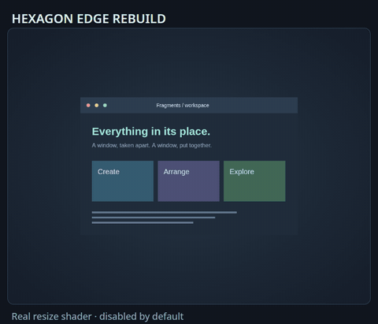
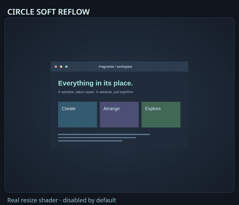
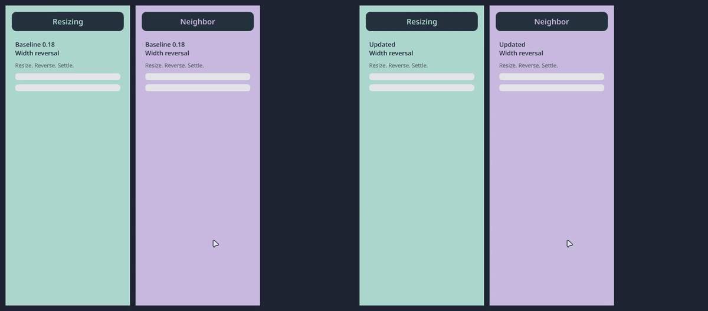
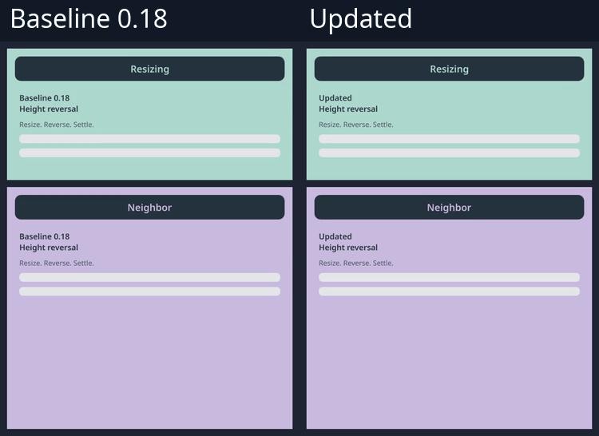
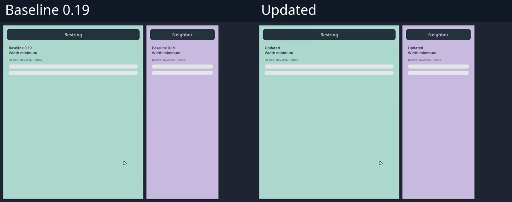
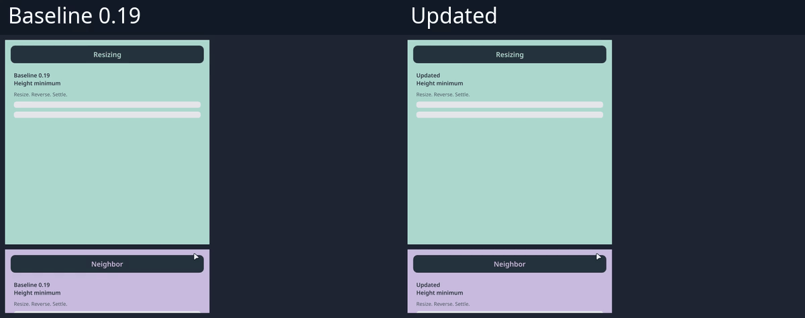

# Resize effects

Built-in presets preserve your existing resize settings. Choose a resize effect
for Fragments, Elastic, Slices or Distortion, or assign one separately in
a [profile](profiles.md).

Niri animates selected size changes, including cycling preset column widths and
maximizing a column. This does not turn continuous pointer resizing into a spring
simulation. Very small changes may not animate; see [Niri's resize interface](https://niri-wm.github.io/niri/Configuration:-Animations.html#window-resize).

| Style | Behavior | Importable profile | Preview |
| --- | --- | --- | --- |
| Elastic Stretch | A damped stretch in the changing dimensions; edges stay sealed | [JSON](../examples/profiles/elastic-resize.json) | [GIF](gifs/elastic-resize.gif) |
| Accordion Resize | Alternating folds across the changing geometry | [JSON](../examples/profiles/accordion-resize.json) | [GIF](gifs/accordion-resize.gif) |
| Ripple Resize | Radial texture ripples with adjustable origin, wavelength and strength | [JSON](../examples/profiles/ripple-resize.json) | [GIF](gifs/ripple-resize.gif) |
| Edge Ripple | Waves travel inward from the right/bottom edges; changed axes and growth/shrink determine displacement | [Subtle](../examples/profiles/edge-ripple-subtle.json), [Expressive](../examples/profiles/edge-ripple-expressive.json) | [Comparison](gifs/compare-edge-ripple-resize.gif) |
| Torsion Resize | A twist in the interior, with a steady border; shrink reverses the twist | [Subtle](../examples/profiles/torsion-subtle.json), [Expressive](../examples/profiles/torsion-expressive.json) | [Comparison](gifs/compare-torsion-resize.gif) |
| Fragment breakup | Full, Edge Rebuild or Soft Reflow | [Examples](../examples/README.md) | [Comparison](gifs/resize-full.gif) |

The profiles above use Balanced for opening and closing. Previewing or importing
one does not change your desktop; applying it enables its resize slot.

```sh
python3 -m niri_fx preview --custom examples/profiles/elastic-resize.json --output /tmp/elastic-resize.html
python3 -m niri_fx render --custom examples/profiles/elastic-resize.json > /tmp/nirifx-resize.kdl
niri validate -c /tmp/nirifx-resize.kdl
```

Use [standalone setup](standalone.md) or your shell's documented installation path
when ready to apply. For a single style, `--resize --resize-strength 0.5` explicitly
adds resize; omitting the flag preserves your existing resize configuration.

All families share resize time and strength. Elastic uses spring strength,
frequency, damping, axis and origin. Slices uses strip count, angle and stagger.
Distortion uses displacement, wavelength, travel cycles, falloff and origin.
Open/close-only controls such as ink color or glitch bands do not affect resize.

## Edge Ripple and Torsion Resize

These modes require NiriFX 0.11 or newer. Start with **Subtle** for everyday
use or **Expressive** for a stronger deformation. All four profiles keep Balanced
opening and closing, and explicitly assign a resize effect at 650 ms. Import the
JSON in Studio, select the Resize action, and use **Grow** or **Shrink** to preview.




| Control | Applies to | Meaning |
| --- | --- | --- |
| `--distortion-resize-mode ripple` | Radial Ripple | Existing radial resize effect, still the default |
| `--distortion-resize-mode edge-ripple` | Edge Ripple | Wave displacement follows the signed width/height change |
| `--distortion-resize-mode torsion` | Torsion Resize | Twist follows the dominant changing dimension |
| `--resize-strength` | All resize modes | Overall strength, 0 to 1; zero retains the normal texture crossfade |
| `--resize-twist` | Torsion Resize | Signed twist, -45 to 45 degrees before size-change scaling; zero removes the twist |
| `--distortion-strength`, `--distortion-wavelength` | Edge Ripple | Displacement in pixels and spacing between waves |
| `--distortion-cycles`, `--distortion-falloff` | Edge Ripple | Wave travel and attenuation toward the opposite edge |

Niri supplies old and new dimensions, but this shader interface does not identify
the physical edge being dragged. Edge Ripple uses the right edge for width changes
and the bottom edge for height changes. Torsion uses logical pixels to keep wide
and tall windows balanced. Both modes smoothly limit displacement within the
current rectangle, preserving transparent source pixels and exact endpoints.

Selecting a mode or adjusting its controls does **not** enable resize. A single
style still needs `--resize`; a profile needs an explicit resize slot. These modes
do not add pointer physics or carry shader velocity across interrupted resizes.
Niri owns interruption handling; the tests check settling and cleanup rather than
claiming uninterrupted velocity.

## Shaped resize

NiriFX 0.13 adds the eight fragment shapes to resize. The layout stays fixed in the
new window's logical geometry while the current rectangle stretches. Triangles
and hexagons form joined partitions; circles and other silhouettes emerge only
during deformation. Border pieces stay intact, and both endpoint textures are
restored exactly. Resizing still needs explicit activation.

| Triangle Edge Rebuild | Hexagon Edge Rebuild | Circle Soft Reflow |
| --- | --- | --- |
|  |  |  |
| [JSON](../examples/profiles/triangle-edge-rebuild.json) | [JSON](../examples/profiles/hexagon-edge-rebuild.json) | [JSON](../examples/profiles/circle-soft-reflow.json) |

These profiles use Balanced opening and closing. Edge Rebuild concentrates motion
in the outer bands of changing dimensions; it does not identify the dragged edge.
Soft Reflow blends a gentle deformation with intact content. All three use 750 ms.

Applicable controls are shape, aspect, orientation, emergence, rounding, shrink,
size variation, gravity direction, rotation, spin, density, resize strength and
time. Gravity strength, open/close scatter, release timing and waves are disabled
in the resize preview. Small windows and elongated pieces can leave little
interior room for deformation because the border must remain sealed.

```sh
python3 -m niri_fx studio --custom examples/profiles/triangle-edge-rebuild.json
python3 scripts/test-interruptions.py --resize-profile examples/profiles/triangle-edge-rebuild.json
```

On stock Niri, the shader keeps deterministic piece identities within one resize,
but has no retained state across successive resizes. The current experimental
renderer adds the bounded continuation described below.

## Resize reversals in the experimental compositor

When a resize reverses, its edge and the neighboring window should continue
along matching paths. The development build after 0.18 retains the incoming
width and height velocities separately, and leaves an unchanged axis on its
original timeline. Active paths keep their timing through a configuration reload;
a newly moving axis uses the reloaded timing. This addresses tested gaps between
adjacent columns and stacked windows. The current development build enables this
path for a custom movement shader or a marked NiriFX resize shader.

| Width reversal | Height reversal |
| --- | --- |
|  |  |

Each comparison shows sequential captures from the 0.18 baseline and updated
pinned compositor, with identical synthetic windows and passthrough shaders.
The shaders leave the geometry visible. These are native compositor recordings;
see the [measurements and reproduction](validation.md#resize-geometry-continuity).

The additional [width](gifs/native-resize-orthogonal-width-comparison.gif) and
[height](gifs/native-resize-orthogonal-height-comparison.gif) comparisons show
retargeting the other axis while a resize is active. The
[timing-reload comparison](gifs/native-resize-timing-reload-height-comparison.gif)
shows the previous development build beside the fix after changing resize timing
from 1200 ms to 350 ms and reversing.

### Minimum-size retargets

The current development build shares a constrained displacement between each
resizing axis and its affected neighbors. A reversal that would cross the
one-pixel geometry floor brakes before reaching it; the neighboring edge samples
the same path. Independent resizing sources keep separate contributions, and a
stacked column follows the largest sampled tile width. Swaps, source removal and
focus changes preserve the sampled handoff instead of adding a source twice.

| Minimum width | Minimum height |
| --- | --- |
|  |  |

These comparisons use the preserved 0.19 build and the current development build
with identical synthetic geometry masks. The masks remove stretched texture-edge
filtering so the gap remains measurable. Frames where a one-pixel source disappears
in video conversion report neighbor clearance separately. Those frames are excluded
from the visible-edge gap range. See the [native results](validation.md#resize-geometry-continuity).

### Retained resize appearance

The current [development compositor](../experimental/README.md) retains the
original resize phase, reference geometry and shader program for an active NiriFX
resize episode. Newly committed content blends on its own clock. Retargeting or
replacing a shader therefore does not reconstruct the existing fragment grid;
the next episode adopts the new shader. Resize Off or global animations Off ends
the retained episode immediately. Resize remains an explicit profile choice.

This requires the current experimental build and a generated shader carrying the
resize-continuity marker. A verified movement contract 2 alone does **not** prove
retained resize support: older builds also advertise that movement contract.
Stock Niri and unmarked custom shaders retain their existing resize interface.

Closing during resize still uses a snapshot and does not continue the retained
resize material. The [acceptance scope](validation.md#retained-material-acceptance-unreleased)
separates the tested native phase and capture paths from closing, background blur,
popups, mixed scales and graphics-reset recovery. These remain explicit follow-on
work in the [design notes](next-phases.md#rendering-and-interruptions).
