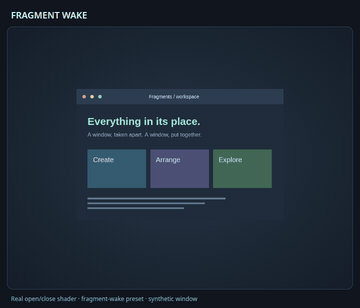
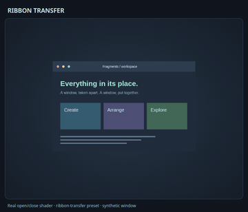
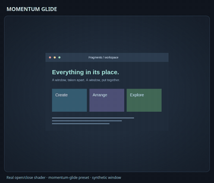

# Choose an effect by scenario

The gallery has **172 GIFs**, including all **73 built-in presets**. Use this
index to find a look or answer a tuning question. The [setup scenario guide](scenarios.md)
separately covers installation on standalone Niri, iNiR/iRiS, DMS and Noctalia.

[Search and play one example at a time](https://jturbide.github.io/niri-fx/gallery/) or browse the [full catalog](catalog.md).

[Quickshell picker: search, review, apply and restore](gifs/workflow-quickshell-picker.gif)
shows the optional desktop UI. [Setup and embedding](quickshell.md).

[GTK picker: search, review, apply and restore](gifs/workflow-gtk-picker.gif)
shows the GTK 4 alternative. [Standalone and AGS setup](gtk.md).

[Terminal guide: choose, review, apply and undo](gifs/workflow-terminal.gif)
shows the one-command preset workflow. [Terminal guide](terminal.md).

## Opening and closing

These use stock Niri shaders. The recordings use synthetic window textures in
Studio's real WebGL renderer. Fragments come first in the [main gallery](catalog.md#see-it-in-motion).

| I want… | Start with | Compare or customize |
| --- | --- | --- |
| A compact everyday breakup | [Subtle](gifs/preset-subtle.gif) or [Balanced](gifs/preset-balanced.gif) | [Particle density](gifs/compare-density.gif) |
| A strong explosion or inward collapse | [Explosion](gifs/preset-explosion.gif), [Implosion](gifs/preset-implosion.gif), [Core Detonation](gifs/preset-core-detonation.gif) | [Burst origin](gifs/compare-origin.gif), [release order](gifs/compare-fragment-release.gif) |
| Triangles, circles, confetti or a honeycomb | [Triangle Shatter](gifs/preset-triangle-shatter.gif), [Circle Burst](gifs/preset-circle-burst.gif), [Rectangle Confetti](gifs/preset-rectangle-confetti.gif), [Hex Swarm](gifs/preset-hex-swarm.gif) | [Shapes, proportions and emergence](fragment-shapes.md) |
| Falling pieces or a black-hole pull | [Earth](gifs/preset-earth.gif), [Black Hole](gifs/preset-black-hole.gif), [Orbital Collapse](gifs/preset-orbital-collapse.gif) | [Gravity direction](gifs/compare-gravity.gif), [strength](gifs/compare-strength.gif), [rotation](gifs/compare-rotation.gif) |
| Ribbons, blinds or folding strips | [Alternating Blinds](gifs/preset-alternating-blinds.gif), [Ribbon Wave](gifs/preset-ribbon-wave.gif), [Hinged Fan](gifs/preset-hinged-fan.gif) | [Directions](gifs/compare-slice-directions.gif), [count](gifs/compare-slice-count.gif), [hinges](gifs/compare-slice-hinges.gif) |
| Springy motion without breakup | [Spring Wobble](gifs/preset-spring-wobble.gif), [Jelly](gifs/preset-jelly.gif), [Flag Wave](gifs/preset-flag-wave.gif) | [Elastic styles](gifs/compare-elastic.gif), [twist and ripples](gifs/compare-elastic-transforms.gif) |
| A pixel wipe or disintegration | [Pixel Wipe](gifs/preset-pixel-wipe.gif), [Pixelate](gifs/preset-pixelate.gif), [Dust Drift](gifs/preset-dust-drift.gif) | [Modes](gifs/compare-pixel-modes.gif), [wipe directions](gifs/compare-pixel-directions.gif), [dust size](gifs/compare-dust-size.gif), [wind](gifs/compare-dust-wind.gif) |
| Ghostly threads or an ink current | [Ghost Wisps](gifs/preset-ghost-wisps.gif), [Ink Current](gifs/preset-ink-current.gif) | [Curl](gifs/compare-wisp-curl.gif), [white/ink/teal palettes](gifs/compare-wisp-palette.gif) |
| Frost or monochrome erosion | [Frost Vanish](gifs/preset-frost-vanish.gif), [Ember Erosion](gifs/preset-ember-erosion.gif) | [Noise size](gifs/compare-dissolve-scale.gif), [palette](gifs/compare-ember-palette.gif), [flow](gifs/compare-dissolve-flow.gif) |
| A geometric reveal | [Iris Bloom](gifs/preset-iris-bloom.gif), [Diamond Turn](gifs/preset-diamond-turn.gif), [Portal Out](gifs/preset-portal-out.gif) | [Circle/diamond/square masks](gifs/compare-iris-shapes.gif) |
| A shockwave or texture ripple | [Shockwave](gifs/preset-shockwave.gif), [Ripple Collapse](gifs/preset-ripple-collapse.gif), [Wave Fold](gifs/preset-wave-fold.gif) | [Patterns](gifs/compare-distortion-patterns.gif), [displacement strength](gifs/compare-distortion-strength.gif), [origin](gifs/compare-shockwave-origin.gif) |
| A spiral collapse or subtle swirl | [Vortex Fold](gifs/preset-vortex-fold.gif), [Soft Swirl](gifs/preset-soft-swirl.gif) | [Twist directions](gifs/compare-vortex-twist.gif), [native swap](gifs/native-swap-vortex-fold.gif) |

Comparisons keep the same texture and seed, with matched timing. A direction or
strength comparison changes only that control. Palette panels intentionally
combine hue, saturation and brightness. Dust travel is measured in cells, so
larger grains travel farther in pixels even at the same travel setting.
See [effect controls](effect-controls.md) for ranges and [recording definitions](gifs/showcases.json)
for every panel's exact settings. Preset loops retain their own default timing.

## Different effects for each action

The seven built-in open/close [profiles](../examples/profiles/README.md) leave resize off.
Opening and closing are independent; these are not application-specific rules.

| Profile | Opens with | Closes with | Recording |
| --- | --- | --- | --- |
| [Fragment Flow](../examples/profiles/fragment-flow.json) | Balanced | Implosion | [Loop](gifs/profile-fragment-flow.gif) |
| [Burst and Drift](../examples/profiles/burst-and-drift.json) | Explosion | Dust Drift | [Loop](gifs/profile-burst-and-drift.gif) |
| [Frost and Fragments](../examples/profiles/frost-and-fragments.json) | Frost Vanish | Pixel Dust | [Loop](gifs/profile-frost-and-fragments.gif) |
| [Spring and Ember](../examples/profiles/spring-and-ember.json) | Spring Wobble | Ember Erosion | [Loop](gifs/profile-spring-and-ember.gif) |
| [Ghost and Shockwave](../examples/profiles/ghost-and-shockwave.json) | Ghost Wisps | Shockwave | [Loop](gifs/profile-ghost-and-shockwave.gif) |
| [Pixel Shuffle](../examples/profiles/pixel-shuffle.json) | Pixel Wipe | Pixelate | [Loop](gifs/profile-pixel-shuffle.gif) |
| [Ribbon Exit](../examples/profiles/ribbon-exit.json) | Alternating Blinds | Ribbon Fold | [Loop](gifs/profile-ribbon-exit.gif) |

Use Studio's **Independent action effects** and **Editing action** controls to
make your own. [The profile guide](profiles.md) also explains import/export,
Undo/Redo and pinned A/B comparisons.

## Resize, movement and swaps

| Scenario | Demo | Requirement |
| --- | --- | --- |
| Whole-window resize breakup | [Full Breakup](gifs/resize-full.gif) | Stock Niri; explicitly enable fragment resize |
| Resize with the center readable | [Edge Rebuild](gifs/resize-edge.gif), [Soft Reflow](gifs/resize-soft.gif) | Stock Niri; explicitly enable fragment resize |
| Real fragment swaps | [Original swap](gifs/native-swap.gif), [Crosswind](gifs/native-swap-crosswind.gif), [Orbital Ribbons](gifs/native-swap-orbital-ribbons.gif), [Bubble Burst](gifs/native-swap-bubble-burst.gif), [Core Detonation](gifs/native-swap-core-detonation.gif) | Separately built experimental Niri patch |
| Real elastic swaps | [Spring Wobble](gifs/native-swap-spring-wobble.gif), [Twist Snap](gifs/native-swap-twist-snap.gif) | Separately built experimental Niri patch |
| Move/swap design exploration | [Move concept](gifs/move-concept.gif), [Swap concept](gifs/swap-concept.gif), [Three swap concepts](gifs/compare-swap-styles.gif) | Labelled Canvas simulations in Studio; these are not compositor recordings |

See [resize controls](usage.md), [movement limits](movement.md) and the
[nested compositor experiment](../experimental/README.md). Wisps, Dissolve, Iris and Hexagons currently support opening/closing only. Pixels also supports experimental movement; Slices and Distortion now support movement and resize.

## Workflows and real compositor scenarios

Watch common workflows and see effects on different window shapes. These
recordings use sample content in Studio, shell interfaces and Niri.

| Try this | Watch | What the demo shows |
| --- | --- | --- |
| Import, edit one action, A/B, Undo/Redo, export | [Studio workflow](gifs/workflow-studio-profile.gif) | Import, edit, compare and export a profile; resize off |
| Select mixed profiles and restore Snappy | [iRiS gallery](gifs/workflow-iris.gif) | Two mixed-action profiles and return to the previous style in the iRiS gallery |
| Search, select, Undo, launch Studio | [DMS launcher](gifs/workflow-dms.gif) | Preset search, selection, Undo and Studio launch in the DMS launcher |
| Select a profile and return to base | [Noctalia picker](gifs/workflow-noctalia.gif) | Noctalia 5.2.1 / Niri Animations 0.2.0; 55 presets plus a custom profile |
| Transparent margins and separated tile | [Fragments](gifs/stock-transparent-fragments.gif), [Wisps](gifs/stock-transparent-wisps.gif) | Stock Niri 26.04 with a real transparent Quickshell client |
| Wide and tall geometry | [Wide Shockwave](gifs/stock-wide-shockwave.gif), [Tall Pixel Wipe](gifs/stock-tall-pixels.gif) | 900×280 and 300×660 logical client sizes |
| Fractional scale | [Frost at 1.5×](gifs/stock-fractional-frost.gif) | One nested output; not a mixed-monitor test |
| Repeated movement interruption | [Reverse direction](gifs/native-interrupted.gif) | Pinned experimental Niri; both clients finish reconstructed |
| Rapid wobble reversals | [Eight direction changes](gifs/native-rapid-reversals.gif) | Pinned experimental Niri; both clients return to their initial columns |
| Close while moving | [Close during movement](gifs/native-close-during-move.gif) | Pinned experimental Niri; closed client disappears and survivor reconstructs |

The iRiS cards show the shell's timing preview. The iRiS and DMS clips use real
UI components in isolated demo windows; the Noctalia clip uses the running shell.
See [tested versions and details](validation.md#workflow-and-compositor-scenarios)
or [record your own demo](gifs/README.md#workflow-and-compositor-recordings).

## Known limits

Mixed-scale monitors, output-edge clipping, decorations, fullscreen applications
and overlapping resize/close animations need broader testing. See
[testing and known limits](validation.md) for the current coverage and the
[roadmap](../ROADMAP.md) for planned improvements.

GIFs demonstrate appearance. For shader timing data, see [GPU measurements](performance.md).

## New styles and resize profiles

| Scenario | Examples |
| --- | --- |
| Hexagonal tiles | [Hexagon Burst](gifs/preset-hexagon-burst.gif), [Hive Collapse](gifs/preset-hive-collapse.gif) |
| Spreading ink | [Ink Spread](gifs/preset-ink-spread.gif), [Ink Bloom](gifs/preset-ink-bloom.gif) |
| Signal distortion | [Signal Glitch](gifs/preset-signal-glitch.gif), [Chromatic Glitch](gifs/preset-chromatic-glitch.gif) |
| Movement styles used for open/close | [Slice Exchange](gifs/preset-slice-exchange.gif), [Pixel Transfer](gifs/preset-pixel-transfer.gif), [Soft Phase](gifs/preset-soft-phase.gif) |
| Edge Ripple and Torsion | [Edge Ripple comparison](gifs/compare-edge-ripple-resize.gif), [Torsion comparison](gifs/compare-torsion-resize.gif); [profiles and controls](resize.md) |
| Optional continuous resize | [Elastic](gifs/elastic-resize.gif), [Accordion](gifs/accordion-resize.gif), [Ripple](gifs/ripple-resize.gif), [Compare](gifs/compare-resize-families.gif) |
| Experimental native swaps | [Slice Exchange](gifs/native-swap-slice-exchange.gif), [Pixel Transfer](gifs/native-swap-pixel-transfer.gif), [Soft Phase](gifs/native-swap-soft-phase.gif) |
| Close before opening completes | [Continued opening trajectory](gifs/native-close-during-open.gif) · requires the experimental compositor |

All new styles have [JSON examples](../examples/README.md). The seven resize
profiles explicitly enable resize; the built-in presets do not.

## General movement and shaped resize

The native clips use the pinned experimental compositor and synthetic clients.
The resize clips render stock Niri-compatible shaders. Resize remains opt-in.

| Fragment Wake | Ribbon Transfer | Momentum Glide |
| --- | --- | --- |
|  |  |  |
|  |  |  |

| Triangle Edge Rebuild | Hexagon Edge Rebuild | Circle Soft Reflow |
| --- | --- | --- |
|  |  |  |

[Movement controls and requirements](movement.md#movement-presets-and-general-rearrangement) ·
[Resize profiles](resize.md#shaped-resize) · [Profile JSON](../examples/profiles/README.md)
