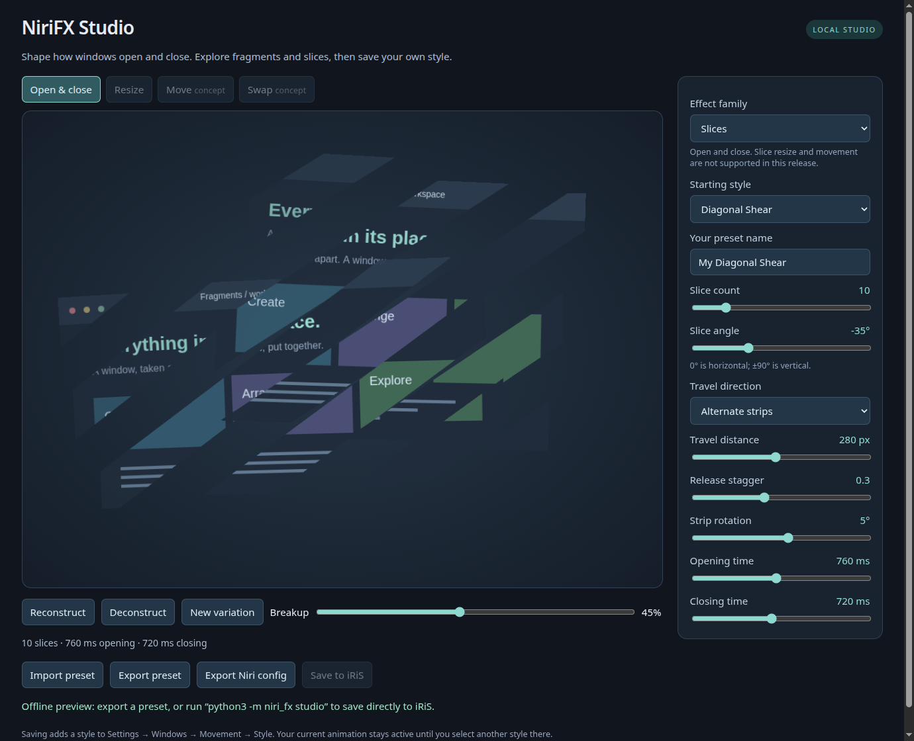

# Studio and controls



```sh
python3 -m niri_fx studio
```

This opens a dedicated Chromium app window, with no tabs or address bar and a
separate profile. The optional application launcher opens the same window.
The renderer is still web technology, not a native QML page. If Chromium is
unavailable, it falls back to your browser; `studio --browser` explicitly opens
a browser tab. Choose **Fragments** or **Slices** first. The starting styles and
controls follow the selected family. Switching families starts with that family's
first preset; export a custom style before switching if you want to keep it.

## Slices

Slices preserve broad strips of the actual window texture. They support opening
and closing on stock Niri; resize and movement controls are unavailable for this
family in 0.6. Opening reverses the closing path with its own duration.

| Control | Range / meaning |
| --- | --- |
| Slice count | 2–48 strips; more strips also increase shader work |
| Slice angle | −90° to 90°; 0° horizontal, ±90° vertical |
| Travel direction | Split outward, alternating strips, along the angle, against the angle |
| Travel distance | 0–600 logical pixels |
| Release stagger | 0–0.75; delay between first and last strip |
| Strip rotation | −60° to 60° during travel |
| Opening / closing time | Independent 100–1500 ms durations |

```sh
python3 -m niri_fx preview --preset diagonal-shear --output /tmp/slices.html
python3 -m niri_fx render --family slices --slice-count 20 --slice-angle 30 \
  --slice-direction alternate --slice-rotation 8 > /tmp/slices.kdl
```

Every preset leaves resize off. Slice JSON uses schema 2 and requires NiriFX 0.6+.
Fragment exports retain schema 1 and remain readable by the old 0.5 editor.

## Fragments

Live fragment controls include:

- **Gravity direction:** none, down, up, left, right, center, or outward.
- **Gravity strength:** 0–3×. Downward gravity accelerates; outward space motion
  drifts at a constant radial rate. Strength is artistic, not an SI unit.
- **Particles:** a target of 16–4096 pieces, or a fixed square size of 8–128
  logical pixels. Target counts are approximate so fragments remain square;
  very small windows also have a four-pixel minimum tile size.
- **Rotation:** none, random spin, or orientation toward the travel direction.
- **Spin:** 0–720 degrees; the random spin range or the alignment limit.
- **Orbit:** −360 to +360 degrees around the selected burst origin.
- **Spread:** 0–240 logical pixels of initial radial scatter.
- **Path dispersion:** 0–1; separates fragment speeds and curves their paths.
- **Release stagger:** 0–0.4; varies when fragments separate and dissolve.
- **Release direction:** together, or three waves starting at the left, right,
  top or bottom. **Wave span** (0–0.7) separates the first and last wave; larger
  values make the sweep more pronounced. Random stagger still varies individual pieces.
- **Burst origin X/Y:** 0–1 within the window, from left/top to right/bottom.
  The same point controls scatter, central attraction and orbit.
- **Timing:** independent opening, closing and resizing durations, 100–1500 ms.
- **Resize (off by default):** enable switch and breakup strength (0–1); bounded fragments
  reconstruct the window at its new size. Resize shares particle count, gravity
  direction and rotation; its strength is separate from open/close gravity.
  Choose **Full Breakup**, **Edge Rebuild** (keeps the center intact) or **Soft
  Reflow** (lighter breakup over the ordinary resize image). Selecting a style
  alone does not enable resize.

The editor uses the same shader templates as the CLI. Click **Reconstruct** or
**Deconstruct**, or scrub the timeline. Set a name and choose **Save to iRiS**;
then select that named style in iRiS's existing picker. Saving does not activate
it. Saving the same name updates that custom preset, with a backup.

The **Move** and **Swap** tabs are visual concepts: textured particles cross
between columns and reconstruct at their destinations. They are not installed
movement effects. Saving/exporting changes open/close and enabled resize behavior.
Run `python3 scripts/nested-demo.py` after building the isolated experiment
to try actual native movement. See [the compositor work](movement.md).

The controls live in NiriFX Studio. iRiS's native page lists the resulting
presets; its stock thumbnail still shows generic timing rather than this shader.

The editor binds only to loopback and uses a per-session save token and origin
checks. It reads the installed iNiR helper and writes only the preset registry.
The editor page makes no external network requests. It exits within 15 minutes of the app window or tab
closing (or immediately with Ctrl+C when launched from a terminal).

For an app-launcher entry tied to this checkout:

```sh
python3 scripts/install-desktop.py
```

Search for **NiriFX Studio** in your application launcher. This is
on-demand; nothing is added to session startup. Keep the checkout at its current
path, or recreate the launcher after moving it.

An offline editor is also available:

```sh
python3 -m niri_fx preview --preset earth --output /tmp/fragments.html
xdg-open /tmp/fragments.html
```

Both offline and app-style Studio support **Import preset**, JSON export and
standalone KDL export. Import validates the entire file before replacing editor
settings; it does not save or activate anything. Files are limited to 16 KiB and
contain named parameters, never arbitrary shaders. Missing fields use defaults;
legacy files without `resize` keep it off. An explicit `resize: true` is retained.

Open the same file directly from the CLI:

```sh
python3 -m niri_fx studio --custom examples/corner-burst.json
python3 -m niri_fx render --custom examples/corner-burst.json > /tmp/corner-burst.kdl
```

Use `--custom` without effect overrides. To save an imported file to iNiR:

```sh
python3 -m niri_fx register --custom ~/Downloads/nirifx-preset.json
```

## Command-line options

```sh
# Save a custom option alongside the built-in pack.
python3 -m niri_fx register --name "Heavy Meteor" --preset earth \
  --gravity-strength 1.8 --particles 400 --rotation random --spin 360

# Render a standalone override; includes no shell integration or activation.
python3 -m niri_fx render --preset black-hole --gravity-strength 0.8 \
  --swirl 120 --rotation gravity --particles 300 > fragments.kdl
niri validate -c fragments.kdl
```

`--tile-size` switches off target-count mode. `--particles 0` also selects fixed
sizing. `list` prints the built-in parameters as JSON. `--preset` chooses the
starting values for `render`, `preview`, `studio`, or a named `register`.

## Presets

| Preset | Motion |
| --- | --- |
| Subtle / Balanced / Dramatic | Increasingly dense bursts: 360 / 720 / 1,100 pieces |
| Explosion | 1,200 tumbling pieces burst outward; opening implodes them into place |
| Implosion | 1,000 pieces collapse toward the center; opening reverses the collapse |
| Earth | Accelerates downward with randomized spin |
| Black Hole | Draws pieces inward and turns them toward the center |
| Space | Drifts outward in every direction with free spin |
| Vortex | Spirals inward while pieces follow their travel direction |
| Confetti | Small tumbling pieces with downward gravity |
| Updraft | Rises with a slight orbit and direction-following rotation |
| Directional Wave | Three stages release from left to right, with upward drift |
| Corner Burst | 1,200 pieces scatter from a lower-left origin |
| Orbital Collapse | 1,400 pieces spiral inward with 300° orbit |
| Slide Apart (Slices) | 12 horizontal strips split outward |
| Alternating Blinds (Slices) | 16 vertical strips travel alternately and rotate |
| Diagonal Shear (Slices) | 10 diagonal strips travel alternately |

Particle targets are approximate and depend on window geometry. Opening reverses
the closing trajectory with its own duration; the effect is artistic rather than
a physical simulation. There are no particle collisions.

## Resize is opt-in

Resize effects are available for **Fragments only** in this release.

All built-in presets and fresh Studio sessions start with fragment resize
disabled. Imported custom presets retain their explicit choice. Enable **Fragment windows when resizing**, or pass `--resize`:

```sh
python3 -m niri_fx register --name "Resize experiment" --preset balanced --resize
python3 -m niri_fx render --preset balanced --resize --resize-mode edge > /tmp/fragments-resize.kdl
```

`--no-resize` suppresses the override. With the iNiR adapter, the base preset's
resize behavior is preserved when fragments are disabled. Standalone exports
omit `window-resize`, leaving your existing Niri settings in charge. Saved custom
presets keep their explicit choices; legacy JSON without `resize` opts out.

See [installation, updating and rollback](getting-started.md) before applying
exports. The CLI's `--help` and subcommand `--help` list every available option.
