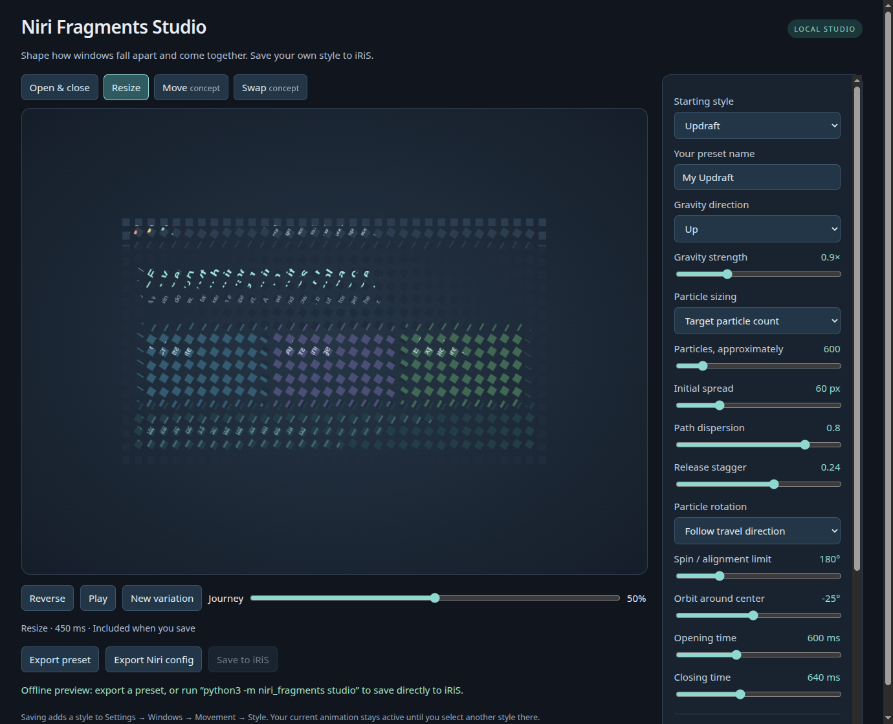
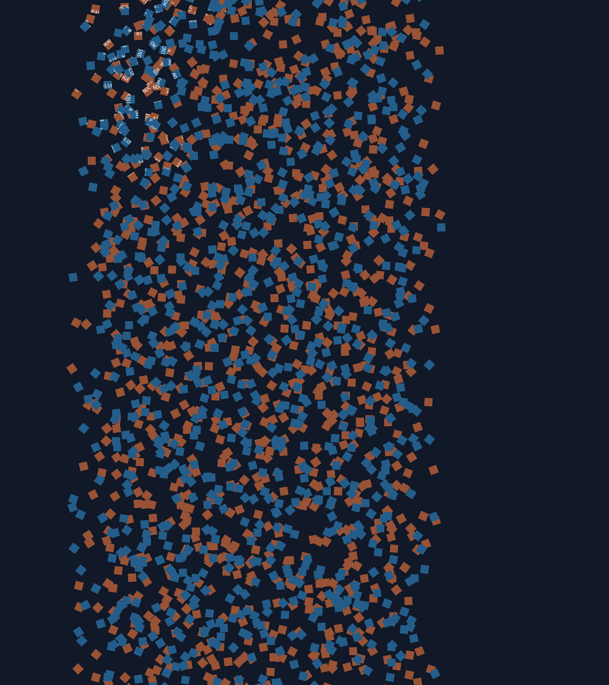

# Prototype validation

## Version 0.4 — resize and isolated native movement

Checked on 2026-10-02:

- 22 project tests passed, including loopback saving, legacy custom documents,
  resize opt-out and exclusion of movement shaders from stock exports.
- All 44 generated shaders (11 × open/close/resize/experimental movement)
  compiled as GLSL ES 1.00. All 11 stock configurations passed installed Niri
  validation and apply/recognition checks through the installed iNiR helper
  in a temporary config. Global off/slowdown controls survived.
- Browser rendering verified all 11 resize shaders, exact starting/ending
  coverage, visible intermediate fragmentation, old/new texture replacement
  and Python/browser export parity, alongside existing open/close and concept
  movement checks. The resize preview below uses synthetic content.
- The pinned Niri patch built with Rust 1.99.0 and no default features.
  19 config tests, one config integration test and 12 existing layout animation
  regression tests passed. The patch also applied to a clean pinned checkout
  and reproduced the expected source diff.
- A native nested session rendered two synthetic Alacritty clients. Both
  fragmented during a real column swap, changed columns and regained their
  original measured colored areas. Native resize and shader-removal captures
  were inspected. No shader compilation/render/config errors were observed
  in the final smoke runs. The demo and its clients were closed afterward.
- The v0.4 wheel/source distribution built; the installed wheel loaded its new
  shader and Studio resources from outside the checkout. Both desktop entries
  passed `desktop-file-validate`.
- The live preset pack was updated with a registry backup. Confetti remained
  selected and gained resize; the scoped animation config backup is under
  `~/.local/state/niri-fragments/backups/20261002T231832Z/`. Installed Niri
  validated and reloaded the config without shader errors in the observed log.
  No movement shader was written to the live config, and its binary was untouched.

The native build is a development prototype. GPU frame time, direct dragging,
seamless retargeting, particle-level ordering between windows, fractional scale,
multiple outputs and all capture/interaction cases are not accepted yet. See
[the experiment scope](../experimental/README.md). The default debug build is
not a production performance benchmark.

## Version 0.3 — denser bursts, app window and movement concepts

Checked on 2026-10-02:

- 19 unit tests passed, including the new dispersion/stagger bounds and actual
  loopback save endpoint. Named custom presets remain preserved on pack update.
- All 22 open/close shaders compiled as GLSL ES 1.00. All 11 generated configs
  passed Niri 26.04 validation. The installed iNiR helper applied and recognized
  each preset in an isolated config, retaining global off/slowdown settings.
- Chromium software WebGL rendered all 11 presets with an intact starting
  texture, visible fragmented midpoint and fully transparent end. Gravity
  directions and inward contraction passed position/coverage checks.
- Python and browser shader exports matched. Maximum particle count, gravity,
  rotation, orbit, dispersion and stagger rendered without WebGL errors.
  Saving through the UI wrote a preset into a temporary registry.
- Move/swap concept tests verified that both textured windows arrive intact in
  the correct columns. Canvas endpoint comparisons allow 2/255 channel rounding
  from resampling at different screen positions; WebGL alpha endpoints are exact.
- The wheel and source distribution built. The installed wheel loaded the GLSL,
  editor and embedded movement resource outside the checkout. The existing
  desktop entry still passed desktop-file-validate.
- The live preset registry now has all 11 styles. Earth remained selected and
  was refreshed after a scoped config backup. Niri reloaded the config without
  shader warnings/errors in the observed journal interval. A separate Studio
  app window was observed through Niri IPC, alongside the existing browser tab.
- An isolated config probe confirmed that the installed Niri rejects movement
  custom shaders. The move/swap renderer is a design preview, not desktop support.

Rendering checks do not establish compositor frame time or visual preference.
The new shader evaluates up to 27 candidates per pixel instead of the previous
nine. GPU performance, repeated/interrupted animations, output clipping, scaling,
transparency and real application appearance still need desktop acceptance.

## Version 0.2 — gravity and Studio

Checked on 2026-10-02:

- The user reported the original effect working well in Niri; Subtle was
  active. All three original shader/timing pairs remain byte-for-byte equal
  to their installed 0.1 presets.
- 19 tests passed, including named preset preservation, parameter validation,
  the real loopback save endpoint, and rejection of foreign-origin requests.
- All 18 built-in open/close shaders compiled as GLSL ES 1.00; all nine KDL
  outputs passed Niri 26.04 configuration validation.
- All nine presets were applied and correctly recognized by the installed
  iNiR helper in an isolated temporary configuration. Global off/slowdown
  settings survived every application.
- Browser rendering checked every preset's intact start, nonempty fragmented
  midpoint and fully transparent end. Measured fragment positions confirmed
  Earth moving downward, Updraft upward, and Black Hole contracting.
- Browser-generated GLSL matched Python-generated GLSL for every built-in
  preset. Extreme count, gravity, rotation and orbit controls rendered without
  WebGL errors. The Save button wrote a named preset to an isolated registry.
- The wheel installed and rendered KDL and the editor outside the checkout;
  the desktop launcher passed `desktop-file-validate`.

Browser checks use Chromium software WebGL. They do not establish real Niri
GPU performance. Native visual acceptance of the new gravity modes, clipping
at large displacements, scaling and application-specific behavior remains open.

## Version 0.1 — original effect

Checked on 2026-10-02:

- 13 Python unit tests passed: preservation of unrelated presets and base
  timings, malformed/duplicate registry rejection, ownership collisions,
  idempotence, backups, symlinks, dry-run behavior, and input validation.
- All six shaders (open and close across three presets) compiled with
  `glslangValidator` as GLSL ES 1.00.
- All three generated KDL configurations passed `niri validate` with
  Niri 26.04 (`8ed0da4`).
- The installed iNiR helper applied each generated preset inside an isolated
  temporary XDG configuration, recognized the active preset correctly, and
  retained global `off` and `slowdown` controls.
- A wheel and source distribution built; installing the wheel into an isolated
  virtual environment preserved the shader and preview resources. The installed
  CLI rendered valid KDL and generated its standalone preview outside the checkout.
- Chromium's WebGL renderer compiled the actual effect and rendered an intact
  sample window and intermediate fragment motion. The included image is a
  synthetic preview, not a desktop screenshot. Software rendering was used;
  this is not a benchmark of the compositor or the user's GPU.

Still to validate in a real Niri session: visual preference, startup/closing
behavior with real applications, shader compilation in Niri's own renderer,
frame time, client-side decoration behavior, output-edge clipping, transparency,
fractional scaling, and multiple monitors. The project deliberately remains
labeled a prototype until those checks are complete.
