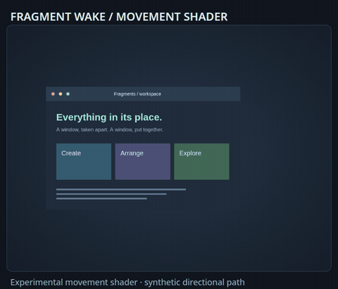

# Importable action profiles

Each profile assigns independent opening and closing effects. All seven built-in pairings leave
resize and experimental movement unset, preserving the user's existing behavior.
Choose one by name with `--profile`, import its JSON in Studio, or preview it using the commands below. Previewing
and exporting do not activate animations.

| Profile | Opening | Closing | Showcase |
| --- | --- | --- | --- |
| [Fragment Flow](fragment-flow.json) | Balanced | Implosion | [GIF](../../docs/gifs/profile-fragment-flow.gif) |
| [Burst and Drift](burst-and-drift.json) | Explosion | Dust Drift | [GIF](../../docs/gifs/profile-burst-and-drift.gif) |
| [Frost and Fragments](frost-and-fragments.json) | Frost Vanish | Pixel Dust | [GIF](../../docs/gifs/profile-frost-and-fragments.gif) |
| [Spring and Ember](spring-and-ember.json) | Spring Wobble | Ember Erosion | [GIF](../../docs/gifs/profile-spring-and-ember.gif) |
| [Ghost and Shockwave](ghost-and-shockwave.json) | Ghost Wisps | Shockwave | [GIF](../../docs/gifs/profile-ghost-and-shockwave.gif) |
| [Pixel Shuffle](pixel-shuffle.json) | Pixel Wipe | Pixelate | [GIF](../../docs/gifs/profile-pixel-shuffle.gif) |
| [Ribbon Exit](ribbon-exit.json) | Alternating Blinds | Ribbon Fold | [GIF](../../docs/gifs/profile-ribbon-exit.gif) |

Run from the checkout:

```sh
python3 -m niri_fx preview --profile fragment-flow --output /tmp/fragment-flow.html
python3 -m niri_fx preview --profile pixel-shuffle --output /tmp/pixel-shuffle.html
python3 -m niri_fx preview --profile ribbon-exit --output /tmp/ribbon-exit.html
python3 -m niri_fx preview --custom examples/profiles/burst-and-drift.json --output /tmp/burst-and-drift.html
python3 -m niri_fx preview --custom examples/profiles/frost-and-fragments.json --output /tmp/frost-and-fragments.html
python3 -m niri_fx preview --custom examples/profiles/spring-and-ember.json --output /tmp/spring-and-ember.html
python3 -m niri_fx preview --custom examples/profiles/ghost-and-shockwave.json --output /tmp/ghost-and-shockwave.html
```

Export one profile as stock Niri KDL and check it without applying:

```sh
python3 -m niri_fx render --custom examples/profiles/burst-and-drift.json > /tmp/burst-and-drift.kdl
niri validate -c /tmp/burst-and-drift.kdl
```

To make a new combination, use Studio's **Independent action effects** or
`python3 -m niri_fx profile --help`. See the [profile guide](../../docs/profiles.md)
for editing, saving and explicit resize opt-in; follow [setup and restore](../../docs/setup.md)
when ready to apply a profile.

## Optional resize profiles

These four profiles keep Balanced opening and closing and explicitly enable a
separate resize effect. They require NiriFX 0.11 or newer. See the
[resize guide](../../docs/resize.md) for controls and limitations.

| Profile | Showcase |
| --- | --- |
| [Edge Ripple Subtle](edge-ripple-subtle.json) | [GIF](../../docs/gifs/edge-ripple-subtle.gif) |
| [Edge Ripple Expressive](edge-ripple-expressive.json) | [GIF](../../docs/gifs/edge-ripple-expressive.gif) |
| [Torsion Subtle](torsion-subtle.json) | [GIF](../../docs/gifs/torsion-subtle.gif) |
| [Torsion Expressive](torsion-expressive.json) | [GIF](../../docs/gifs/torsion-expressive.gif) |

```sh
python3 -m niri_fx preview --custom examples/profiles/edge-ripple-subtle.json --output /tmp/edge-ripple-subtle.html
python3 -m niri_fx preview --custom examples/profiles/edge-ripple-expressive.json --output /tmp/edge-ripple-expressive.html
python3 -m niri_fx preview --custom examples/profiles/torsion-subtle.json --output /tmp/torsion-subtle.html
python3 -m niri_fx preview --custom examples/profiles/torsion-expressive.json --output /tmp/torsion-expressive.html
```

## Shaped resize and experimental movement

These examples require NiriFX 0.13 or newer. The resize profiles deliberately
enable resize; the movement profile leaves resize unset and needs the pinned
experimental compositor. None is enabled by importing or previewing it.

| Profile | Action | Showcase |
| --- | --- | --- |
| [Triangle Edge Rebuild](triangle-edge-rebuild.json) | Resize | [GIF](../../docs/gifs/triangle-edge-rebuild.gif) |
| [Hexagon Edge Rebuild](hexagon-edge-rebuild.json) | Resize | [GIF](../../docs/gifs/hexagon-edge-rebuild.gif) |
| [Circle Soft Reflow](circle-soft-reflow.json) | Resize | [GIF](../../docs/gifs/circle-soft-reflow.gif) |
| [Fragment Wake Motion](fragment-wake-motion.json) | Movement | [GIF](../../docs/gifs/native-swap-fragment-wake.gif) |

```sh
python3 -m niri_fx studio --custom examples/profiles/triangle-edge-rebuild.json
python3 -m niri_fx studio --custom examples/profiles/fragment-wake-motion.json
python3 scripts/nested-demo.py --custom examples/profiles/fragment-wake-motion.json
```

The movement shader preview uses a synthetic directional path;
[native recordings](../../docs/movement.md) show compositor-owned trajectories.



```sh
python3 -m niri_fx preview --custom examples/profiles/triangle-edge-rebuild.json --output /tmp/triangle-edge-rebuild.html
python3 -m niri_fx preview --custom examples/profiles/hexagon-edge-rebuild.json --output /tmp/hexagon-edge-rebuild.html
python3 -m niri_fx preview --custom examples/profiles/circle-soft-reflow.json --output /tmp/circle-soft-reflow.html
python3 -m niri_fx preview --custom examples/profiles/fragment-wake-motion.json --output /tmp/fragment-wake-motion.html
```
